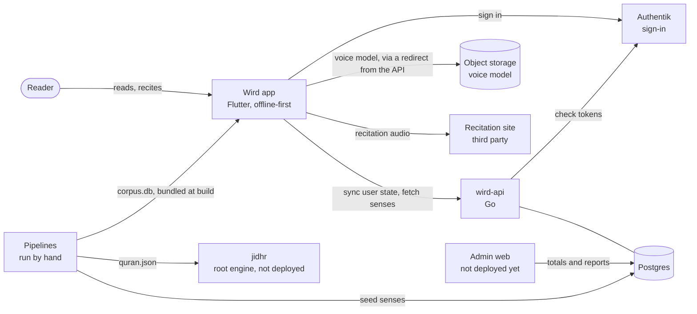
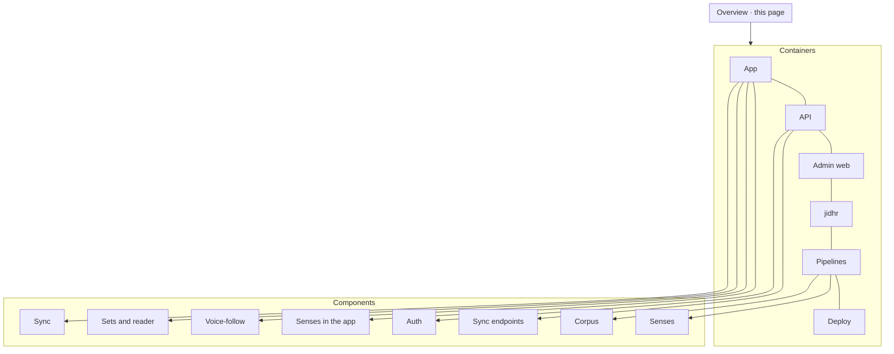

# Wird documentation

Wird helps a Muslim prepare a prayer. Before praying, you read a small set of ayas and open any word to learn what its Arabic root means. During the prayer, you recite that set and the app follows your voice. Progress is counted in ayas understood, not pages turned.

This page is the top of the map. Read it, then go as deep as you like: each architecture page starts with a **black box** (what it does, seen from outside) and ends with a **white box** (how it does it, down to the code). You can stop at any black box and still have a correct picture.

## Start here

Pick the path that fits you.

- **Curious how it works?** Take a [tour](#tours). Each one follows a single thing through the whole system.
- **Want to change something?** Read [Getting started](guides/getting-started.md), then the container page for the area you are touching.
- **Wondering why it is built this way?** The [decisions](adr/README.md) record every major choice and what it cost.

## The system in one picture

The app carries the whole Quran text and its word-by-word data on the phone, so reading and praying work with no network. The server keeps what belongs to you (what you understood, kept and prayed, and your reading order), the reports you choose to send, and the senses of roots, which change after release. Admin web and jidhr are built and tested here but not deployed.

## Containers

| Container | What it is | Page |
|---|---|---|
| App | Flutter client for iOS, Android, tablet and macOS | [app.md](architecture/app.md) |
| API | `wird-api`, the Go service holding user state and serving senses | [api.md](architecture/api.md) |
| Admin web | Separate Go binary for operators: totals and reports only. Not deployed yet | [adminweb.md](architecture/adminweb.md) |
| jidhr | Standalone engine that finds an Arabic word's root. Not deployed | [jidhr.md](architecture/jidhr.md) |
| Pipelines | Offline tools that build the corpus and draft senses | [pipelines.md](architecture/pipelines.md) |
| Deploy | CI, container image, helm, ArgoCD | [deploy.md](architecture/deploy.md) |

## Tours

Tours are narrated walks. Each follows one journey end to end and links to the pages it passes through.

1. [A prayer, from tap to Postgres](tours/prayer-to-postgres.md)
2. [How a word finds its root and its sense](tours/word-to-sense.md)
3. [Where the Quran text comes from](tours/where-the-text-comes-from.md)
4. [Following your voice](tours/following-your-voice.md)
5. [Signing in](tours/signing-in.md)
6. [Shipping a change](tours/shipping-a-change.md)

## Glossary

These words mean one thing each, everywhere in these docs.

### The Quran and the reader

| Term | Meaning |
|---|---|
| **Wird** | A daily portion of Quran recitation. Also the name of the app. |
| **Reader** | A person using Wird. On the server, one row in `users`, keyed by the token's subject. |
| **Aya** | One verse of the Quran. |
| **Sūra** | One chapter of the Quran. |
| **Muṣḥaf** | The written Quran, in its written order. |
| **Rakʿah** | One cycle of the prayer. Each opens with Al-Fātiḥa; the first two add a passage after it. |
| **Reading order** | The order the walk follows: `nuzul` (order of revelation, the default) or `mushaf` (written order). |
| **Walk** | Your position in the reading order: the next aya you have not yet understood. It is derived, never stored. |
| **Set** | The few ayas the walk proposes for one prayer. You read it before the prayer and recite it during it, after Al-Fātiḥa. Its id is derived from the reading order and its first and last aya ([ADR 0002](adr/0002-set-identity.md)). |
| **Visit** | Opening the reader on an aya you chose instead of on the walk ([ADR 0003](adr/0003-addressable-reader.md)). |
| **Passage** | What the reader screen shows: a set, or a place in a sūra you opened ([ADR 0006](adr/0006-a-passage-is-read-a-set-is-answered-for.md)). |
| **Understood** | The mark you put on an aya once you understand it. Progress counts these. |
| **Kept** | An aya, a root or a note you saved. |
| **Screen codes** | Names from the design: 1a reader, 1b prayer, 1c constellation, 1d progress, 1e kept, 2b and 3a root screens. |

### Words and meanings

| Term | Meaning |
|---|---|
| **Root** | The consonant skeleton an Arabic word is built on, usually three letters. Words sharing a root share a family of meaning. |
| **Morphology** | The per-word analysis from the Quranic Arabic Corpus: each word's root, form and parsing. |
| **Gloss** | The word-by-word meaning shown under each word: English, or French from The Last Dialogue for a reader in French. Not a sense. |
| **Sense** | What a root means: one entry per root, with an English and a French text. Senses are drafted by a language model and live on the server ([ADR 0010](adr/0010-the-server-owns-the-roots-and-their-senses.md)). jidhr's API calls them `meanings`. |
| **Sense pack** | The whole answer of `GET /v1/senses`, with a version the app stores and sends back as an ETag. |
| **Drafts log** | `data/root_senses_draft.tsv`: every drafted sense, appended, never rewritten. The last row for a root wins. |
| **jidhr** | Arabic for "root". The engine that answers "which root is this word from?". |

### Data and sync

| Term | Meaning |
|---|---|
| **Corpus** | The SQLite database bundled in the app: text, gloss, morphology, roots, recitation timings, the French translation and iʿrāb. |
| **`corpus_version`** | The build number stamped inside the corpus. |
| **wird.db** | The one database on the phone: a copy of the corpus plus your tables, the outbox included. |
| **Op** | One write waiting in the outbox: an id minted on the phone, a kind and a body. |
| **Outbox** | The app's local queue of ops. |
| **Flush** | One round of sending ops and pulling changes. It runs when the app opens or comes back to the foreground, at most once every two minutes. |
| **Parked op** | An op the server refused, or one that failed ten times. It is never sent again on its own; Settings offers "send again" or "discard". |
| **Cursor** | Your position in the server's stream of changes, returned by `GET /v1/changes`. |
| **Tombstone** | A kept item marked deleted. It is never removed, so other devices learn about the delete. |
| **Report** | Feedback a reader chooses to send. It travels as an op and is shown in the operations view. |

### Voice-follow

| Term | Meaning |
|---|---|
| **Voice-follow** | The feature that follows your recitation during the prayer and lights the aya you are on. |
| **Recogniser** | The on-device speech model that writes down the sounds it hears. |
| **Voice model** | The recogniser's files, downloaded once from `/models/` and kept beside wird.db. |
| **Matcher** | The part that finds where in the set those sounds are. |
| **Prayer cursor** | The word of the rakʿah the matcher, the pace or your tap says you are on. |
| **Prayer trail** | A log file of one prayer, written beside wird.db and cleared at the next prayer. |

### Operations

| Term | Meaning |
|---|---|
| **Operator** | A member of the Authentik group allowed into the operations view. |
| **Operations view** | The page Admin web shows operators: totals and reports, never one reader's data ([ADR 0004](adr/0004-the-operations-view-behind-authentiks-group.md)). |
| **The gate** | `scripts/qa.sh`. Its exit code decides whether a change is ready. |

## Other documents

| Folder | What is in it |
|---|---|
| [guides/](guides/) | How to run, test and wire things: [getting started](guides/getting-started.md), [Authentik wiring](guides/authentik-wiring.md), [the visual gate](guides/gate-visual.md), [releasing the APK](guides/releasing-the-apk.md), [releasing to the stores](guides/releasing-to-stores.md) |
| [adr/](adr/README.md) | Architecture decisions, oldest first |
| [research/](research/) | Investigations that shaped a decision. Frozen. |
| [journal/](journal/) | Notes from walking the app on real devices. Frozen, not kept current. |
| [design/](design/README.md) | The vendored design system and screen mockups. Never edited by hand. |
| [toolchain.md](toolchain.md) | What the build machine needs, checked by the gate. |
| [../data/SOURCES.md](../data/SOURCES.md) | Where every piece of data comes from, and its licence. |
