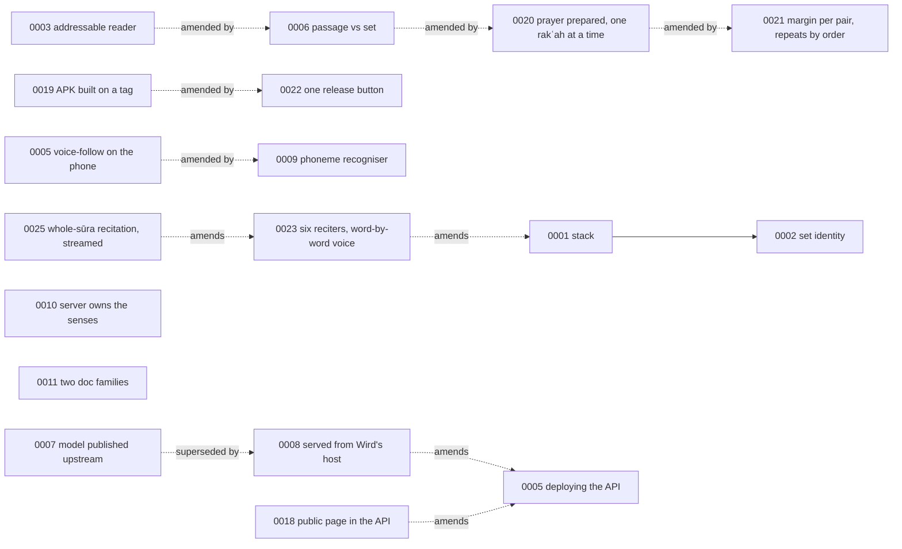

# Architecture decisions

Each file records one decision: the context, what was chosen, and what it costs. They are history, so their bodies are never edited. A later ADR supersedes or amends an earlier one instead, and only the earlier one's status line changes.

New ADRs start from [TEMPLATE.md](TEMPLATE.md) and take the next free number. Two early files share the number 5, so this index lists files, not numbers.

| File | Decision | Status |
|---|---|---|
| [0001-stack.md](0001-stack.md) | Flutter, Go, Postgres 18, Authentik, GitOps; offline-first with an outbox | accepted, amended by 0023 |
| [0002-set-identity.md](0002-set-identity.md) | A set's identity is derived, and one op records a prayer | accepted |
| [0003-addressable-reader.md](0003-addressable-reader.md) | Screen 1a is addressable, and it changes in place | accepted, amended by 0006 |
| [0004-the-operations-view-behind-authentiks-group.md](0004-the-operations-view-behind-authentiks-group.md) | The operations view sits behind Authentik's group and only sees totals | accepted |
| [0005-deploying-the-api.md](0005-deploying-the-api.md) | One image, the API only, database credentials from Infisical | accepted, amended by 0008 and 0018 |
| [0005-voice-follow-locates-the-reciter-with-a-quran-model-on-the-phone.md](0005-voice-follow-locates-the-reciter-with-a-quran-model-on-the-phone.md) | Voice-follow runs a Qur'an model on the phone | accepted, model choice superseded by 0009 |
| [0006-a-passage-is-read-a-set-is-answered-for.md](0006-a-passage-is-read-a-set-is-answered-for.md) | A passage is read; a set is answered for | accepted, amended by 0014 and 0020 |
| [0007-the-voice-model-is-published-where-its-weights-already-live.md](0007-the-voice-model-is-published-where-its-weights-already-live.md) | Publish the voice model where its weights live | superseded by 0008 |
| [0008-the-recogniser-is-served-from-wirds-own-host.md](0008-the-recogniser-is-served-from-wirds-own-host.md) | The recogniser is served from Wird's own host | accepted |
| [0009-the-recogniser-hears-quranic-phonemes-not-language.md](0009-the-recogniser-hears-quranic-phonemes-not-language.md) | The recogniser hears Qur'anic phonemes, not language | accepted |
| [0010-the-server-owns-the-roots-and-their-senses.md](0010-the-server-owns-the-roots-and-their-senses.md) | The server owns the roots and their senses | accepted |
| [0011-two-doc-families.md](0011-two-doc-families.md) | Agent docs and human docs are two families with two styles | accepted |
| [0012-french-word-glosses-from-the-last-dialogue.md](0012-french-word-glosses-from-the-last-dialogue.md) | The French under each word comes from The Last Dialogue, matched by its Arabic | accepted |
| [0013-the-reading-screens-root-panel-walks-word-by-word.md](0013-the-reading-screens-root-panel-walks-word-by-word.md) | The reading screen's root panel walks word by word, where the corpus attribution stood | accepted, amended by 0014 |
| [0014-the-reading-screen-reads-a-whole-sura-a-word-at-a-time.md](0014-the-reading-screen-reads-a-whole-sura-a-word-at-a-time.md) | The reading screen reads a whole sūra, a word at a time | accepted |
| [0015-the-reading-position-is-kept-per-sura-and-synced.md](0015-the-reading-position-is-kept-per-sura-and-synced.md) | The reading position is kept per sūra and synced | accepted |
| [0016-installed-corpora-upgrade-and-words-carry-their-lemma.md](0016-installed-corpora-upgrade-and-words-carry-their-lemma.md) | Installed corpora upgrade, and words carry their lemma | accepted |
| [0017-ayas-are-translated-into-english-from-pickthall.md](0017-ayas-are-translated-into-english-from-pickthall.md) | Ayas are translated into English from Pickthall | accepted |
| [0018-the-public-site-is-served-by-the-api.md](0018-the-public-site-is-served-by-the-api.md) | The public page is embedded in wird-api, and its demos run on the corpus | accepted |
| [0019-the-apk-is-built-on-a-tag-and-published-by-ci.md](0019-the-apk-is-built-on-a-tag-and-published-by-ci.md) | A version tag builds the APK and publishes it at /download/android | proposed, amended by 0022 |
| [0020-a-prayer-is-prepared-then-recited-one-rakah-at-a-time.md](0020-a-prayer-is-prepared-then-recited-one-rakah-at-a-time.md) | A prayer is prepared, then recited one rakʿah at a time | accepted, amended by 0021 |
| [0021-the-margin-is-asked-per-pair-and-repeats-are-settled-by-order.md](0021-the-margin-is-asked-per-pair-and-repeats-are-settled-by-order.md) | The matcher's margin is asked per pair of places, and a repeated phrase is settled by order | accepted |
| [0022-a-release-is-cut-by-one-button-from-the-pubspec.md](0022-a-release-is-cut-by-one-button-from-the-pubspec.md) | A release is cut by one button, and the pubspec holds the only version | accepted |
| [0023-six-reciters-and-a-word-by-word-voice.md](0023-six-reciters-and-a-word-by-word-voice.md) | The reader picks one of six reciters, and can hear each word spoken alone | accepted, amended by 0025 |
| [0024-the-sura-picker-turns-its-order-and-searches-the-text.md](0024-the-sura-picker-turns-its-order-and-searches-the-text.md) | The sūra picker turns its own order, and searches the text of the Qur'an in memory | accepted |
| [0025-the-reader-recites-the-whole-sura-and-streams-what-is-not-on-disk.md](0025-the-reader-recites-the-whole-sura-and-streams-what-is-not-on-disk.md) | The reader recites the whole sūra, and streams what is not on disk | accepted |
