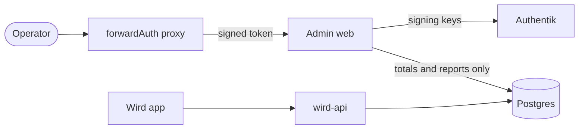
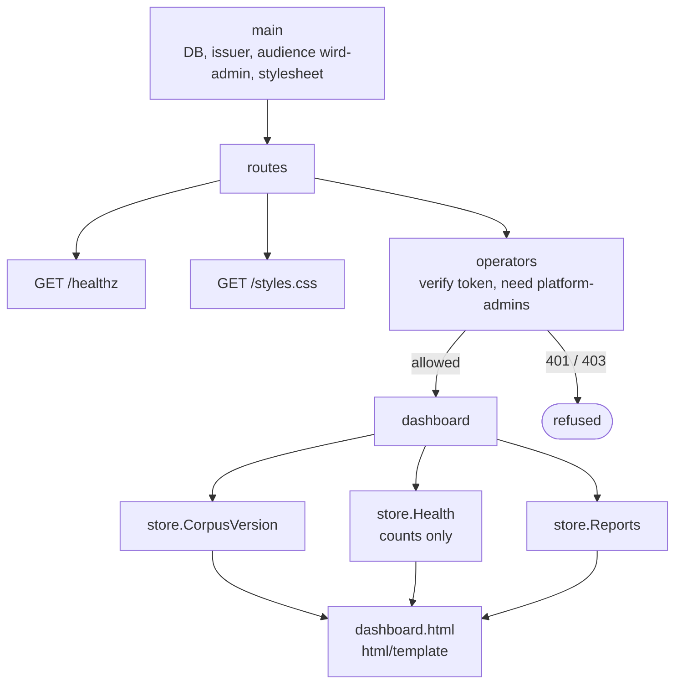

# Admin web

> The operations view: a separate Go binary, gated on an Authentik group, that reads totals and reports straight from the database. Not deployed yet. Level L1 · Parent [Overview](../README.md) · Children none

## Black box

Admin web is one page for operators. It shows how many readers there are, how many sets have been prayed, how many writes failed or were parked, and the reports readers chose to send. It never shows what one reader understood, kept or prayed.

It is a separate binary from `wird-api`. It reads the same Postgres directly and does not call the API. Only members of Authentik's `platform-admins` group get in, and the token proving that is checked here, not trusted from a proxy header.

It is **not deployed today**. Nothing builds its image, and the Authentik client does not yet put a `groups` claim in its tokens, so the page would refuse everyone.

| In | Out | Depends on |
|---|---|---|
| An operator's browser, through the cluster's forwardAuth proxy | One HTML page: totals, corpus versions, reports | Postgres, the same database as `wird-api` |
| A signed token in `X-Forwarded-Access-Token` or `Authorization: Bearer` | 401 for no or bad token, 403 outside the group | Authentik, for the signing keys and the group claim |
| | | The Nocturne stylesheet, read from disk at start |



## White box



### 1. Start-up: issuer, audience, stylesheet

The binary opens the database and discovers the issuer, like `wird-api`. Its audience is its own, `wird-admin`, not the readers' app. It then reads the vendored Nocturne stylesheet and refuses to start without it.

```go
	audience := env("OIDC_AUDIENCE", "wird-admin")

	// Read once, and refuse to start without it. An operations page served
	// unstyled is a wall of rows nobody reads carefully, and a dashboard is
	// believed whether or not it is legible.
	css, err := os.ReadFile(env("NOCTURNE_CSS", "docs/design/nocturne-styles.css"))
	if err != nil {
		log.Error("stylesheet unavailable", "err", err)
		os.Exit(1)
	}
```

[main.go:37-46](../../server/cmd/adminweb/main.go#L37-L46)

The stylesheet is [`docs/design/nocturne-styles.css`](../design/nocturne-styles.css), the one the app's theme is tested against. Reading it rather than copying it means the page cannot drift from the design system. It listens on `ADMIN_ADDR`, `:8081` by default ([main.go:48](../../server/cmd/adminweb/main.go#L48)).

### 2. Three routes, one of them gated

```go
	mux.HandleFunc("GET /healthz", func(w http.ResponseWriter, _ *http.Request) {
		w.WriteHeader(http.StatusOK)
	})
	mux.HandleFunc("GET /styles.css", func(w http.ResponseWriter, _ *http.Request) {
		w.Header().Set("Content-Type", "text/css; charset=utf-8")
		if _, err := w.Write(css); err != nil {
			log.Error("stylesheet not written", "err", err)
		}
	})
	mux.Handle("GET /{$}", operators(verifier, log, http.HandlerFunc(s.dashboard)))
```

[main.go:60-69](../../server/cmd/adminweb/main.go#L60-L69)

### 3. The group gate

The proxy handles the login. Admin web makes the decision. Either header may carry the token, and both go through the same verifier, so a header set by hand gets a 401 ([auth.go:48-57](../../server/cmd/adminweb/auth.go#L48-L57)). A valid token without the group gets a 403.

```go
		token, err := verifier.Verify(r.Context(), raw)
		if err != nil {
			log.Info("token refused", "err", err)
			http.Error(w, "token rejected", http.StatusUnauthorized)
			return
		}
		var claims struct {
			Groups []string `json:"groups"`
		}
		if err := token.Claims(&claims); err != nil || !slices.Contains(claims.Groups, operatorGroup) {
			log.Info("not an operator", "group", operatorGroup)
			http.Error(w, "this page is for "+operatorGroup, http.StatusForbidden)
			return
		}
```

[auth.go:26-39](../../server/cmd/adminweb/auth.go#L26-L39)

There is no admin table in Wird. An operator is whoever Authentik says is in `platform-admins` ([auth.go:12-17](../../server/cmd/adminweb/auth.go#L12-L17)). A token with no `groups` claim contains nothing, so today every token gets a 403. That is the safe way round.

### 4. The page reads three things, each on its own

Each section is read separately. A section that could not be read says so, instead of showing an empty list that looks like "nothing yet".

```go
	if page.Corpus, err = s.db.CorpusVersion(r.Context()); err == nil {
		page.CorpusOK = true
	} else {
		s.log.Error("corpus version", "err", err)
	}
	if page.Health, err = s.db.Health(r.Context()); err == nil {
		page.HealthOK = true
	} else {
		s.log.Error("health", "err", err)
	}
	if page.Reports, err = s.db.Reports(r.Context(), store.ReportPage); err == nil {
		page.ReportsOK = true
	} else {
		s.log.Error("reports", "err", err)
	}
```

[main.go:95-109](../../server/cmd/adminweb/main.go#L95-L109)

The page is rendered by `html/template` from an embedded file ([main.go:117-124](../../server/cmd/adminweb/main.go#L117-L124)), which links the stylesheet served in step 2 ([dashboard.html:7](../../server/cmd/adminweb/dashboard.html#L7)).

### 5. Totals only, by construction

None of the store methods admin web may call takes a reader. The health numbers are plain counts over whole tables.

```go
	readersSQL      = `SELECT count(*) FROM users`
	setsPrayedSQL   = `SELECT count(*) FROM set_prayers`
	syncFailuresSQL = `SELECT coalesce(sum(ops), 0)::bigint FROM sync_outcomes WHERE status = 'failed'`
	parkedWritesSQL = `SELECT coalesce(sum(ops), 0)::bigint FROM sync_outcomes WHERE status = 'refused'`
```

[admin.go:19-22](../../server/internal/store/admin.go#L19-L22)

Tests hold the rule, not habit:

- The package may call only `Health`, `Reports`, `CorpusVersion` and `Close`, and holds no SQL of its own ([adminweb_test.go:142](../../server/cmd/adminweb/adminweb_test.go#L142)).
- The page, rendered from a real database with two readers, never contains their ids or subjects ([adminweb_test.go:227](../../server/cmd/adminweb/adminweb_test.go#L227)).
- A valid token outside the group, and a token that cannot be proven, are both served nothing ([adminweb_test.go:77](../../server/cmd/adminweb/adminweb_test.go#L77), [adminweb_test.go:113](../../server/cmd/adminweb/adminweb_test.go#L113)).

Reports carry no reader id, but ADR 0004 is precise about the limit: the page cannot attribute a report, while someone with `SELECT` on the database still can.

## Why it is this way

- [ADR 0004](../adr/0004-the-operations-view-behind-authentiks-group.md) — the group gate, forwardAuth with the token verified here, totals only, and Go with `html/template` and the Nocturne stylesheet.
- [ADR 0005](../adr/0005-deploying-the-api.md) — why only `wird-api` is deployed: admin web needs a `groups` scope mapping in Authentik and its own image, in one change.

## Go deeper

- [Auth](api/auth.md) — the readers' side of the same JWKS check.
- [API](api.md) — the other binary on the same database.
- [Deploy](deploy.md) — what is built and shipped, and what is not.
- [Authentik wiring](../guides/authentik-wiring.md#2-groups-is-not-in-scopes_supported) — why the `groups` claim is missing today.
