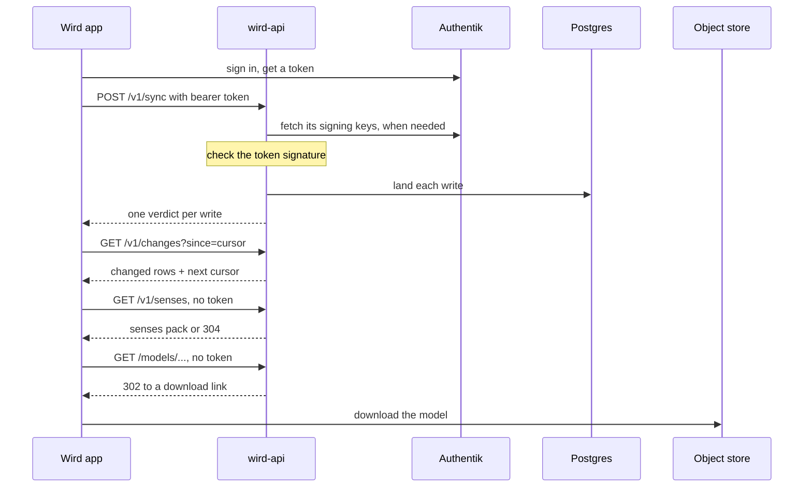
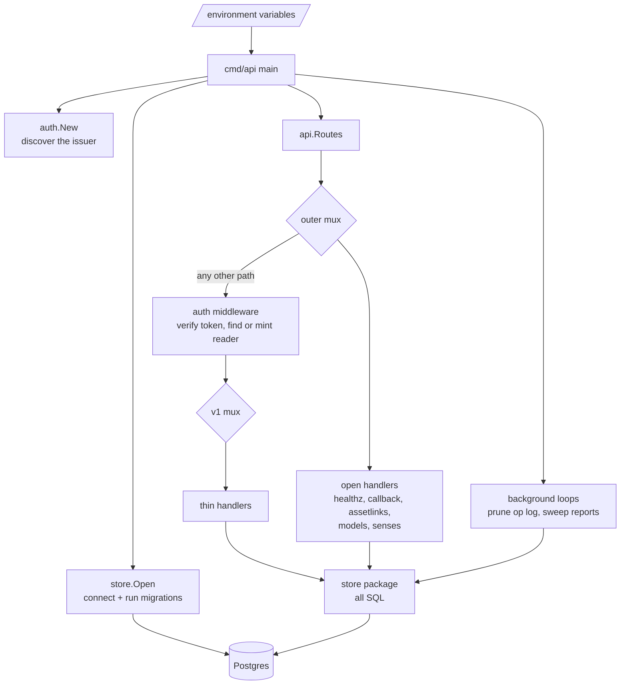
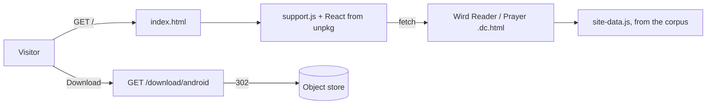
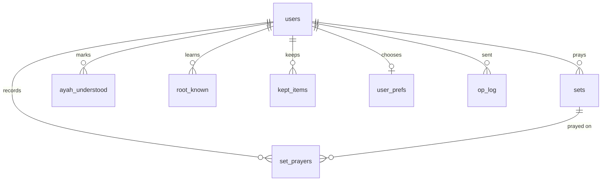

# API

> wird-api: the Go service that keeps each reader's state, serves senses and the voice model to anyone, and serves the public page at its root. Level L1 · Parent [Overview](../README.md) · Children [Auth](api/auth.md), [Sync endpoints](api/sync-endpoints.md)

## Black box

wird-api is the only server Wird deploys. It answers at `https://wird.bnei.dev`. The app talks to it for two reasons: to keep a signed-in reader's state (what they understood, kept and prayed) on the server, and to fetch things that change after a release, such as senses and the voice model. Everything a reader does works without it; the app catches up when a network is there.

| In | Out | Depends on |
|---|---|---|
| Batches of writes from the app's outbox | One verdict per write | Postgres, for all state |
| Pulls since a cursor | Rows changed since then, plus the next cursor | Authentik, to check bearer tokens |
| Senses fetches, signed in or not | The senses pack, or "not changed" | An object store holding the voice model |
| Voice model fetches, signed in or not | A redirect to a short-lived download link | |
| A visitor's browser at `/` | The public page and its two live demos | |
| The page's Download button | A redirect to the published APK | |



### The endpoints

There are two groups. The open group needs no token, because the app is fully usable signed out. The bearer group needs a valid Authentik token.

| Endpoint | Token | What it answers | Called by the app |
|---|---|---|---|
| `GET /healthz` | no | 200, for the liveness probe | no |
| `GET /auth/callback` | no | A page that hands the sign-in code back to the app | through the browser |
| `GET /.well-known/assetlinks.json` | no | Android's proof that the app owns `/auth/callback` | by Android |
| `GET /.well-known/apple-app-site-association` | no | iOS's proof that the app owns `/auth/callback` | by iOS |
| `GET /models/...` | no | 302 to the voice model file; 503 when no store is set up | yes |
| `GET /v1/senses` | no | Every sense, with who wrote them; 304 when unchanged. `HEAD` checks without the body | yes |
| `GET /`, `GET /{file}`, `GET /_ds/...` | no | The public page and the files it renders from. See [the site](#the-public-page) | no |
| `GET /download/android` | no | 302 to the published APK; 503 until one is published | no |
| `POST /v1/sync` | yes | The one write path. See [Sync endpoints](api/sync-endpoints.md) | yes |
| `GET /v1/changes` | yes | What changed since a cursor. See [Sync endpoints](api/sync-endpoints.md) | yes |
| `GET /v1/me` | yes | The reader the token belongs to | no |
| `DELETE /v1/me` | yes | Deletes the reader and everything they own; 204. A token signed in before the deletion is refused from then on | yes |
| `GET /v1/progress` | yes | Counts for the progress screen | no |
| `GET /v1/kept` | yes | Kept items, optionally of one kind | no |
| `GET /v1/corpus/version` | yes | The server's record of the corpus version | no |
| `GET /v1/ayahs/{s}/{a}/tafsir` | yes | Placeholder commentary, or 404 | no |
| `GET /v1/ayahs/{s}/{a}/irab` | yes | Placeholder parsing, or 404 | no |
| `GET /v1/roots/{letters}/lexicon` | yes | Placeholder lexicon entries, or 404 | no |

The last column comes from the app's code. The app calls only [`/v1/sync`](../../app/lib/data/sync.dart#L59), [`/v1/changes`](../../app/lib/data/sync.dart#L77), [`/v1/senses`](../../app/lib/data/senses.dart#L94), [`DELETE /v1/me`](../../app/lib/data/auth.dart#L275) and [`/models/`](../../app/lib/data/speech.dart#L65). The other bearer routes are served and tested, but no screen reads them today.

Errors from the JSON endpoints have one shape, `{"error": "<reason>"}`. The reason says what the caller did wrong, never which table or statement failed. The voice model and app-link routes answer errors in plain text.

## White box



### 1. Start: read the environment, migrate, listen

`main` reads its whole configuration from the environment. It opens Postgres, which also applies every migration not yet run, then asks the identity server to describe itself. If either step fails, the process exits. [main.go:20-34](../../server/cmd/api/main.go#L20-L34)

| Variable | Default | What it sets |
|---|---|---|
| `DATABASE_URL` | the local compose Postgres | The database. [main.go:20](../../server/cmd/api/main.go#L20) |
| `OIDC_ISSUER` | the local OIDC stub | Where tokens come from. [main.go:29](../../server/cmd/api/main.go#L29) |
| `OIDC_AUDIENCE` | `wird` | The `aud` a token must carry; in production, the app's client id. [main.go:30](../../server/cmd/api/main.go#L30) |
| `API_ADDR` | `:8080` | The listen address. [main.go:39](../../server/cmd/api/main.go#L39) |
| `WIRD_ANDROID_SHA256` | unset, so 404 | Signing-key fingerprints for `assetlinks.json`. [applinks.go:37](../../server/internal/api/applinks.go#L37) |
| `WIRD_MODELS_S3_*` | unset, so models answer "not configured" | Bucket, endpoint, key pair and region of the voice model store. [models.go:48-68](../../server/internal/api/models.go#L48-L68) |
| `WIRD_APK_KEY` | unset, so the download answers 503 | The object key of the published APK in that same store, named by its digest. [apk.go:22](../../server/internal/api/apk.go#L22) |
| `WIRD_APK_VERSION` | unset, so `/download/android/version` answers 204 and the page prints plain "APK" | The release that key is, printed beside the page's Download button. Set by `apk.yml` together with the key. [apk.go:47](../../server/internal/api/apk.go#L47) |

Migrations are embedded in the binary. The server and the test database both come up through `Open`, so a migration cannot work in one and fail in the other. [store.go:28-55](../../server/internal/store/store.go#L28-L55)

```go
func Migrate(ctx context.Context, url string) error {
	db := stdlib.OpenDB(*mustParse(url))
	defer db.Close()
	goose.SetBaseFS(migrations.FS)
	goose.SetLogger(goose.NopLogger())
	if err := goose.SetDialect("postgres"); err != nil {
		return err
	}
	return goose.UpContext(ctx, db, ".")
}
```

### 2. Routes: two muxes, one gate

`Routes` builds a `v1` mux for everything that needs a reader, and an outer mux for everything that does not. The outer mux hands any path it does not know to the auth middleware wrapped around `v1`. An open route stays open because it is registered on the outer mux, not because the middleware skips it. [api.go:26-82](../../server/internal/api/api.go#L26-L82)

```go
	v1 := http.NewServeMux()
	v1.HandleFunc("GET /v1/me", h.me)
	v1.HandleFunc("DELETE /v1/me", h.deleteMe)
	v1.HandleFunc("GET /v1/corpus/version", h.corpusVersion)
	v1.HandleFunc("POST /v1/sync", h.sync)
	v1.HandleFunc("GET /v1/changes", h.changes)
	v1.HandleFunc("GET /v1/progress", h.progress)
	v1.HandleFunc("GET /v1/kept", h.kept)
	v1.HandleFunc("GET /v1/ayahs/{surah}/{ayah}/tafsir", h.tafsir)
	v1.HandleFunc("GET /v1/ayahs/{surah}/{ayah}/irab", h.irab)
	v1.HandleFunc("GET /v1/roots/{letters}/lexicon", h.lexicon)
```

`/v1/senses` is the one `/v1/` path on the outer mux. Go's `ServeMux` picks the most specific pattern, so it wins over the catch-all and never meets the middleware. [api.go:71-80](../../server/internal/api/api.go#L71-L80)

### The public page

The page sits on the same outer mux. Its files are one path segment deep, or under `_ds/`, and every API route is two segments or more, so `GET /{file}` never reaches `v1`. `/healthz` is matched exactly and wins over it. An unknown one-segment path now answers 404 rather than 401. [api.go:72-79](../../server/internal/api/api.go#L72-L79)

The files are embedded with `//go:embed all:static`. A plain `static` would leave out `_ds/`, because embed skips names that start with an underscore, and the page would render unstyled. Every response carries `Cache-Control: no-cache`, because embedded files have no modification time to revalidate against. [site.go](../../server/internal/site/site.go)

The two demos are Claude Design prototypes, rendered in the visitor's browser by the design runtime, which loads React and Babel from unpkg. Their Qur'an text, glosses, roots, senses and counts come from `site-data.js`, which `scripts/site-data.py` writes from the corpus. [The site's README](../../server/internal/site/README.md) says which files are verbatim and which are Wird's. [ADR 0018](../adr/0018-the-public-site-is-served-by-the-api.md) records why the page lives here.



The middleware verifies the token, then finds the reader behind its subject, creating the row the first time. [Auth](api/auth.md) has the details. [auth.go:45](../../server/internal/auth/auth.go#L45)

### 3. Handlers stay thin

A handler checks what came off the wire, calls the store once, and writes JSON. Two helpers in `httpx` write the only two response shapes. [httpx.go:10-22](../../server/internal/httpx/httpx.go#L10-L22)

When the store fails, `fail` decides what the caller may learn. A missing row is a 404. Anything else is a 500 that says only `unavailable`, and the real reason goes to the log. [api.go:203-210](../../server/internal/api/api.go#L203-L210)

```go
func (h *Handler) fail(w http.ResponseWriter, what string, err error) {
	if errors.Is(err, store.ErrNotFound) {
		httpx.Error(w, http.StatusNotFound, "nothing here yet")
		return
	}
	h.log.Error(what, "err", err)
	httpx.Error(w, http.StatusInternalServerError, "unavailable")
}
```

Input checks are small and local. An aya path must name a sūra from 1 to 114 and an aya from 1 to 999, folded into a `surah*1000 + ayah` key ([api.go:177-185](../../server/internal/api/api.go#L177-L185)), a root must be at most 32 bytes of Arabic letters ([api.go:189-199](../../server/internal/api/api.go#L189-L199)), and a kept kind must be `aya`, `root` or `note` ([api.go:116-123](../../server/internal/api/api.go#L116-L123)).

### 4. The store holds every SQL statement

`server/internal/store` is the only package that speaks SQL. It uses `pgx/v5` with hand-written queries and no ORM. [store.go:1-3](../../server/internal/store/store.go#L1-L3)



The tables come from nine migrations in `server/migrations`:

| Migration | Adds |
|---|---|
| [00001](../../server/migrations/00001_user_state.sql) | Reader state: `users`, `sets`, `set_prayers`, `ayah_understood`, `root_known`, `kept_items`, `user_prefs`, and `op_log` for replays |
| [00002](../../server/migrations/00002_content.sql) | Placeholder `tafsir_entries`, `irab_entries`, `lexicon_entries`, and `corpus_meta` |
| [00003](../../server/migrations/00003_change_order.sql) | The `change_seq` sequence that orders the change stream |
| [00004](../../server/migrations/00004_derived_set_ids.sql) | Set identity per reader, for derived set ids |
| [00005](../../server/migrations/00005_reports_and_health.sql) to [00008](../../server/migrations/00008_reports_are_written_by_the_clock_not_by_the_reader.sql) | Anonymous `reports`, `report_inbox`, and the `sync_outcomes` totals |
| [00009](../../server/migrations/00009_the_server_owns_the_senses.sql) | `root_senses`, the senses the server serves |

Read endpoints are pure queries. Progress is counted on each request, never stored; `percent` is understood ayas over 6236, as a fraction. [store.go:160-211](../../server/internal/store/store.go#L160-L211)

### 5. Placeholders answer honestly

No licensed tafsir, iʿrāb or lexicon text exists yet. The content tables hold a few rows marked `is_placeholder`, and the payload carries `"placeholder": true`. An aya or root with no row is a 404, never an invented answer. [00002_content.sql:3-8](../../server/migrations/00002_content.sql#L3-L8), [store.go:266-290](../../server/internal/store/store.go#L266-L290)

`corpus_meta` is seeded once by that migration and nothing updates it, so `/v1/corpus/version` does not follow the corpus the app ships. [00002_content.sql:41](../../server/migrations/00002_content.sql#L41)

### 6. Two loops run beside the server

`main` starts two goroutines. One prunes `op_log` rows older than 90 days, once a day ([main.go:52-62](../../server/cmd/api/main.go#L52-L62), [store.go:382-391](../../server/internal/store/store.go#L382-L391)). The other moves anonymous reports from the inbox into the table the operations view reads, every ten minutes ([main.go:75-91](../../server/cmd/api/main.go#L75-L91)). [main.go:36-37](../../server/cmd/api/main.go#L36-L37)

```go
	go maintain(ctx, db, log)
	go sweep(ctx, db, log)
```

Both are marked as deliberate ceilings: they assume one replica ([main.go:50-51](../../server/cmd/api/main.go#L50-L51)). Two replicas racing the report sweep could lose or double a report. [main.go:81-83](../../server/cmd/api/main.go#L81-L83)

## Why it is this way

- [ADR 0001](../adr/0001-stack.md) — Go, Postgres and hand-written SQL; the server owns user state, the app owns the corpus.
- [ADR 0002](../adr/0002-set-identity.md) — a set id is derived, and one op records a prayer.
- [ADR 0004](../adr/0004-the-operations-view-behind-authentiks-group.md) — the operations view sees totals only, which is why reports pass through an inbox and a sweep.
- [ADR 0005](../adr/0005-deploying-the-api.md) — one image, holding only this binary; the corpus is never in it.
- [ADR 0008](../adr/0008-the-recogniser-is-served-from-wirds-own-host.md) — the voice model is served from Wird's own host, as a redirect.
- [ADR 0010](../adr/0010-the-server-owns-the-roots-and-their-senses.md) — the server owns the senses, and serves them without a token.

## Go deeper

- [Auth](api/auth.md) — how the middleware checks a token and finds the reader.
- [Sync endpoints](api/sync-endpoints.md) — `POST /v1/sync` and `GET /v1/changes` in detail.
- [Sync in the app](app/sync.md) — the outbox on the other end of those calls.
- [Senses in the app](app/senses.md) and [the senses pipeline](pipelines/senses.md) — who reads `/v1/senses` and where its rows come from.
- [Admin web](adminweb.md) — a separate binary that reads the same Postgres through the same store package.
- [Deploy](deploy.md) — how this binary reaches `wird.bnei.dev`.
- Tour: [A prayer, from tap to Postgres](../tours/prayer-to-postgres.md).
