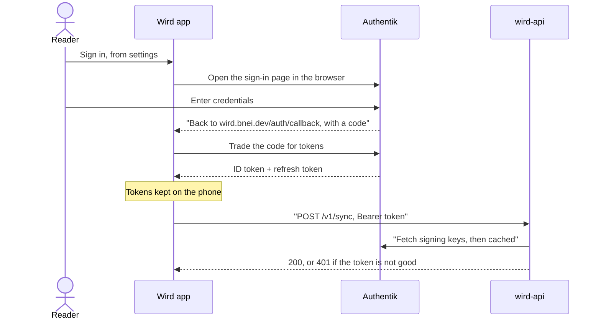
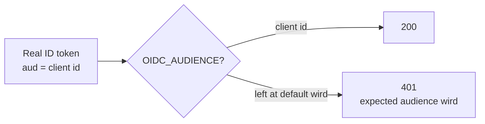

# Auth

> How a request proves who it is: the app signs in to Authentik with PKCE, and the API checks the token against the issuer's keys. Level L2 · Parent [API](../api.md) · Children none

## Black box

Signing in is optional. Reading, praying and marking ayas all work without an account. An account only gives the **outbox** somewhere to land.

The app signs the reader in at Authentik and keeps the tokens on the phone. Every sync request carries one as a bearer token. The API never mints tokens. It only checks the one it is given, then finds or creates the reader it names.

| In | Out | Depends on |
|---|---|---|
| A reader tapping "sign in" in settings | Tokens stored on the device | Authentik, as the identity provider |
| A request to `/v1/...` with `Authorization: Bearer <token>` | The request, now tied to one reader, or a 401 | The issuer's discovery document and signing keys |
| | | Postgres, to find or create the reader |



Some routes are open and need no token at all: `/healthz`, `/auth/callback`, `/v1/senses`, `/models/` and the App Link file. Every other path goes through the check.

## White box

```mermaid
flowchart LR
  subgraph app["app/lib/data/auth.dart"]
    begin["Account.begin<br/>verifier + state + challenge"]
    complete["Account.complete<br/>check state"]
    exchange["_exchange<br/>POST token endpoint"]
    handover["_handOver<br/>new reader? clear device"]
    table[("sqflite<br/>auth_tokens")]
    token["Account.token<br/>refresh if spent"]
    header["AuthHeader<br/>Dio interceptor"]
  end
  subgraph server["server"]
    mw["auth.Middleware"]
    verify["go-oidc Verify<br/>signature, iss, aud, exp"]
    ensure["store.EnsureUser"]
    v1["v1 handlers"]
  end
  begin --> complete --> exchange --> handover --> table
  table --> token --> header
  header -->|"Bearer ID token"| mw --> verify --> ensure --> v1
  header -.->|"401: refresh once, retry"| token
```



### 1. The app starts a sign-in

The app is a **public client**: it holds no secret. PKCE stands in for one. The app makes a random verifier, sends only its SHA-256 hash, and keeps the verifier in memory until the reader comes back. The `state` value guards the return trip.

```dart
    final verifier = _randomToken();
    final state = _randomToken();
    final url = Uri.parse(await _endpoint('authorization_endpoint')).replace(
      queryParameters: {
        'response_type': 'code',
        'client_id': clientId,
        'redirect_uri': redirect,
        'scope': _scopes,
        'state': state,
        'code_challenge': _challenge(verifier),
        'code_challenge_method': 'S256',
      },
    );
```

[auth.dart:202-214](../../../app/lib/data/auth.dart#L202-L214)

The endpoints come from the issuer's discovery document, not from string joins, because Authentik does not put them under the issuer path ([auth.dart:328-334](../../../app/lib/data/auth.dart#L328-L334)). The issuer, client id and redirect are compile-time defines, so a debug run can point at the local stub ([auth.dart:23-58](../../../app/lib/data/auth.dart#L23-L58)). The redirect is `https://wird.bnei.dev/auth/callback`, an App Link, and it must match the Authentik registration character for character. The settings panel starts the flow and listens for the link before the browser opens ([account_panel.dart:110-113](../../../app/lib/features/settings/account_panel.dart#L110-L113)).

### 2. The code comes back and is traded for tokens

The returned `state` must match the one the app made. Otherwise any link could sign the device in as someone else. Then the code and the verifier go to the token endpoint.

```dart
    final code = answer['code'];
    if (code == null || answer['state'] != begun.state) {
      throw const AuthFailed('that address did not come from this sign-in');
    }
    return _exchange({
      'grant_type': 'authorization_code',
      'code': code,
      'redirect_uri': redirect,
      'client_id': clientId,
      'code_verifier': begun.verifier,
    });
```

[auth.dart:228-238](../../../app/lib/data/auth.dart#L228-L238)

The scopes ask for `offline_access`, which is what brings a refresh token back. A phone that spends a week mostly offline stays signed in because of it ([auth.dart:64](../../../app/lib/data/auth.dart#L64)).

### 3. The tokens are stored in sqflite

There is no secure-storage plugin. The tokens live in one row of an `auth_tokens` table in the app's own database ([auth.dart:103-110](../../../app/lib/data/auth.dart#L103-L110)). Writing the row and handing the device over happen in one transaction.

```dart
    await db.transaction((txn) async {
      await _handOver(txn, sub);
      await txn.insert('auth_tokens', {
        'id': 1,
        'subject': tokens.subject,
        'id_token': tokens.idToken,
        'refresh_token': tokens.refreshToken,
        'expires_at': tokens.expiresAt.toIso8601String(),
      }, conflictAlgorithm: ConflictAlgorithm.replace);
    });
```

[auth.dart:315-324](../../../app/lib/data/auth.dart#L315-L324)

`_handOver` compares the token's `sub` with the last reader this device knew. The same reader coming back keeps everything. A different reader clears the reader's own tables, including the outbox and the record of which senses were judged, so one person's notes never show on another's screen ([auth.dart:399-419](../../../app/lib/data/auth.dart#L399-L419)). Signing out deletes the tokens row and nothing else ([auth.dart:254-257](../../../app/lib/data/auth.dart#L254-L257)).

### 4. Every sync request carries the ID token

The token the device sends is the **ID token**, not the access token. This was settled by experiment: the API checks `aud` against the client id, and only the ID token carries it ([auth.dart:66-75](../../../app/lib/data/auth.dart#L66-L75)). A token that expires within a minute is refreshed first.

```dart
  Future<String?> token({bool force = false}) async {
    final held = await current();
    if (held == null) return null;
    if (!force &&
        held.expiresAt.isAfter(
          DateTime.now().add(const Duration(minutes: 1)),
        )) {
      return held.idToken;
    }
    return _refresh(held);
  }
```

[auth.dart:188-198](../../../app/lib/data/auth.dart#L188-L198)

A Dio interceptor is the only place a token is attached ([auth.dart:465-472](../../../app/lib/data/auth.dart#L465-L472)), and only the sync client has it ([flush.dart:193](../../../app/lib/data/flush.dart#L193)). On a 401 it refreshes once and retries on a plain client, so it cannot loop ([auth.dart:480-498](../../../app/lib/data/auth.dart#L480-L498)). Only a 400 on the refresh itself signs the reader out. A lost network leaves the account alone ([auth.dart:269-277](../../../app/lib/data/auth.dart#L269-L277)).

### 5. The API builds a verifier from the issuer

At start-up the API reads the issuer's discovery document through `coreos/go-oidc`, which then fetches and caches the JWKS. The audience it expects is the verifier's `ClientID`.

```go
func New(ctx context.Context, issuer, audience string, users *store.Store, log *slog.Logger) (*Authenticator, error) {
	provider, err := oidc.NewProvider(ctx, issuer)
	if err != nil {
		return nil, err
	}
	return &Authenticator{
		verifier: provider.Verifier(&oidc.Config{ClientID: audience}),
		users:    users,
		log:      log,
	}, nil
}
```

[auth.go:27-37](../../../server/internal/auth/auth.go#L27-L37)

Both values come from the environment, `OIDC_ISSUER` and `OIDC_AUDIENCE` ([main.go:29-30](../../../server/cmd/api/main.go#L29-L30)). Swapping the local stub for the real Authentik is one variable, and no code on this path knows which it talks to.

### 6. The middleware checks, then finds the reader

The middleware wraps the whole `v1` mux, which answers every path the open routes do not claim ([api.go:40-78](../../../server/internal/api/api.go#L40-L78)). It refuses a missing bearer, then verifies signature, issuer, audience and expiry. Only a verified token's subject is trusted.

```go
		token, err := a.verifier.Verify(r.Context(), raw)
		if err != nil {
			a.log.Info("token refused", "err", err)
			httpx.Error(w, http.StatusUnauthorized, "token rejected")
			return
		}
		if token.Subject == "" {
			httpx.Error(w, http.StatusUnauthorized, "token rejected")
			return
		}
		user, err := a.users.EnsureUser(r.Context(), token.Subject)
```

[auth.go:51-61](../../../server/internal/auth/auth.go#L51-L61)

`EnsureUser` finds the reader by subject, or creates one on first contact ([store.go:74](../../../server/internal/store/store.go#L74)). Handlers read the reader back with `auth.User` ([auth.go:82-85](../../../server/internal/auth/auth.go#L82-L85)).

### 7. The `OIDC_AUDIENCE` trap



The local default audience is `wird`. A real Authentik ID token carries the **client id** in `aud`, not `wird`. Left at the default, the API refuses every real token with `expected audience "wird"`. The deployed values set `OIDC_AUDIENCE` to the client id ([values.yaml:149-158](../../../helm/values.yaml#L149-L158)).

The check matters more than usual here. The identity provider signs tokens for many apps with one key, so a valid signature alone proves little. Only `aud` and `iss` tell a Wird token from another app's.

### 8. Locally, a stub stands in for Authentik

`docker compose up -d postgres oidc-stub` starts `mock-oauth2-server` on port 8082 ([docker-compose.yml:23-29](../../../docker-compose.yml#L23-L29)). It serves discovery and JWKS and signs a token for any login, which is all the verifier needs. The API's default issuer points at it.

The stub behaves like Authentik in one way that matters: its ID token carries the client id in `aud`, and its access token carries `default`. That is how the ID-token choice in step 4 was proved.

## Why it is this way

- [ADR 0001](../../adr/0001-stack.md) — Authentik as the identity provider, with a public client and PKCE, because a phone cannot keep a secret.
- [ADR 0004](../../adr/0004-the-operations-view-behind-authentiks-group.md) — the operations view uses the same verifier shape, with its own audience.
- PKCE is hand-rolled over Dio, and tokens live in sqflite, instead of using `flutter_appauth` and `flutter_secure_storage` ([auth.dart:101-110](../../../app/lib/data/auth.dart#L101-L110)).
- One redirect only, an App Link on `wird.bnei.dev`. A custom URL scheme can be claimed by any app, and PKCE does not stop a copycat running its own flow ([auth.dart:45-54](../../../app/lib/data/auth.dart#L45-L54)).

## Go deeper

- [Authentik wiring](../../guides/authentik-wiring.md) — the real client, [the two traps](../../guides/authentik-wiring.md#the-two-traps), and how to check tokens against the real issuer.
- [Sync endpoints](sync-endpoints.md) — what a verified request can do next.
- [Sync](../app/sync.md) — the outbox that sends these requests.
- [Admin web](../adminweb.md) — the same JWKS check, gated on a group.
- Tour: [Signing in](../../tours/signing-in.md).
