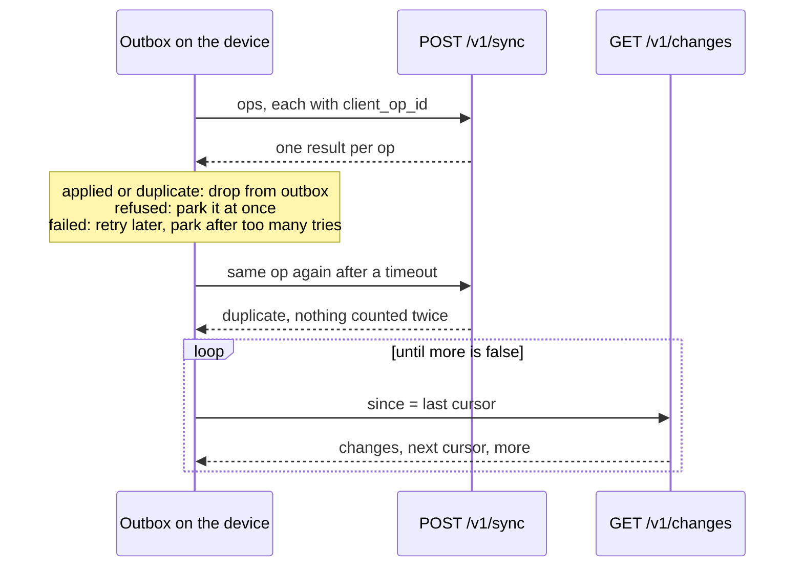
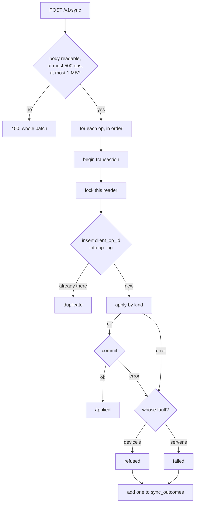
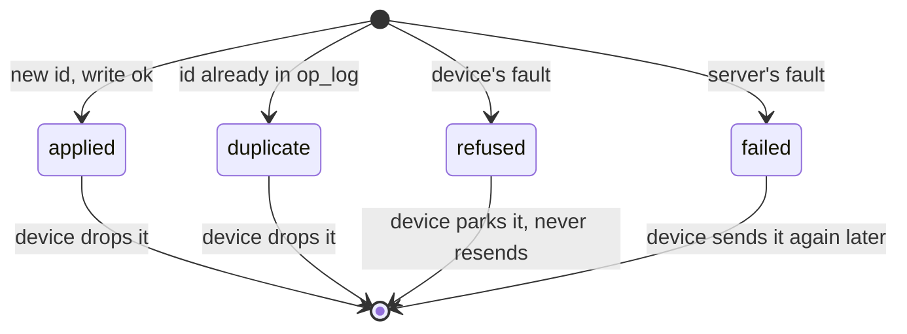
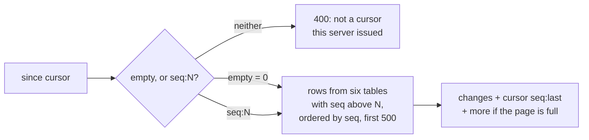
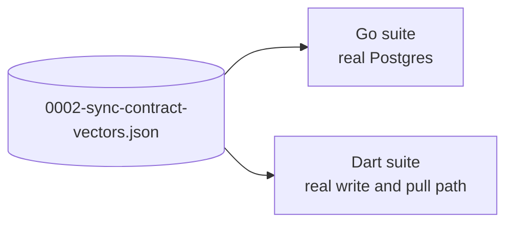

# Sync endpoints

> The server side of `POST /v1/sync` and `GET /v1/changes`: where the outbox lands, and where a second device catches up. Level L2 · Parent [API](../api.md) · Children none

## Black box

These two endpoints are the whole of sync. The app's outbox sends every write through `POST /v1/sync`, online or not, and gets one verdict back per write. A device then asks `GET /v1/changes` for everything that changed since its cursor, so a phone and a tablet end up holding the same state. Both need a bearer token. The client half is [Sync in the app](../app/sync.md).

| In | Out | Depends on |
|---|---|---|
| A batch of ops, each with a device-minted `client_op_id`, a kind and a body | One result per op: `applied`, `duplicate`, `refused` or `failed` | A signed-in reader (see [Auth](auth.md)) |
| A cursor from the last pull, or none | Up to 500 changed rows, the next cursor, and whether more are waiting | Postgres |



Three promises hold from outside:

- **Sending an op twice is safe.** The second send answers `duplicate` and changes nothing.
- **One bad op never blocks the rest.** Each op gets its own verdict. The whole batch fails only when it is unreadable, has more than 500 ops, is over one megabyte, or the database cannot be reached at all.
- **A pull never misses a write.** The cursor follows the order writes land on the server, not the device's clock. A write made offline on Monday and sent on Friday still reaches a tablet that last pulled on Wednesday.

## White box



### 1. The handler reads the batch and hands it over

`sync` caps the body at one megabyte and the batch at 500 ops, then passes the ops to the store. Only an unreadable or oversized batch is refused whole with a 400. If the store cannot even open a transaction, the whole batch answers 500. [sync.go:28-46](../../../server/internal/api/sync.go#L28-L46)

```go
	if err := json.NewDecoder(http.MaxBytesReader(w, r.Body, maxSyncBody)).Decode(&batch); err != nil {
		httpx.Error(w, http.StatusBadRequest, "the batch is not readable")
		return
	}
	if len(batch.Ops) > maxOpsPerBatch {
		httpx.Error(w, http.StatusBadRequest, "too many ops in one batch")
		return
	}
	results, err := h.store.Apply(r.Context(), auth.User(r.Context()).ID, batch.Ops)
	if err != nil {
		h.fail(w, "sync", err)
		return
	}
	httpx.JSON(w, http.StatusOK, map[string]any{"results": results})
```

An op is three fields: `client_op_id`, `kind` and a raw `body`. [store/sync.go:23-27](../../../server/internal/store/sync.go#L23-L27)

### 2. Each op gets its own transaction

`Apply` walks the ops in order and lands each one alone. [store/sync.go:55-65](../../../server/internal/store/sync.go#L55-L65) Inside the transaction, three things happen in a fixed order. [store/sync.go:104-119](../../../server/internal/store/sync.go#L104-L119)

```go
func applyInTx(ctx context.Context, tx pgx.Tx, userID string, op Op) OpResult {
	if err := lockReader(ctx, tx, userID); err != nil {
		return classify(op, err)
	}
	first, err := recordOp(ctx, tx, userID, op.ClientOpID)
	if err != nil {
		return classify(op, err)
	}
	if !first {
		return OpResult{ClientOpID: op.ClientOpID, Status: OpDuplicate}
	}
	if err := applyKind(ctx, tx, userID, op); err != nil {
		return classify(op, err)
	}
	return OpResult{ClientOpID: op.ClientOpID, Status: OpApplied}
```

The transaction only commits when the op was `applied`. So the `op_log` row and the write it stands for commit together or not at all. If they could split, a retry would look like a replay and the write would be lost. [store/sync.go:84-99](../../../server/internal/store/sync.go#L84-L99)

### 3. Idempotence: the op log

`op_log` has the key `(user_id, client_op_id)`. Inserting an id that is already there does nothing, and that is how a replay is spotted. [00001_user_state.sql:71-76](../../../server/migrations/00001_user_state.sql#L71-L76), [store.go:337-345](../../../server/internal/store/store.go#L337-L345)

```go
	tag, err := q.Exec(ctx, `
		INSERT INTO op_log (user_id, client_op_id) VALUES ($1, $2)
		ON CONFLICT DO NOTHING`, userID, clientOpID)
	if err != nil {
		return false, err
	}
	return tag.RowsAffected() == 1, nil
```

The API prunes op log rows older than 90 days ([store.go:348](../../../server/internal/store/store.go#L348)). A replay older than that is still safe for most kinds, because the writes themselves are upserts or skip rows already there. A report is the exception: replayed that late, it would land twice. [store/sync.go:525-528](../../../server/internal/store/sync.go#L527-L530) A prayer with no id of its own takes the op id as its row id, so even that replay lands on the same row. [store/sync.go:453-458](../../../server/internal/store/sync.go#L455-L460)

### 4. The reader lock keeps the cursor honest

Before anything else, the transaction takes an advisory lock on the reader. A sequence number is handed out when a row is written, not when it commits. Without the lock, two writes in flight could commit in the opposite order to their numbers, and a device whose cursor had passed the lower number would never see that row. With it, one reader's writes land one at a time. [store/sync.go:121-141](../../../server/internal/store/sync.go#L121-L141)

The same lock makes the server-assigned set `ordinal` safe: `MAX(ordinal) + 1` cannot race. [store/sync.go:359-388](../../../server/internal/store/sync.go#L361-L390)

### 5. Apply by kind

`applyKind` dispatches on the op's kind. An unknown kind is refused. [store/sync.go:177-196](../../../server/internal/store/sync.go#L177-L198)

| Kind | What it writes | Rule |
|---|---|---|
| `ayah_understood` | One row per aya in `ayah_understood` | Each aya id must fold into a sūra from 1 to 114; already-understood ayas are skipped. [L228](../../../server/internal/store/sync.go#L230) |
| `kept_upsert` | A `kept_items` row | Last write wins on `updated_at`; another reader's item never moves. [L275](../../../server/internal/store/sync.go#L277) |
| `kept_delete` | Sets `deleted_at` on a `kept_items` row | A tombstone, never a delete. [L299](../../../server/internal/store/sync.go#L301) |
| `set_prayed` | The set, if the body carries its range, and the prayer | With a range, the set id is recomputed and must match. Either way the set must exist. [L425](../../../server/internal/store/sync.go#L427) |
| `set_recorded` | A set | Old shape, kept so old phones can drain their queue. [L396](../../../server/internal/store/sync.go#L398) |
| `prefs_set` | The reader's `user_prefs` | Reading order must be `mushaf` or `nuzul`; last write wins. [L570](../../../server/internal/store/sync.go#L572) |
| `position_moved` | The reader's `reading_positions` row for that sūra | The word must belong to the sūra; the time must be set and no more than five minutes ahead of the server; last write wins. [L600](../../../server/internal/store/sync.go#L600) |
| `report_written` | A row in `report_inbox`, with no reader attached | Swept into `reports` later, on a clock. [L493](../../../server/internal/store/sync.go#L495) |

Every body is decoded strictly. One unknown field refuses the op. [store/sync.go:219-226](../../../server/internal/store/sync.go#L221-L228)

```go
func decode(body json.RawMessage, into any) error {
	decoder := json.NewDecoder(bytes.NewReader(body))
	decoder.DisallowUnknownFields()
	if err := decoder.Decode(into); err != nil {
		return refuse("%s", err)
	}
	return nil
}
```

This is why the app must never send a new field before the server that accepts it is live.

### 6. Refused or failed

`classify` splits errors into two answers. `refused` means the device sent something that will never land: a bad body, a bad value, a missing set. Postgres data errors (class 22) and constraint errors (class 23) count as refused too. Anything else is `failed`, which the device should retry. [store/sync.go:146-154](../../../server/internal/store/sync.go#L146-L154)



The reason sent back never names a table or a statement. [store/sync.go:158-175](../../../server/internal/store/sync.go#L158-L175) Refused and failed ops are counted per day, kind and verdict in `sync_outcomes`, with no reader attached, so the operations view can see that syncs fail without seeing whose. [store/sync.go:210-217](../../../server/internal/store/sync.go#L212-L219)

### 7. The pull: `GET /v1/changes`



The six tables the pull reads each carry a `seq` column fed by one sequence, `change_seq`. Each insert takes the next number, and each update of a kept item, of preferences or of a reading position takes a fresh one. [00003_change_order.sql:11-17](../../../server/migrations/00003_change_order.sql#L11-L17), [store/sync.go:290](../../../server/internal/store/sync.go#L292), [store/sync.go:311](../../../server/internal/store/sync.go#L313), [store/sync.go:586](../../../server/internal/store/sync.go#L588) `root_known` has no `seq` and is not in the stream.

The query unions `ayah_understood`, `kept_items`, `sets`, `set_prayers`, `user_prefs` and `reading_positions`, orders by `seq`, and stops at 500 rows. A kept item with `deleted_at` set is sent like any other row: that row is the tombstone. [store/sync.go:613-642](../../../server/internal/store/sync.go#L656-L689)

The cursor is the text `seq:` followed by the last number sent. A cursor without that prefix is refused with a 400 rather than read as some place in the stream. [store/sync.go:689-708](../../../server/internal/store/sync.go#L736-L755)

```go
func parseCursor(cursor string) (int64, error) {
	if cursor == "" {
		return 0, nil
	}
	rest, found := strings.CutPrefix(cursor, cursorPrefix)
	if !found {
		return 0, ErrBadCursor
	}
	seq, err := strconv.ParseInt(rest, 10, 64)
	if err != nil || seq < 0 {
		return 0, ErrBadCursor
	}
	return seq, nil
}
```

When a page comes back empty, the cursor the device sent is returned unchanged. `more` is true only when the page is full. [store/sync.go:675-678](../../../server/internal/store/sync.go#L722-L725) The endpoint writes nothing.

### 8. One file both sides answer to

Four things cross the device and server boundary with no compiler to check them: the op body field names, the four result words, the six change kinds with their row keys, and the two reading-order words. They are written once, in [0002-sync-contract-vectors.json](../../adr/0002-sync-contract-vectors.json). The Go suite lands every op body against a real Postgres and requires `applied`, and checks the stream emits exactly those kinds and keys. [sync_contract_vectors_test.go:79](../../../server/internal/store/sync_contract_vectors_test.go#L79), [sync_contract_vectors_test.go:144](../../../server/internal/store/sync_contract_vectors_test.go#L144) The Dart suite reads the same file. [sync_contract_vectors_test.dart](../../../app/test/data/sync_contract_vectors_test.dart)



A change on one side reddens that side's suite. Following it into the file reddens the other. Change the file and both suites in one commit.

## Why it is this way

- [ADR 0001](../../adr/0001-stack.md) — the server is the source of truth for user state; the app keeps an outbox so prayer never waits on a socket.
- [ADR 0002](../../adr/0002-set-identity.md) — set ids are derived, a prayer is one op, and the contract vectors exist because each side's tests only agreed with themselves.
- [ADR 0004](../../adr/0004-the-operations-view-behind-authentiks-group.md) — why a report reaches an inbox with no reader, and why outcomes are counted only in totals.

## Go deeper

- [Sync in the app](../app/sync.md) — the outbox, the flush, and what the device does with each verdict.
- [API](../api.md) — the rest of the service these endpoints live in.
- [Auth](auth.md) — how the reader behind the bearer token is found.
- Tour: [A prayer, from tap to Postgres](../../tours/prayer-to-postgres.md).
