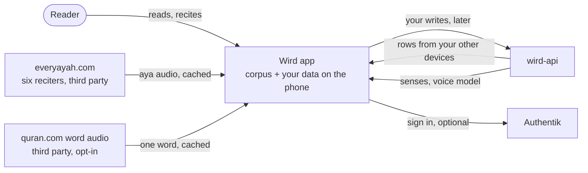
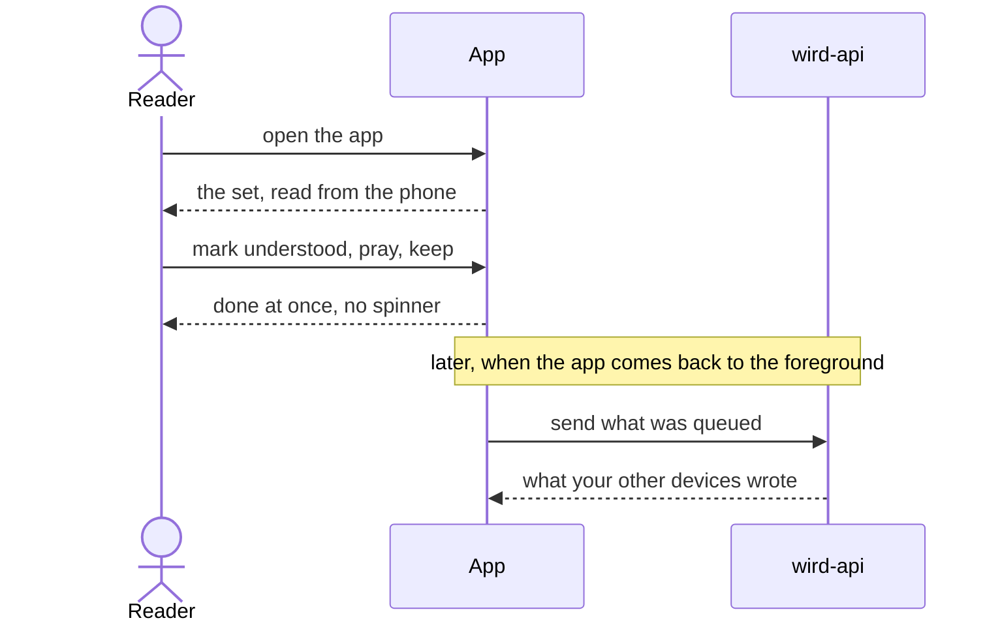
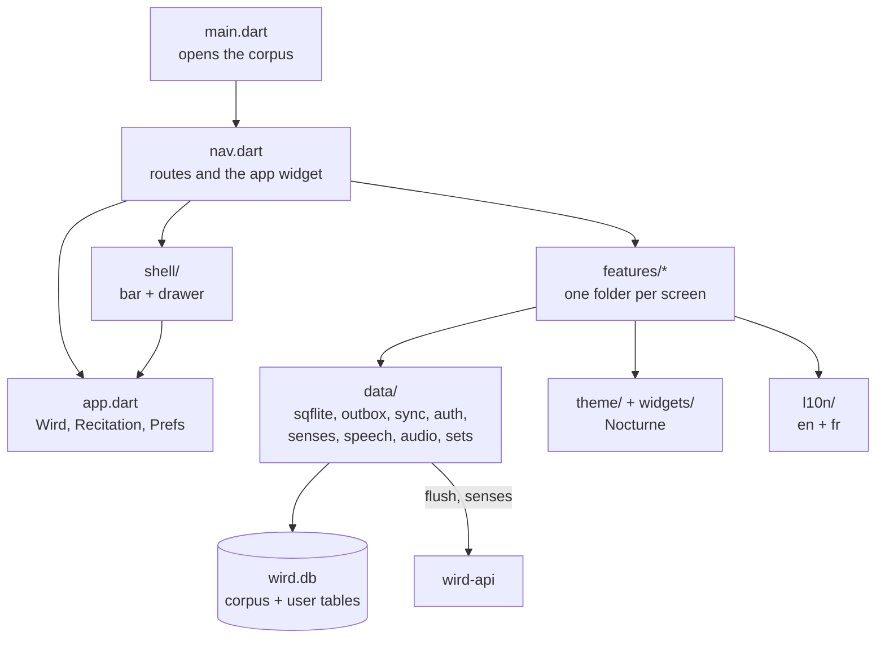
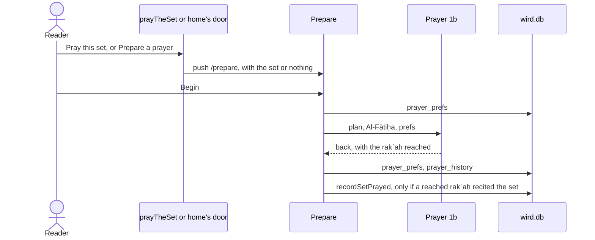
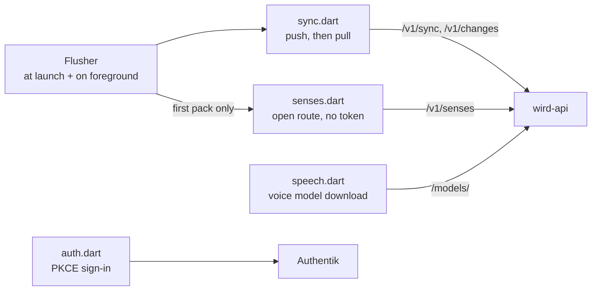

# App

> The Flutter client: it carries the corpus, builds each set, follows your voice and queues your writes for the server. Level L1 · Parent [Overview](../README.md) · Children [Sync](app/sync.md), [Sets and reader](app/sets-and-reader.md), [Voice-follow](app/voice-follow.md), [Senses in the app](app/senses.md)

## Black box

The app is what the reader holds. It runs on iOS, Android, tablets and macOS. Everything a screen reads is already on the phone: the Quran text, the word-by-word data and the reader's own progress. The network is only used around the prayer. No screen waits on it, and the prayer screen never does.

The reader is the only caller. The app talks to three outside parties, and none of them is on the path of a screen: `wird-api` for your writes and for the senses, Authentik when you choose to sign in, and two third-party audio hosts when you play audio: everyayah.com for the reciter you chose, and quran.com's word-by-word recordings if you asked to hear each word alone.

| In | Out | Depends on |
|---|---|---|
| Taps, drags, your voice while you recite | Screens: the set, the prayer, a root, progress, kept items | The **corpus**, bundled inside the app |
| The senses pack from `wird-api` | Your writes (understood, kept, prayed, reading order, reports), sent through the **outbox** | `wird-api` at `wird.bnei.dev`, when a network is there |
| Rows another of your devices wrote | Nothing at all during a prayer | Authentik, only if you sign in |



What the reader gets from this shape:



A reader in airplane mode can read a set, pray it, open any root and see their progress. Nothing is lost. The queued writes leave the next time the app comes to the foreground with a network.

## White box

The code lives in `app/lib`. It is split by what outlives a screen and what does not.



| Folder | What is in it |
|---|---|
| `data/` | Everything that touches the database or the network. Screens call into it; it never draws. |
| `features/` | One folder per screen: `dashboard`, `study` (1a), `prayer` (the preparation and 1b), `root` (3a, 2b), `deepdive` (1c), `progress` (1d), `kept` (1e), `index`, `settings`, `report`, `about`. |
| `shell/` | The bar and drawer drawn around each destination screen. |
| `theme/`, `widgets/` | The Nocturne tokens and the few shared controls built on them. Dark only. |
| `l10n/` | English and French strings. The reader's choice decides, and their phone's until they make one. |

### 1. Startup opens the corpus before anything routes

`main` builds `WirdApp`, which waits on one future: open the database, read the reader's preferences, and build the thing that flushes the queue. Until that resolves there is nothing to route to, so the app shows a bare frame. The first launch waits on a file copy, not on a network call.

```dart
typedef Bootstrap = ({Database db, Prefs prefs, Flusher flusher});

Future<Bootstrap> _open(Future<Database> corpus) async {
  final db = await corpus;
  return (db: db, prefs: await Prefs.read(db), flusher: flusherFor(db));
}
```

[main.dart:16](../../app/lib/main.dart#L16-L21) · the bare frames: [main.dart:41](../../app/lib/main.dart#L41-L58)

### 2. The bundled corpus becomes the one database

The **corpus** ships as `assets/corpus.db`. sqflite cannot open an asset in place, so the first launch copies it out to `wird.db`. The copy goes to a `.part` file and is renamed, so an interrupted copy never leaves a half-written corpus behind.

```dart
Future<void> installCorpus(File target, Uint8List bytes) async {
  await target.parent.create(recursive: true);
  final partial = File('${target.path}.part');
  await partial.writeAsBytes(bytes, flush: true);
  await partial.rename(target.path);
}
```

[db.dart:164](../../app/lib/data/db.dart#L164-L169) · [openWird, db.dart:22](../../app/lib/data/db.dart#L22-L46)

A phone that already holds an older corpus is upgraded on launch. When the app's `bundledCorpusVersion` is above the installed `corpus_meta.corpus_version`, [`upgradeCorpus`](../../app/lib/data/db.dart#L84-L106) fills the new corpus in `wird.db.next`, copies across every table the corpus does not ship and the senses fetched into `root_notes`, then swaps the files by rename. If anything fails before the swap, the old file is kept and the next launch tries again.

Then [openWirdAt](../../app/lib/data/db.dart#L173) creates the user tables inside that same file: understood ayas, preferences, sets, prayers, how the last prayer was prepared, the passages recited, the senses pack and the **outbox**. Progress is a join between your rows and corpus rows, which is why there is one file and no ATTACH.

The copy only happens when `wird.db` is missing. A later app update with a newer corpus does not replace it.

### 3. One layer above the navigator holds what outlives a screen

`wirdApp` wraps the navigator in two widgets. `Wird` holds the database, the recitation player and the preferences. `Flushing` holds the flusher for as long as the app is up. A test or the gallery passes no flusher, because there is no server to reach.

```dart
}) => Wird(
  db: db,
  prefs: prefs,
  recitation: recitation ?? Recitation(),
  child: Flushing(
    flusher: flusher,
```

[nav.dart:202](../../app/lib/nav.dart#L202-L236) · [Wird, app.dart:20](../../app/lib/app.dart#L22-L46) · [Prefs, app.dart:273](../../app/lib/app.dart#L332)

### 4. Routes: destinations get the shell, pushed screens do not

Every screen is registered by name in one map. The drawer lists the destinations. A destination is drawn inside `WirdShell`, which carries the bar, the drawer and the audio transport. A screen you push into, such as a root or the prayer, carries its own way back and gets no shell. That is how screen 1b is kept free of anything drawn over the aya.

```dart
    builder: (_) {
      final screen = build(db, arguments);
      return isDestination(settings.name)
          ? WirdShell(
              route: settings.name!,
              step: step,
              bar: shellDrawsTheBar(settings.name!),
              child: screen,
            )
          : screen;
    },
```

[nav.dart:168](../../app/lib/nav.dart#L168-L195) · [the route map, nav.dart:75](../../app/lib/nav.dart#L75-L105) · [the drawer list, nav.dart:115](../../app/lib/nav.dart#L115-L124) · [WirdShell](../../app/lib/shell/wird_shell.dart#L23)

### 5. A prayer is prepared, then recorded on the way back from it

A prayer starts on the preparation screen. "Pray this set" opens it on that set, through `prayTheSet` ([app.dart:453](../../app/lib/app.dart#L540-L544)), and home's "Prepare a prayer" door opens it with no set. The preparation screen pushes screen 1b, which writes nothing. When the reader comes back, however they left, the preparation screen writes what the prayer reached, then closes. A prayer the reader never returns from is not counted: the count may be short, never invented.



```dart
    final recited = <String, StudySet>{};
    for (var r = 1; r <= outcome.reached && r <= plan.rakahs; r++) {
      final set = plan.passageFor(r);
      if (set != null) recited[set.id] = set;
    }
    for (final set in recited.values) {
      await notePassageRecited(db, set);
    }
    if (plan.credited case final set? when recited.containsKey(set.id)) {
      await recordSetPrayed(db, set);
    }
```

[prepare_screen.dart:299](../../app/lib/features/prayer/prepare_screen.dart#L299-L314)

`prayer_prefs` and `prayer_history` stay on the phone. Only `recordSetPrayed` queues an op. [Sets and reader](app/sets-and-reader.md#9-praying-a-set) says which set is credited.

That write, like every other write, goes to the **outbox** inside the same transaction as the local rows. [Sync](app/sync.md) takes it from there.

### 6. The network, and who calls it

Four parts of `data/` leave the phone, and no screen awaits any of them while you pray. At the foreground moment the flusher fetches the senses only when the phone holds none yet: [flush.dart:144](../../app/lib/data/flush.dart#L144-L154). Audio playback is the fifth, fetched from the two audio hosts into one capped cache; it never reaches `wird-api`. Which reciter, and whether a word plays alone, is a device-local choice in Settings ([ADR 0023](../adr/0023-six-reciters-and-a-word-by-word-voice.md)). Each reciter can be heard on the basmala before choosing, through `Recitation.sample`, which fetches one file without touching the set's pins. While a set plays, the bar names who recites it. The reading screen's button and the bar both pause and resume where the recitation stopped, and the aya being read has its own button, beside its number, that recites it alone.



- The queue and the pull: [Sync](app/sync.md).
- What a root means: [Senses in the app](app/senses.md).
- The recogniser and its model: [Voice-follow](app/voice-follow.md).
- The server's origin is one define, `WIRD_ORIGIN`, defaulting to `https://wird.bnei.dev`: [flush.dart:21](../../app/lib/data/flush.dart#L21-L24).

## Why it is this way

- [ADR 0001](../adr/0001-stack.md) — Flutter against a Go server; the phone owns the corpus and keeps an outbox so 1b never waits on a socket.
- [ADR 0002](../adr/0002-set-identity.md) — a set's id is derived, and one op records a prayer.
- [ADR 0003](../adr/0003-addressable-reader.md) — screen 1a is addressable and changes in place.
- [ADR 0006](../adr/0006-a-passage-is-read-a-set-is-answered-for.md) — a passage is read; a set is answered for.
- [ADR 0020](../adr/0020-a-prayer-is-prepared-then-recited-one-rakah-at-a-time.md) — a prayer is prepared, then recited one rakʿah at a time; the set is credited only if a reached rakʿah recited it.
- [ADR 0010](../adr/0010-the-server-owns-the-roots-and-their-senses.md) — senses come from the server, not the bundle.

## Go deeper

- [Sync](app/sync.md) — the **outbox**, the flush, and the pull.
- [Sets and reader](app/sets-and-reader.md) — how a set is chosen and read.
- [Voice-follow](app/voice-follow.md) — the on-device recogniser.
- [Senses in the app](app/senses.md) — fetching and showing what a root means.
- Server side: [API](api.md), [Sync endpoints](api/sync-endpoints.md).
- Tours that pass here: [A prayer, from tap to Postgres](../tours/prayer-to-postgres.md), [Following your voice](../tours/following-your-voice.md).
