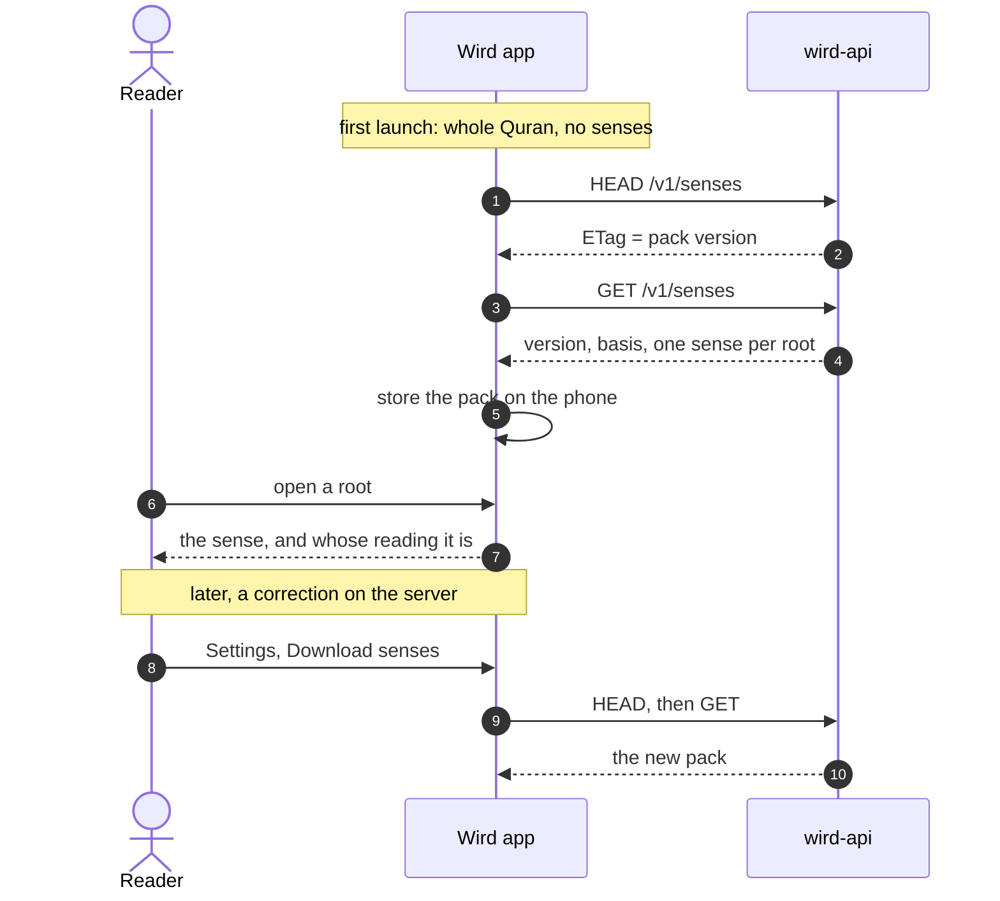
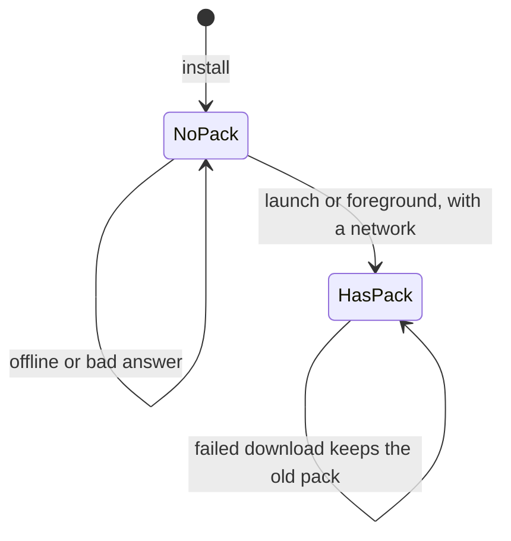
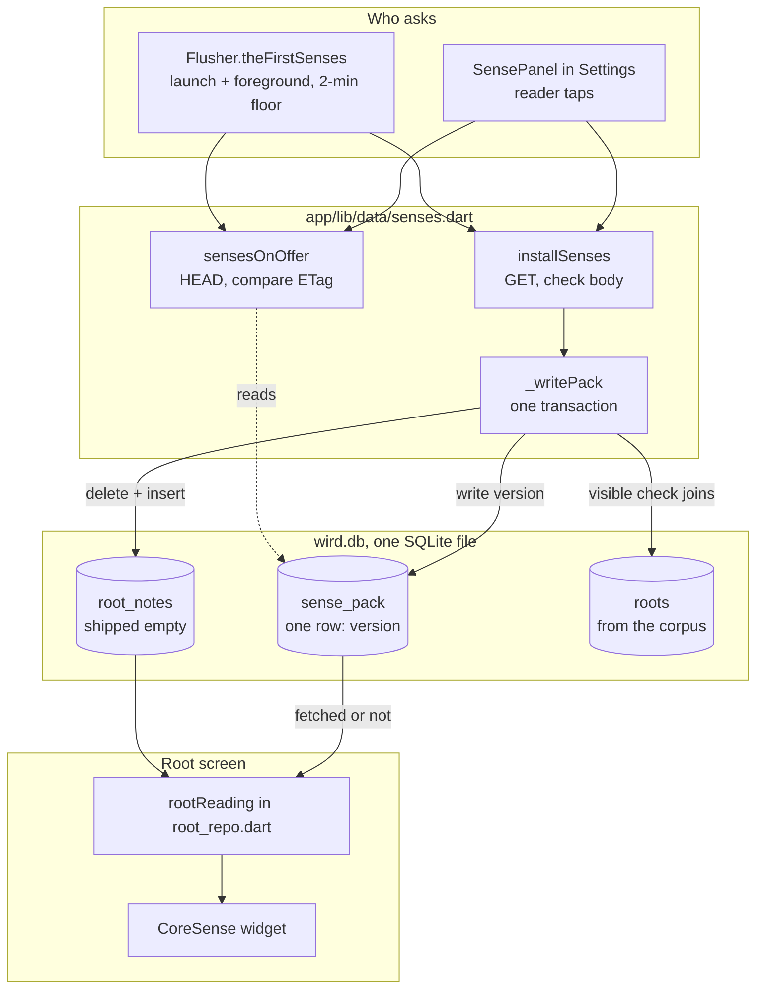
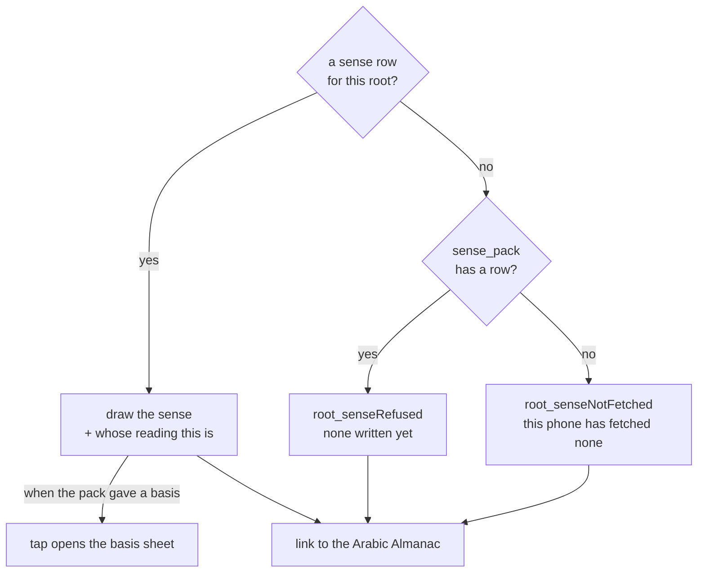
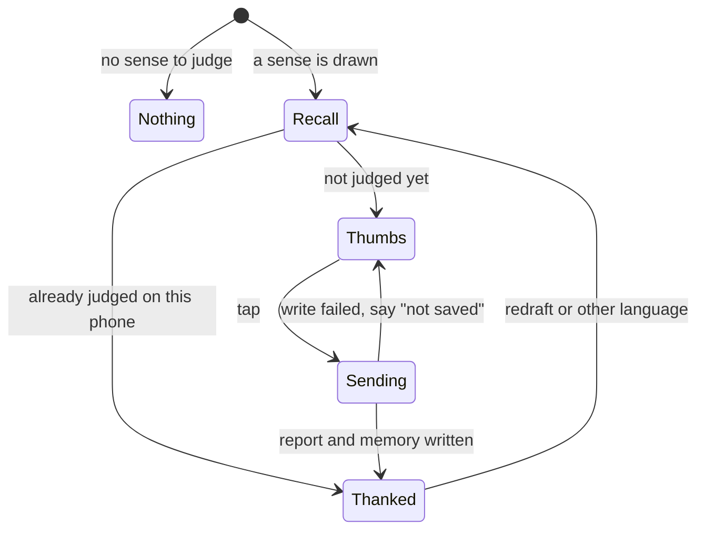

# Senses in the app

> How the app fetches the senses from the server, stores them next to the corpus, and shows them on a root. Level L2 · Parent [App](../app.md) · Children none

## Black box

The corpus bundled in the app carries every root but no senses. The senses come from the server, as one pack holding the senses for the roots. The app fetches the first pack by itself, quietly, the first time it has a network. After that, a newer pack moves only when the reader asks for it in Settings. The root screen then shows the sense, or explains why there is none.

| In | Out | Depends on |
|---|---|---|
| The sense pack from `GET /v1/senses`, and its version from `HEAD /v1/senses` | The sense and its "whose reading this is" line on every root screen | The API's open senses route ([Senses pipeline](../pipelines/senses.md)) |
| The app coming back to the foreground | The version of the pack this phone holds | The corpus's list of roots, to prove the pack fits |
| A thumb up or down on a sense | A sense verdict, queued in the **outbox** as a report | The outbox, which sends it whenever there is a network and someone is signed in |
| A tap on the Settings download button | | No account, no sign-in |



With no network the app still opens and the reader can pray. A root simply says that this phone has not fetched any senses yet.



| State | What a root without a sense says |
|---|---|
| NoPack | This phone has not fetched any senses yet. Settings carries the button. |
| HasPack | None has been written for this root yet. |

## White box



### 1. Two moments start a fetch

The `Flusher` runs on launch and every time the app returns to the foreground. Beside the sync flush, it starts `theFirstSenses`. The two run apart, because a phone with nobody signed in gets 401 on every flush, and the senses route needs no token.

```dart
  void _inTheBackground() {
    unawaited(flush().catchError((Object _) => null));
    unawaited(theFirstSenses().catchError((Object _) => null));
  }
```
[flush.dart:108](../../../app/lib/data/flush.dart#L104-L107)

`theFirstSenses` only fetches for a phone that holds no pack at all. It joins a fetch already running, and waits at least two minutes between tries, so a pack that keeps failing does not download 800 KB on every unlock. It never draws anything, because this moment can come while the reader is praying.

```dart
  Future<void> theFirstSenses() async {
    final running = _fetchingSenses;
    if (running != null) return running;
    final last = _lastSenses;
    if (last != null && DateTime.now().difference(last) < gap) return;
    if ((await db.query('sense_pack', limit: 1)).isNotEmpty) return;
    _lastSenses = DateTime.now();
    final run = _fetchTheFirstSenses();
    _fetchingSenses = run;
    return run.whenComplete(() => _fetchingSenses = null);
  }
```
[flush.dart:144](../../../app/lib/data/flush.dart#L140-L150)

The fetch itself is the same two calls Settings makes: a HEAD first, then a GET only when a pack is on offer ([flush.dart:156](../../../app/lib/data/flush.dart#L152-L155)).

Every later pack goes through Settings. `SensePanel` asks when it opens, shows a Download button when a new version is on offer, and an Ask again button when the server could not be reached ([settings_screen.dart:407](../../../app/lib/features/settings/settings_screen.dart#L466-L491)).

### 2. HEAD asks, and moves no bytes

`sensesOnOffer` sends a HEAD to `/v1/senses` on the same origin as sync ([flush.dart:21](../../../app/lib/data/flush.dart#L17-L20)). It compares the ETag with the version in `sense_pack`, and returns the offered version, or null when the phone is already current. If a proxy dropped the ETag, a phone with no pack is still offered one.

```dart
Future<String?> sensesOnOffer(Database db, {Dio? over}) async {
  final answer = await (over ?? _wird()).head<void>(_route);
  final offered = _tag(answer.headers.value('etag'));
  final installed = await _installedVersion(db);
  if (offered == null || offered.isEmpty) {
    // Something between here and the server dropped the header — nginx does it
    // when it gzips, Apache rewrites it. For a device that already holds a pack
    // that is a reason to do nothing. For one that holds none it would mean
    // never being offered anything at all, which is the blank screen this whole
    // path exists to avoid, so offer: [installSenses] takes the version from
    // the body and never from the header.
    return installed == null ? unknownSenseVersion : null;
  }
  return offered == installed ? null : offered;
}
```
[senses.dart:48](../../../app/lib/data/senses.dart#L48-L62)

The Dio it builds carries no token ([senses.dart:96](../../../app/lib/data/senses.dart#L96)). `_tag` strips the quotes and the weak marker a proxy may add, so only the version is compared ([senses.dart:176](../../../app/lib/data/senses.dart#L184-L192)).

### 3. GET, and check the whole body first

`installSenses` fetches the pack and checks it before any row is touched. A captive portal's sign-in page, a truncated answer or a field of the wrong type throws here, while the reader's senses are still in place.

```dart
Future<String?> installSenses(Database db, {Dio? over}) async {
  final answer = await (over ?? _wird()).get<dynamic>(_route);
  final pack = _thePack(answer);
  try {
    return await db.transaction((txn) => _writePack(txn, pack));
  } on _SensesNotForThisCorpus {
    // The transaction rolled back, so the reader still has what they had. This
    // is the server and this corpus disagreeing about what a root is called,
    // which no reader can act on and no retry can mend — so it answers null,
    // the way a check that found nothing does, rather than throwing out of a
    // foreground call.
    return null;
  }
}
```
[senses.dart:79](../../../app/lib/data/senses.dart#L79-L92)

`_thePack` requires a non-empty `version` and a `senses` list, and each row needs a `root` and an English sense. French is optional. If a root appears twice, the last row wins ([senses.dart:200](../../../app/lib/data/senses.dart#L208-L248)).

### 4. Replace the rows in one transaction

The senses go into `root_notes`, a table the corpus already has and ships empty. There is no second file and no ATTACH: the reader's own tables live in the same SQLite file and are never touched. Only root-level rows (`word_id IS NULL`) are replaced. `source` and `basis` are the same for the whole pack on the wire, and are copied into every row.

```dart
  await txn.delete('root_notes', where: 'word_id IS NULL');
  final rows = txn.batch();
  for (final sense in pack.senses) {
    rows.insert('root_notes', {
      'root_letters': sense.root,
      'note': sense.en,
      // Drawn now: a root read in French is read from this column, and the
      // English beside it is what a root whose French never arrived falls back
      // to. It was stored before anything read it, on the argument that
      // dropping it here would mean fetching it again the day the locale read
      // landed — which is the day this comment was rewritten.
      'note_fr': sense.fr,
      'source': pack.source,
      'basis': pack.basis,
```
[senses.dart:108](../../../app/lib/data/senses.dart#L108-L120)

Both sentences are stored, and which one a reader gets is settled when the root
is read rather than when the pack lands — see [Which language a sense is read
in](#7-which-language-a-sense-is-read-in) below.

### 5. Refuse a pack no reader could see

Before it records the version, the transaction counts the new senses whose root exists in the corpus. If none does, it throws, the transaction rolls back, and the next check offers the pack again. An empty pack fails the same test, so an empty answer never wipes the senses a phone already has.

```dart
  final visible = Sqflite.firstIntValue(await txn.rawQuery(
    'SELECT COUNT(*) FROM root_notes n JOIN roots r ON r.letters = n.root_letters '
    'WHERE n.word_id IS NULL',
  ));
  if (visible == null || visible == 0) {
    throw const _SensesNotForThisCorpus();
  }

  await txn.insert('sense_pack', {
    'id': 1,
    'version': pack.version,
    'fetched_at': DateTime.now().toIso8601String(),
  }, conflictAlgorithm: ConflictAlgorithm.replace);
  return pack.version;
```
[senses.dart:142](../../../app/lib/data/senses.dart#L143-L156)

`sense_pack` holds at most one row ([db.dart:255](../../../app/lib/data/db.dart#L265-L274)). Its presence alone means "this phone has fetched senses", which is a different fact from "this root has a sense".

### 6. The root screen reads it back

`rootReading` takes the one root-level row for the root, and checks whether `sense_pack` has a row ([root_repo.dart:263](../../../app/lib/data/root_repo.dart#L263-L274)). `CoreSense` then picks one of three outcomes.



```dart
    if (sense == null) {
      // Two facts, two sentences. "Nobody has written a sense for this root"
      // and "this phone has fetched no senses at all" are different, and one
      // string for both told a reader who has never had a signal 1,642 times
      // that nobody had written anything — which is false, and blames the
      // absence on the work rather than on the download. ADR 0010 names this.
      return PendingSection(
        heading: l.root_coreSense,
        explanation: reading.sensesFetched
            ? l.root_senseRefused
            : l.root_senseNotFetched,
      );
    }
```
[root_sections.dart:152](../../../app/lib/features/root/root_sections.dart#L152-L163)

Under a sense, the "whose reading this is" line is a tap target whenever the pack carried a `basis`. The tap opens the sheet that says the sense is a machine draft no person has read ([root_sections.dart:223](../../../app/lib/features/root/root_sections.dart#L223-L253)). That sentence comes from the server, so a correction to it reaches every phone with the next pack.

Under all three outcomes sits a link that opens the Arabic Almanac at the root in the phone's browser: Hans Wehr, Lane, Kazimirski and Lisan al-ʿArab, side by side. A reader who doubts a sense can check it against the books it was checked against, and a root with no sense still has somewhere to go. Each screen draws it after `CoreSense`, not inside it ([root_screen.dart:182](../../../app/lib/features/root/root_screen.dart#L182), [root_sections.dart:582](../../../app/lib/features/root/root_sections.dart#L582), [deep_dive_screen.dart:361](../../../app/lib/features/deepdive/deep_dive_screen.dart#L361)). The address is spelled in Buckwalter, one letter per radical, and a doubled root is cut to its two distinct letters, because that is how the dictionaries file it ([root_lookup.dart:41](../../../app/lib/features/root/root_lookup.dart#L41-L57)). Nothing is bundled and the app sends nothing; the reader's browser does.

### 7. Which language a sense is read in

`rootReading` takes the locale it should answer in, and it is **required**:

```dart
Future<RootReading?> rootReading(
  Database db,
  String letters, {
  required Locale readIn,
}) async {
```
[root_repo.dart](../../../app/lib/data/root_repo.dart)

Callers pass `Localizations.localeOf(context)`, which **is** the locale
MaterialApp resolved — the same value, not a second reading of the reader's
choice and their phone's. The sense and the screen around it cannot disagree.

Two earlier shapes were wrong and are worth recording, because both looked
right:

- **Passing it in, with a default.** `rootDetail` was a one-line alias for
  `rootReading`, so adding an optional parameter to one left a second signature
  standing: the reading screen's root panel and the kept list came through the
  alias and went on drawing English in a French app. The alias is deleted, and
  the parameter is required, so the compiler names every caller.
- **Reading the preference in the data layer.** That removed the forgetting but
  resolved the locale a second time — and the two resolvers disagreed.
  `PlatformDispatcher.instance.locale` is the phone's *first* preferred
  language; MaterialApp resolves over the whole `locales` list. A phone set to
  Arabic first and French second — this app's likeliest reader — got a French
  screen and English senses, with no choice to blame.

The English is the fallback, not an error: a root whose French never arrived is
still worth reading, and the "nobody has written one" notice would be a lie
about it.

A screen that caches a reading has to drop it when the language moves.
`root_screen`, `deep_dive_screen`, `study_screen` and `kept_screen` each
compare `Localizations.localeOf` against the locale they last read in, and
reload when it differs — so a reader who switches language is handed the other
sentence where they stand, not on the next visit.

### 8. The reader's verdict on a sense

Wherever a sense is drawn, its heading carries two thumbs: the reading screen's sheet, the root screen, its spine view, and the deep dive. Each screen hands `CoreSense` a `JudgeSense` with the database, the reading and its own screen name ([root_screen.dart:145](../../../app/lib/features/root/root_screen.dart#L145-L149), [deep_dive_screen.dart:355](../../../app/lib/features/deepdive/deep_dive_screen.dart#L355-L359), [root_sheet.dart:408](../../../app/lib/features/study/root_sheet.dart#L408-L412)).



A verdict is a report whose body is `sense good: <root>` or `sense bad: <root>`. It carries the language the sense was read in and `sense_hash`, the first 12 hex characters of the SHA-256 of the exact sentence judged ([report.dart:83](../../../app/lib/features/report/report.dart#L83-L84)). The server hashes its own copy the same way, so it can tell a verdict on today's sentence from one on a sentence since corrected. The report and the phone's memory of it commit in one transaction:

```dart
  final hash = senseHash(sense);
  return db.transaction((txn) async {
    await sendReport(
      txn,
      kind: ReportKind.improvement,
      body: 'sense ${good ? 'good' : 'bad'}: $root',
      context: {...context, 'sense_hash': hash},
    );
    await txn.insert('sense_verdicts', {
      'root': root,
      'locale': context['locale'] as String? ?? '',
      'sense_hash': hash,
      'verdict': good ? 'good' : 'bad',
      'judged_at': DateTime.now().toUtc().toIso8601String(),
    }, conflictAlgorithm: ConflictAlgorithm.replace);
  });
```
[report.dart:153](../../../app/lib/features/report/report.dart#L153-L168)

`sense_verdicts` is keyed by root, language and hash ([db.dart:304](../../../app/lib/data/db.dart#L314-L321)). Reopening a judged root shows the thanks, not the thumbs ([report.dart:173](../../../app/lib/features/report/report.dart#L173-L183)). A redraft or the other language is a new hash, so the reader is asked again. The language comes from the same read that chose the sentence, `RootReading.locale`, so a verdict cannot be filed under one language while judging the other's text.

The thanks is drawn only after the write succeeds. If it fails, the thumbs come back with a short "not saved" line, rather than thanking the reader for something nobody will receive ([root_sheet.dart:769](../../../app/lib/features/study/root_sheet.dart#L769-L805)). With nobody signed in, the thanks right after a vote is saved says the verdict goes once the reader signs in, since every flush is refused until then ([root_sheet.dart:792](../../../app/lib/features/study/root_sheet.dart#L792)). A judged sense reopened later gets the plain thanks, because its verdict may have been sent before a sign-out. A write or a recall that finishes after the reader has moved to another root or language is ignored, so its answer is never drawn against the new sentence ([root_sheet.dart:728](../../../app/lib/features/study/root_sheet.dart#L728-L731)). When a different reader signs in on the same phone, the record of judged senses is cleared with the rest of the first reader's tables ([Auth](../api/auth.md)). Where verdicts go after the server is on the [Admin web](../adminweb.md#5-sense-verdicts-are-counted-not-listed) page.

## Why it is this way

- [ADR 0010](../../adr/0010-the-server-owns-the-roots-and-their-senses.md) — Wird's own writing is served, upstream data is bundled. Senses are rows in the existing database, not a second file, so a correction reaches readers without a release.
- The [ADR](../../adr/0010-the-server-owns-the-roots-and-their-senses.md#silent-background-updates) says the app asks before bytes move. The code keeps that for every pack after the first. The first pack is fetched silently, because a phone with no senses has nothing to weigh, and the foreground moment has nowhere safe to ask ([flush.dart:122](../../../app/lib/data/flush.dart#L118-L127)).
- [ADR 0026](../../adr/0026-reports-are-triaged-and-turned-into-issues.md) — a verdict names its language and its sentence, is remembered on the phone, and thanks the reader only once it is queued.
- The route is open, with no account. Needing to sign in to learn what a root means would cut off the readers likeliest to need it, and the verdict button with them ([senses.dart:19](../../../app/lib/data/senses.dart#L19-L21), [ADR 0010](../../adr/0010-the-server-owns-the-roots-and-their-senses.md#senses-behind-the-bearer-token)).

## Go deeper

- [Senses pipeline](../pipelines/senses.md): how the senses are drafted, seeded and served.
- [Sync](sync.md): the `Flusher` that also starts the first senses fetch.
- [Sets and reader](sets-and-reader.md): where a word is tapped to reach its root.
- Tour: [How a word finds its root and its sense](../../tours/word-to-sense.md).
- Glossary: [Sense, Root, Corpus](../../README.md#glossary).
