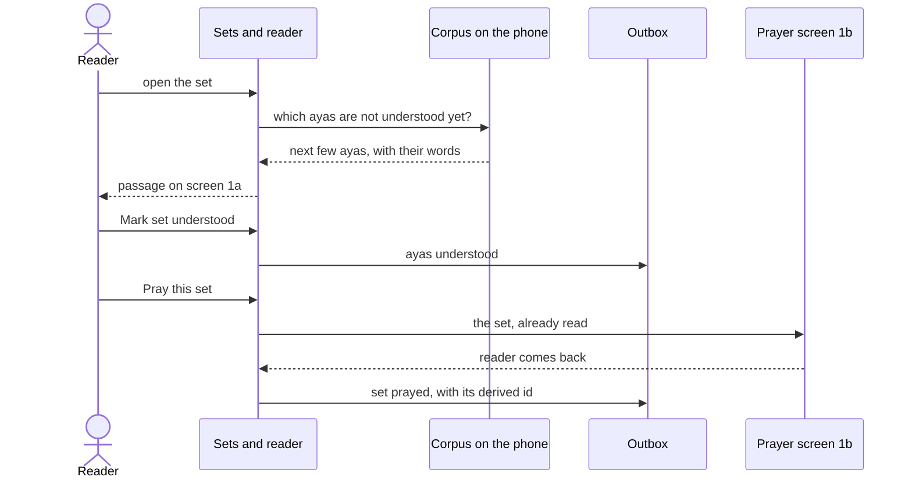
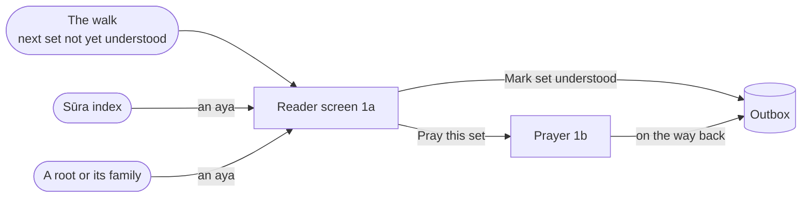
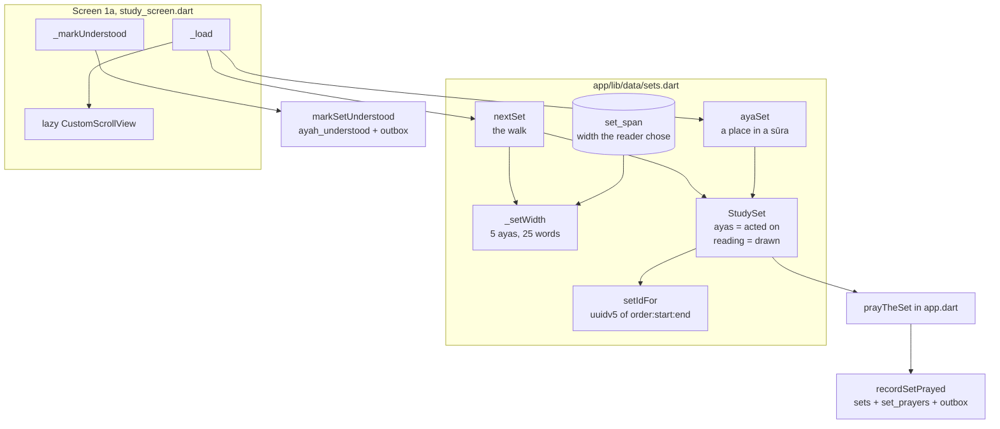
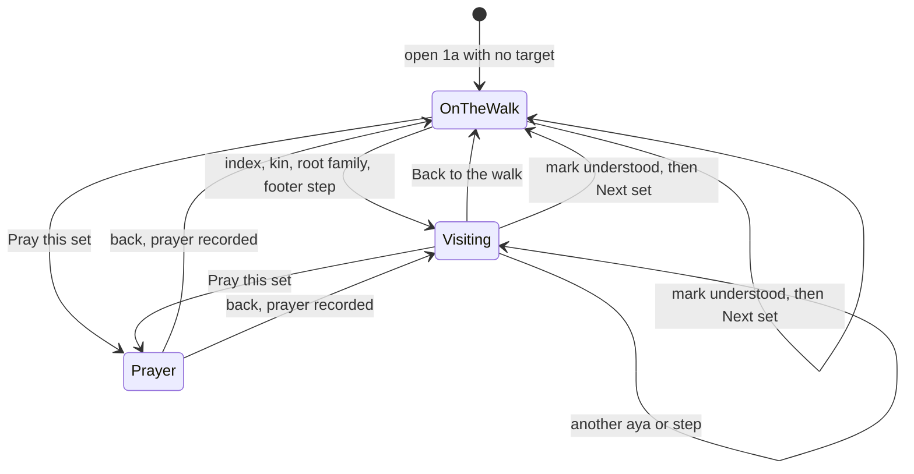

# Sets and reader

> How the app picks the next set of ayas on the phone, names it, and shows it as a passage on the reader screen before a prayer. Level L2 · Parent [App](../app.md) · Children none

## Black box

This part of the app answers one question with no network: what should the reader read next? It proposes a **set**, a few ayas that fit in the head for one prayer. It shows that set, or any place in a sūra the reader asks for, as a **passage** on the reader screen (screen 1a). From there the reader marks the set understood, or prays it. Both writes land in the **outbox** and reach the server later.

| In | Out | Depends on |
|---|---|---|
| The ayas already understood, the reading order, how wide the reader likes a set, an aya chosen from the index or a root | The next set, a passage to read, a set id that every device agrees on, "understood" and "prayed" writes | The bundled **corpus**, the **outbox**, the app's recitation player, the prayer screen |



Nothing here waits on the network. The server only learns about a set when the outbox flushes. It can check the set's id on its own, because the id is computed from the set and nothing else.



## White box



The screen has two modes that are really one: on the walk, or visiting. Only the load differs.



### 1. The walk finds the next set

There is no stored position. [`nextSet`](../../../app/lib/data/sets.dart#L227-L271) looks for the first aya not yet understood in the chosen order, and reads up to 20 ayas from there. The order is one SQL expression per choice, so switching between revelation order (`nuzul`, the default) and written order (`mushaf`) never corrupts progress ([sets.dart:61](../../../app/lib/data/sets.dart#L61-L64)).

A set is a run of consecutive ayas that are not understood. It stops before the next understood aya, unless the reader widened the set on purpose:

```dart
  final reachable = span == null
      ? rows.takeWhile((r) => (r['understood']! as int) == 0).toList()
      : rows;
  final taken = reachable
      .take(
        _setWidth([
          for (final r in reachable) r['word_count']! as int,
        ], span: span),
      )
      .toList();

  return _setFrom(db, order, taken);
```

[sets.dart:259](../../../app/lib/data/sets.dart#L259-L270). When nothing is left, it returns null and the screen shows a "nothing left" message ([study_screen.dart:550](../../../app/lib/features/study/study_screen.dart#L550-L559)).

### 2. How wide a set is

The proposal is at most 5 ayas and 25 words ([sets.dart:13](../../../app/lib/data/sets.dart#L13-L20)). The first aya always goes in, whatever it costs, or 2:282 (128 words) would stall the walk forever. If the reader chose a width in Settings, that width wins, up to 20 ayas.

```dart
int _setWidth(List<int> wordCounts, {int? span}) {
  if (span != null) {
    return span.clamp(1, max(1, min(setMaxDragAyas, wordCounts.length)));
  }
  var taken = 0;
  var words = 0;
  for (final count in wordCounts) {
    if (taken == setMaxAyas) break;
    if (taken > 0 && words + count > setWordBudget) break;
    words += count;
    taken++;
  }
  return taken;
}
```

[sets.dart:460](../../../app/lib/data/sets.dart#L460-L473). The chosen width is stored per starting aya in the local `set_span` table ([sets.dart:481](../../../app/lib/data/sets.dart#L481-L498)). It is a width, never a position, and it never leaves the phone. The Settings stepper writes it ([settings_screen.dart:71](../../../app/lib/features/settings/settings_screen.dart#L71-L78)).

### 3. A set's id is derived, not minted

Every device must name the same set the same way, with no server round trip. So the id is a UUID v5 over the reading order and the first and last aya ids. The namespace is itself derived, so no one copies a magic string by hand.

```dart
final _setNamespace = _uuidV5(
  '6ba7b811-9dad-11d1-80b4-00c04fd430c8', // RFC 9562 NameSpace_URL
  'https://wird.bnei.dev/set',
);

/// A set's identity, which is a pure function of the range it holds and the
/// order it was read in. Nothing is minted and nothing is counted, so a
/// reinstall and a second device arrive at the same id for the same range
/// without having to agree on one — and because it says nothing about where
/// the reader is, the reading order stays switchable.
String setIdFor(ReadingOrder order, int startAyahId, int endAyahId) =>
    _uuidV5(_setNamespace, '${order.name}:$startAyahId:$endAyahId');
```

[sets.dart:28](../../../app/lib/data/sets.dart#L28-L39). A set asks for its id through [`StudySet.id`](../../../app/lib/data/sets.dart#L191). The server recomputes the same id and refuses a mismatch ([sync.go:378](../../../server/internal/store/sync.go#L378)). Shared test vectors keep both sides honest: see [ADR 0002](../../adr/0002-set-identity.md#the-vectors).

### 4. A passage: what is read versus what is acted on

A `StudySet` holds two lists ([sets.dart:146](../../../app/lib/data/sets.dart#L146-L163)):

- `ayas` is what the reader acts on. It is marked, prayed, named in the header, pinned on disk, and it gives the set its id.
- `reading` is what the screen draws. On the walk it is the same list. Off the walk it is the whole sūra.

[`ayaSet`](../../../app/lib/data/sets.dart#L290-L318) builds the off-walk case. It reads every aya of the sūra, but only the acted ayas arrive with their words:

```dart
  final at = rows.indexWhere((r) => r['id'] == ayahId);
  if (at < 0) return null;
  final acted = rows.sublist(at, min(at + max(1, ayas), rows.length));
  final words = await wordsFor(db, [for (final r in acted) r['id']! as int]);
  return StudySet(
    order: order,
    _ayasOf(acted, words),
    reading: _ayasOf(rows, words),
  );
```

[sets.dart:309](../../../app/lib/data/sets.dart#L309-L317). Scrolling through 286 ayas of Al-Baqarah writes nothing, so the walk does not move.

### 5. Screen 1a loads one of three things

[`StudyScreen`](../../../app/lib/features/study/study_screen.dart#L23-L37) is built with an optional `target`. Its [`_load`](../../../app/lib/features/study/study_screen.dart#L180-L283) picks the source:

```dart
  Future<void> _load({int? target, AyaSpan? step}) async {
    final generation = ++_generation;
    final recitation = Wird.of(context).recitation;
    final order = _prefs.order;
    final at = step?.first ?? target;
    final set = at == null
        ? await nextSet(widget.db, order)
        : await ayaSet(
            widget.db,
            order,
            at,
            ayas: step == null ? 1 : step.last - step.first + 1,
          );
```

[study_screen.dart:167](../../../app/lib/features/study/study_screen.dart#L167-L179).

- No target: the walk's next set.
- A target, from the index or a root: that one aya, in its sūra.
- A step from the footer arrows: a span as wide as the reader's usual set ([reading_nav.dart:7](../../../app/lib/features/study/reading_nav.dart#L7-L60), [study_screen.dart:290](../../../app/lib/features/study/study_screen.dart#L290-L299)).

The `generation` counter lets a newer load win. An older load stops before it touches the screen or starts a download. Once the set is ready, the screen hands it to the app's one recitation player and fetches audio in the background ([study_screen.dart:233](../../../app/lib/features/study/study_screen.dart#L233-L282)).

### 6. The passage list is lazy both ways

A sūra can be 286 ayas and 6116 words. The list is a `CustomScrollView` hung from the aya the reader opened on. Slivers before the anchor grow upward, slivers after it grow downward:

```dart
      builder: (context, recited, _) => CustomScrollView(
        // A new passage starts at its own aya rather than at the offset the
        // last one was left scrolled to.
        key: ValueKey(set.ayas.first.id),
        center: _anchor,
        slivers: [
          SliverList(
            delegate: SliverChildBuilderDelegate(
              (context, i) => _ayaTile(n, ayas, focus - 1 - i, recited),
              childCount: focus,
            ),
          ),
          const SliverToBoxAdapter(key: _anchor, child: SizedBox.shrink()),
```

[study_screen.dart:569](../../../app/lib/features/study/study_screen.dart#L569-L581). An aya with no words yet draws a placeholder of about the right height ([study_screen.dart:619](../../../app/lib/features/study/study_screen.dart#L619-L627)) and asks for the words around it: 4 ayas back, 12 ahead, in one query ([study_screen.dart:708](../../../app/lib/features/study/study_screen.dart#L708-L733), [sets.dart:394](../../../app/lib/data/sets.dart#L394-L421)).

Each word arrives with its English gloss and, where The Last Dialogue's pages carry it, its French one. The row picks by the screen's language when it draws, so switching language does not re-read the words; a word with no French shows its English ([`StudyWord.glossIn`](../../../app/lib/data/sets.dart#L88-L89), [ADR 0012](../../adr/0012-french-word-glosses-from-the-last-dialogue.md)).

Tapping a word opens its root in the panel below the passage. Two arrows beside "Mark set understood" move that panel to the word before or after, so a reader can walk the passage a word at a time instead of hunting for the next word to press.

The arrows step through the words the screen is drawing, which off the walk is the whole sūra and not the acted set alone. The list is baked whenever the word cache changes, next to the list of what can be sounded, because whether an arrow is dark is a question every frame asks ([study_screen.dart:136](../../../app/lib/features/study/study_screen.dart#L136-L143)).

Particles and proper nouns carry no root, and the arrows walk onto them like any other word: the panel shows the word and says it has no root, rather than going blank or skipping it ([study_screen.dart:360](../../../app/lib/features/study/study_screen.dart#L360-L383), [ADR 0013](../../adr/0013-the-reading-screens-root-panel-walks-word-by-word.md)).

### 7. Other screens answer down to 1a

There is only one reader screen, because there is only one recitation player. A second 1a pushed on top would fight the first for it. So a screen that names an aya pops the aya id back down, and 1a reloads in place:

```dart
  Future<void> _visit(String route, Object arguments) async {
    final chosen = await Navigator.of(context)
        .pushNamed(route, arguments: arguments);
    if (mounted && chosen is int) await _load(target: chosen);
  }
```

[study_screen.dart:353](../../../app/lib/features/study/study_screen.dart#L353-L357). The screens that pop an aya:

- The sūra index. A row pops the sūra's first aya; the chevron unfolds the aya numbers, and each one pops its own aya ([index_screen.dart:75](../../../app/lib/features/index/index_screen.dart#L75), [index_screen.dart:159](../../../app/lib/features/index/index_screen.dart#L159), [index_screen.dart:277](../../../app/lib/features/index/index_screen.dart#L277)).
- A root, its spine, or the constellation. Every aya reference in a family calls one helper ([family.dart:38](../../../app/lib/features/root/family.dart#L38-L39)).
- Progress (1d). "All 114" opens the index, then passes its answer on down ([progress_screen.dart:49](../../../app/lib/features/progress/progress_screen.dart#L49-L53)).
- The drawer and the dashboard catch an aya too, and push 1a with it as `target` ([wird_shell.dart:229](../../../app/lib/shell/wird_shell.dart#L229-L242), [dashboard_screen.dart:89](../../../app/lib/features/dashboard/dashboard_screen.dart#L89-L93)).

The route table and the reason for each move sit in one comment block ([nav.dart:45](../../../app/lib/nav.dart#L45-L99)). The kept list (1e) shows kept ayas and roots but opens nothing ([kept_screen.dart:16](../../../app/lib/features/kept/kept_screen.dart#L16-L24)).

While visiting, the header shows "Back to the walk", which reloads with no target ([study_chrome.dart:99](../../../app/lib/features/study/study_chrome.dart#L99-L107)).

### 8. Marking a set understood

[`_markUnderstood`](../../../app/lib/features/study/study_screen.dart#L308-L321) sends only the ayas that are still open. An aya the reader pulled the set across is already understood, and marking it again would move its date to today. The write goes through [`markSetUnderstood`](../../../app/lib/data/db.dart#L289-L317). It inserts into `ayah_understood` and queues one `ayah_understood` op in the same transaction. The screen mints a fresh op id only after a press lands. A double tap reuses the same id, and the second write sees it in the outbox and does nothing ([db.dart:180](../../../app/lib/data/db.dart#L294-L300)).

Once every aya is understood, the same button reads "Next set" and reloads the walk ([study_screen.dart:489](../../../app/lib/features/study/study_screen.dart#L489-L491)).

### 9. Praying a set

"Pray this set" lives in the header of 1a ([study_chrome.dart:111](../../../app/lib/features/study/study_chrome.dart#L111-L119)) and on the dashboard. Both call one function:

```dart
Future<void> prayTheSet(BuildContext context, StudySet set) async {
  final db = Wird.of(context).db;
  final navigator = Navigator.of(context);
  await Wird.of(context).recitation.stop();
  await navigator.pushNamed(Routes.prayer, arguments: set);
  await recordSetPrayed(db, set);
}
```

[app.dart:312](../../../app/lib/app.dart#L328-L334). The prayer screen writes nothing: it runs inside the prayer, where no moment is safe for a write ([prayer_screen.dart:16](../../../app/lib/features/prayer/prayer_screen.dart#L16-L31)). The prayer is recorded when the reader comes back, however they leave. [`recordSetPrayed`](../../../app/lib/data/db.dart#L330) inserts the set (ignored if it exists), the prayer, and one `set_prayed` op that carries the range and the derived id.

A prayer the reader never returns from is not counted. The count may be short; it is never invented.

Praying while visiting records a set over the visited ayas. That set is not one the walk will ever propose. [ADR 0006](../../adr/0006-a-passage-is-read-a-set-is-answered-for.md#open-what-the-prayer-tiles-on-screen-1d-count) keeps this open.

### 10. What stays on disk

[`pathsToKeep`](../../../app/lib/data/audio.dart#L107-L127) pins the recitation files the reader will need. On the walk that is this set and the next one. Off the walk it is the visited ayas only, because the walk's next set has nothing to do with where the reader went:

```dart
  final ahead = onTheWalk
      ? await nextSet(db, order, alsoUnderstood: currentIds.toSet())
      : null;
```

[audio.dart:118](../../../app/lib/data/audio.dart#L118-L120).

### 11. What progress counts

Screen 1d replays the walk to count finished sets ([sets.dart:505](../../../app/lib/data/sets.dart#L505-L540)), instead of counting rows in `sets`. A set prayed twice and never marked is not a finished set. The prayer tile counts every recorded prayer, on the walk or not, and is labelled "prayers recorded" for that reason ([passage.dart:160](../../../app/lib/features/progress/passage.dart#L160-L166), [progress_screen.dart:156](../../../app/lib/features/progress/progress_screen.dart#L156-L157)).

## Why it is this way

- [ADR 0002](../../adr/0002-set-identity.md) — a set's id is a UUID v5 of its range and order, and one `set_prayed` op records the set and the prayer together.
- [ADR 0003](../../adr/0003-addressable-reader.md) — the reader screen can open any aya, changes in place, and never stacks a second reader.
- [ADR 0006](../../adr/0006-a-passage-is-read-a-set-is-answered-for.md) — a passage is read, a set is answered for: `reading` versus `ayas`, and the lazy list.
- [ADR 0001](../../adr/0001-stack.md) — the corpus lives on the phone and the app generates its own sets.

## Go deeper

- [Voice-follow](voice-follow.md) — what the prayer screen does with the set while the reader recites.
- [Sync](sync.md) — how the outbox carries "understood" and "prayed" to the server.
- [Senses in the app](senses.md) — what the root panel under the passage shows.
- [Sync endpoints](../api/sync-endpoints.md) — where the server checks the derived set id.
- Tour: [A prayer, from tap to Postgres](../../tours/prayer-to-postgres.md).
