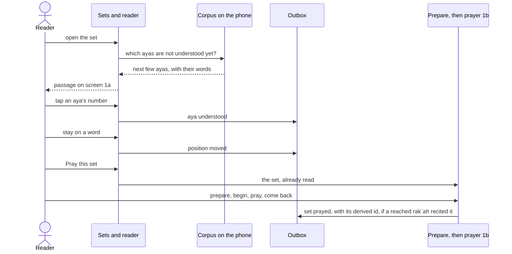
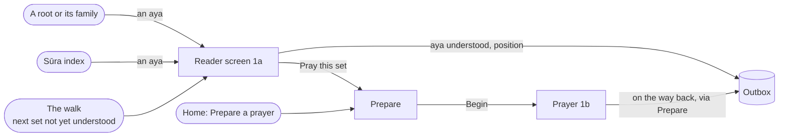
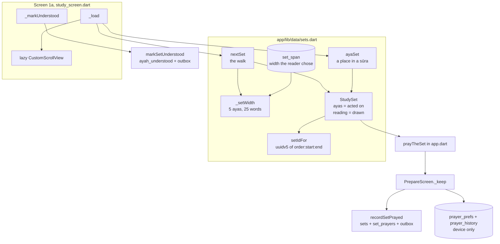
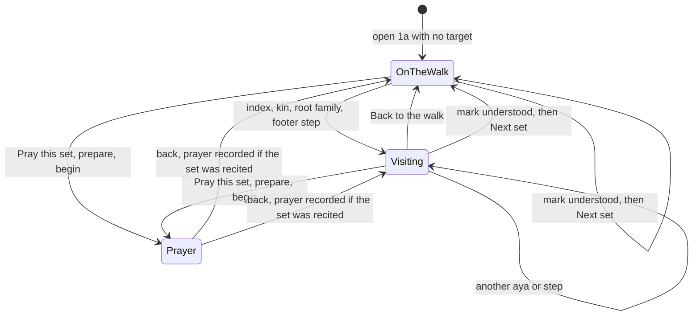
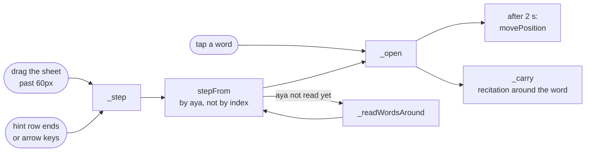
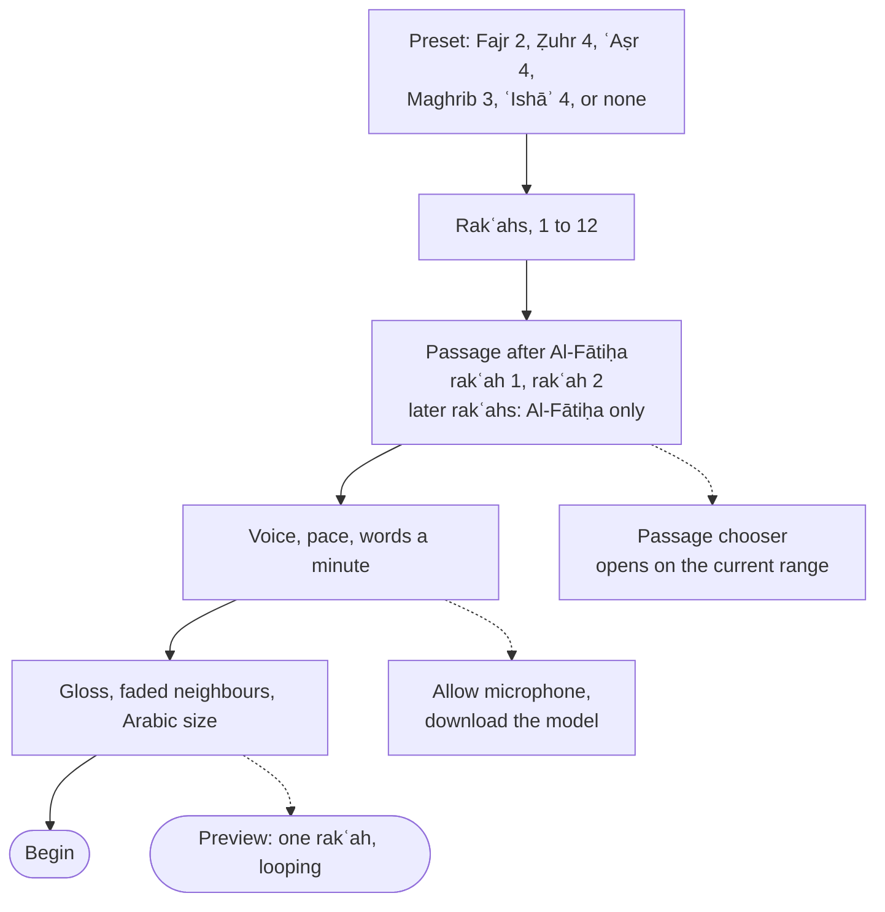
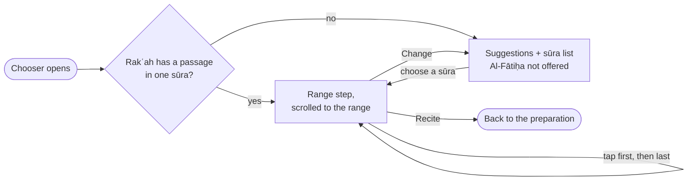

# Sets and reader

> How the app picks the next set of ayas on the phone, names it, shows it as a passage on the reader screen, and prepares a prayer on it. Level L2 · Parent [App](../app.md) · Children none

## Black box

This part of the app answers one question with no network: what should the reader read next? It proposes a **set**, a few ayas that fit in the head for one prayer. The reader screen (screen 1a) shows a whole sūra, opened where the reader last stood or at any aya they ask for. From there the reader marks ayas understood one by one, walks the sūra a word at a time, or prays the ayas around them. Both writes land in the **outbox** and reach the server later.

| In | Out | Depends on |
|---|---|---|
| The ayas already understood, the reading order, how wide the reader likes a set, an aya chosen from the index or a root | The next set, a passage to read, a set id that every device agrees on, "understood" and "prayed" writes | The bundled **corpus**, the **outbox**, the app's recitation player, the prayer's preparation and screen 1b |



Nothing here waits on the network. The server only learns about a set when the outbox flushes. It can check the set's id on its own, because the id is computed from the set and nothing else.



## White box



The screen has two modes that are really one: on the walk, or visiting. Only the load differs.



### 1. The walk finds the next set

There is no stored position. [`nextSet`](../../../app/lib/data/sets.dart#L232-L276) looks for the first aya not yet understood in the chosen order, and reads up to 20 ayas from there. The order is one SQL expression per choice, so switching between revelation order (`nuzul`, the default) and written order (`mushaf`) never corrupts progress ([sets.dart:61](../../../app/lib/data/sets.dart#L61-L64)).

The same order opens the sūra list wherever the reader picks one. The index and the prayer's passage chooser share one list, which only reorders what it draws: the sūras it is handed stay in written order, because everything else looks a sūra up by its number ([sura_picker.dart:25](../../../app/lib/features/index/sura_picker.dart#L25-L31)). A Muṣḥaf / Revelation toggle above the list turns it for as long as the picker is open, without touching the order in Settings. Written order is headed by juz, revelation order by Makkī and Madanī ([sura_picker.dart:306](../../../app/lib/features/index/sura_picker.dart#L306-L333), [ADR 0022](../../adr/0022-the-sura-picker-turns-its-order-and-searches-the-text.md)).

A set is a run of consecutive ayas that are not understood. It stops before the next understood aya, unless the reader widened the set on purpose:

```dart
  final reachable = span == null
      ? rows.takeWhile((r) => (r['understood']! as int) == 0).toList()
      : rows;
  final taken = reachable
      .take(
        _setWidth([
          for (final r in reachable) r['word_count']! as int,
        ], span: span),
      )
      .toList();

  return _setFrom(db, order, taken);
```

[sets.dart:264](../../../app/lib/data/sets.dart#L264-L275). When nothing is left, it returns null, and the reading screen opens on 1:1 ([study_screen.dart:159](../../../app/lib/features/study/study_screen.dart#L159-L160)).

### 2. How wide a set is

The proposal is at most 5 ayas and 25 words ([sets.dart:13](../../../app/lib/data/sets.dart#L13-L20)). The first aya always goes in, whatever it costs, or 2:282 (128 words) would stall the walk forever. If the reader chose a width in Settings, that width wins, up to 20 ayas.

```dart
int _setWidth(List<int> wordCounts, {int? span}) {
  if (span != null) {
    return span.clamp(1, max(1, min(setMaxDragAyas, wordCounts.length)));
  }
  var taken = 0;
  var words = 0;
  for (final count in wordCounts) {
    if (taken == setMaxAyas) break;
    if (taken > 0 && words + count > setWordBudget) break;
    words += count;
    taken++;
  }
  return taken;
}
```

[sets.dart:453](../../../app/lib/data/sets.dart#L453-L466). The chosen width is stored per starting aya in the local `set_span` table ([sets.dart:474](../../../app/lib/data/sets.dart#L474-L491)). It is a width, never a position, and it never leaves the phone. The Settings stepper writes it ([settings_screen.dart:73](../../../app/lib/features/settings/settings_screen.dart#L73-L80)).

### 3. A set's id is derived, not minted

Every device must name the same set the same way, with no server round trip. So the id is a UUID v5 over the reading order and the first and last aya ids. The namespace is itself derived, so no one copies a magic string by hand.

```dart
final _setNamespace = _uuidV5(
  '6ba7b811-9dad-11d1-80b4-00c04fd430c8', // RFC 9562 NameSpace_URL
  'https://wird.bnei.dev/set',
);

/// A set's identity, which is a pure function of the range it holds and the
/// order it was read in. Nothing is minted and nothing is counted, so a
/// reinstall and a second device arrive at the same id for the same range
/// without having to agree on one — and because it says nothing about where
/// the reader is, the reading order stays switchable.
String setIdFor(ReadingOrder order, int startAyahId, int endAyahId) =>
    _uuidV5(_setNamespace, '${order.name}:$startAyahId:$endAyahId');
```

[sets.dart:28](../../../app/lib/data/sets.dart#L28-L39). A set asks for its id through [`StudySet.id`](../../../app/lib/data/sets.dart#L196). The server recomputes the same id and refuses a mismatch ([sync.go:380](../../../server/internal/store/sync.go#L380)). Shared test vectors keep both sides honest: see [ADR 0002](../../adr/0002-set-identity.md#the-vectors).

### 4. A passage: what is read versus what is acted on

A `StudySet` holds two lists ([sets.dart:151](../../../app/lib/data/sets.dart#L151-L168)):

- `ayas` is what the reader acts on. It is marked, prayed, named in the header, pinned on disk, and it gives the set its id.
- `reading` is what the screen draws. On the walk it is the same list. Off the walk it is the whole sūra.

[`ayaSet`](../../../app/lib/data/sets.dart#L295-L337) builds the off-walk case. It reads every aya of the sūra, but only the acted ayas arrive with their words:

```dart
  final at = rows.indexWhere((r) => r['id'] == ayahId);
  if (at < 0) return null;
  final acted = rows.sublist(at, min(at + max(1, ayas), rows.length));
  final words = await wordsFor(db, [for (final r in acted) r['id']! as int]);
  return StudySet(
    order: order,
    _ayasOf(acted, words),
    reading: _ayasOf(rows, words),
  );
```

[sets.dart:314](../../../app/lib/data/sets.dart#L314-L322). Scrolling through 286 ayas of Al-Baqarah writes nothing, so the walk does not move.

### 5. Screen 1a opens a sūra where the reader stood

Since [ADR 0014](../../adr/0014-the-reading-screen-reads-a-whole-sura-a-word-at-a-time.md) the reading screen holds one whole sūra. [`_load`](../../../app/lib/features/study/study_screen.dart#L150-L189) picks the word it opens on:

```dart
    var at = word ?? (target == null ? null : firstWordOf(target));
    if (at == null) {
      final positions = await readingPositions(widget.db, limit: 1);
      if (positions.isNotEmpty) {
        at = positions.first.wordId;
      } else {
        final next = await nextSet(widget.db, order);
        at = firstWordOf(next?.ayas.first.id ?? 1001);
      }
    }
```

[study_screen.dart:153](../../../app/lib/features/study/study_screen.dart#L153-L162).

- A word, from home's "Continue reading": that word.
- An aya, from the index, a root or the walk's set on home: its first word.
- Nothing: where the reader last stood in any sūra, else the walk's next aya, else 1:1.

The sūra comes from [`ayaSet`](../../../app/lib/data/sets.dart#L295-L337), whose `reading` is every aya of it. The screen keeps that set while the reader walks, so the list never rebuilds under them.

### 6. The sūra list is lazy both ways

A sūra can be 286 ayas and 6116 words. The top of the screen is a `CustomScrollView` hung from the aya the reader opened on. Slivers before the anchor grow upward, slivers after it grow downward ([study_screen.dart:589](../../../app/lib/features/study/study_screen.dart#L589-L610)). An aya with no words yet draws a placeholder of about the right height and asks for the words around it: 4 ayas back, 12 ahead, in one query ([study_screen.dart:764](../../../app/lib/features/study/study_screen.dart#L764-L785), [sets.dart:385](../../../app/lib/data/sets.dart#L385-L415)).

Each word arrives with its English gloss and, where The Last Dialogue's pages carry it, its French one ([ADR 0012](../../adr/0012-french-word-glosses-from-the-last-dialogue.md)). Each aya's translation, Pickthall's English or Rashid Maash's French, sits under it unless the reader turns it off in Settings ([ADR 0017](../../adr/0017-ayas-are-translated-into-english-from-pickthall.md)).

### 7. The root sheet walks the sūra a word at a time

A tap on any word, particles included, opens it in the sheet under the list. [`_open`](../../../app/lib/features/study/study_screen.dart#L195-L219) reads everything the sheet shows before it draws any of it:

- the root;
- its lemmas;
- how often the root is read in this sūra;
- up to 20 other ayas it is read in;
- the word's parsing.

That way the sheet never shows one word's root beside another word's counts.



A drag to the right moves to the next word, because Arabic runs leftward. The sheet slides: the finger carries the content, and past 60px it keeps going off that side while the next word is read, then the new word comes in from the other side ([word_swipe.dart:119](../../../app/lib/features/study/word_swipe.dart#L119-L126)). The two ends of the hint row and the arrow keys slide the same way ([word_swipe.dart:61](../../../app/lib/features/study/word_swipe.dart#L61)); any other change of word, such as a tap in the sūra, fades instead. A drag that starts within 24px of the edge is left to the drawer and the back gesture.

The sheet reads in one order. The first row holds the root, the word as this aya writes it, and what it means here. Then come the root's senses, with the reader's thumbs on their heading. Then comes the word's form, meaning its parsing, with the corpus's attribution. The open word glows in the accent inside its aya, in the sūra and in the open aya above the sheet; on the sheet's own row it is plain. Prayer keeps a near-white glow of its own, so the two never read alike ([glow.dart](../../../app/lib/theme/glow.dart#L13-L24)).

A step is found by aya ([`stepFrom`](../../../app/lib/features/study/reading_walk.dart#L17-L37)): past the end of an aya it goes to the next aya, read or not, and the screen reads that aya's chunk before stepping again ([study_screen.dart:325](../../../app/lib/features/study/study_screen.dart#L325-L336)). Counting along a flat list of the words read so far landed a step from 2:255 back near 2:1.

Once the reader has stayed on a word for two seconds, and again when they leave, it is written as their position in that sūra and queued for their other devices ([ADR 0015](../../adr/0015-the-reading-position-is-kept-per-sura-and-synced.md), [`movePosition`](../../../app/lib/data/db.dart#L474-L493)).

A tap on the sheet's top bar, or on its "Counts, forms, other ayas" row, shrinks the sūra to the open word's aya, whole and with its translation, and brings up the counts, the ring of the root's lemmas and the other ayas; scrolling the sheet never does. Each other aya is shown as a line around the root's word in it, lit, so the word it is listed for is never cut off. An other aya opens in place of the sūra, with a way back to the word the reader was on and a way to read that aya's sūra from there.

The root letters open the root's own screen. A screen that names an aya answers by popping its id back down, and the reader reloads in place rather than stacking a second reader ([study_screen.dart:375](../../../app/lib/features/study/study_screen.dart#L375-L379)):

- the sūra index, reached from the sūra's name in the bar;
- a root, its spine and the constellation, which call one helper ([family.dart:38](../../../app/lib/features/root/family.dart#L38-L39));
- Progress (1d), whose "All 114" opens the index and passes its answer on ([progress_screen.dart:49](../../../app/lib/features/progress/progress_screen.dart#L49-L53)).

The drawer and home catch an aya too, and push the reader with it ([wird_shell.dart:247](../../../app/lib/shell/wird_shell.dart#L247-L260)).

### 8. Marking an aya understood

The circle that closes each aya marks it understood when tapped ([study_screen.dart:353](../../../app/lib/features/study/study_screen.dart#L353-L357)). The write goes through [`markSetUnderstood`](../../../app/lib/data/db.dart#L334-L362) with a fresh op id per tap. It inserts into `ayah_understood` and queues one `ayah_understood` op in the same transaction. An aya already understood answers no tap: no op takes the mark back.

Scrolling or walking past an aya marks nothing. Understood is what the reader says, and the position is where they are; neither is read from the other.

### 9. Praying a set

The walk still proposes sets, and home still offers "Pray this set". The reading screen's Pray action prays the ayas around the open word, the reading width wide: the same set the recitation carries ([study_screen.dart:250](../../../app/lib/features/study/study_screen.dart#L250-L304), [study_screen.dart:539](../../../app/lib/features/study/study_screen.dart#L539)). Both call one function, which stops the audio and opens the prayer's preparation on that set:

```dart
Future<void> prayTheSet(BuildContext context, StudySet set) async {
  final navigator = Navigator.of(context);
  await Wird.of(context).recitation.stop();
  await navigator.pushNamed(Routes.prepare, arguments: set);
}
```

[app.dart:416](../../../app/lib/app.dart#L416-L420). Home also has a "Prepare a prayer" door, which opens the same screen with no set ([dashboard_screen.dart:284](../../../app/lib/features/dashboard/dashboard_screen.dart#L284-L288)).

#### The preparation



The screen opens where the reader left it last time, from `prayer_prefs`, except the passages ([prepare_screen.dart:107](../../../app/lib/features/prayer/prepare_screen.dart#L107-L159)). The first is the set it was opened on, or else the walk's next set, but never a set of Al-Fātiḥa: Al-Fātiḥa is already recited in every rakʿah, and as the passage every word would stand in two places ([prepare_screen.dart:128](../../../app/lib/features/prayer/prepare_screen.dart#L128-L133)). The second is the first's continuation: as many ayas as the first holds, straight after it, going on into the next sūra when the first ends one ([prayer_plan.dart:135](../../../app/lib/features/prayer/prayer_plan.dart#L135-L154)).

If the database does not answer, the screen says so and offers "Try again" rather than staying blank. One read runs at a time, so a second tap cannot race the first ([prepare_screen.dart:92](../../../app/lib/features/prayer/prepare_screen.dart#L92-L105), [prepare_screen.dart:703](../../../app/lib/features/prayer/prepare_screen.dart#L703-L717)).

- A preset sets the rakʿah count; tapping the chosen preset again clears it, and the count stays ([prepare_screen.dart:193](../../../app/lib/features/prayer/prepare_screen.dart#L193-L200), [prayer_plan.dart:14](../../../app/lib/features/prayer/prayer_plan.dart#L14-L29)).
- Only the first two rakʿahs carry a passage after Al-Fātiḥa. The second can still be set to "same as the first". The rest are Al-Fātiḥa alone ([prayer_plan.dart:64](../../../app/lib/features/prayer/prayer_plan.dart#L64-L68)).
- The pace runs from 15 to 90 words a minute, in steps of 5 ([prepare_screen.dart:777](../../../app/lib/features/prayer/prepare_screen.dart#L777-L780)). Voice is only ticked once the microphone is granted and the model is on the phone, and the reader's wish is kept for the day it is. Until then, "Follow my voice" carries what is missing right under it: an "Allow microphone" button, then the model's download panel from Settings. When both are done the row ticks itself ([prepare_screen.dart:745](../../../app/lib/features/prayer/prepare_screen.dart#L745-L764)), as described in [voice-follow](voice-follow.md#1-the-microphone-is-asked-for-before-the-prayer-never-in-it).
- "Silence notifications" is a reminder, not a switch. Android only lets an app silence the phone after a permission granted in system settings, and iOS has no way at all, so the reader does it ([prepare_screen.dart:820](../../../app/lib/features/prayer/prepare_screen.dart#L820-L828)).
- The preview sheet runs one rakʿah from its passage, round and round, at the pace when voice or pace is chosen, and never opens the microphone ([prepare_screen.dart:316](../../../app/lib/features/prayer/prepare_screen.dart#L316-L387)).

The sūra list searches by number or by name, in English or Arabic, with the marks folded away so `kafirun` finds al-Kāfirūn, and takes a reference such as `2:255`; a half-typed `2:` already narrows to Al-Baqarah ([sura_picker.dart:36](../../../app/lib/features/index/sura_picker.dart#L36-L67)). Given the database, it also searches the text: ayas whose Arabic, English or French holds the query, and ayas carrying a root typed as letters (`كتب`, `ك ت ب`) or as its transliteration (`k-t-b`). The text is read once and kept in memory, folded so that a reader's spelling meets the muṣḥaf's: the long ā the muṣḥaf writes its own way (a dagger alif, a wāw or yāʾ carrying one) is left out on both sides with every alif, so `الرحمن` finds ٱلرَّحْمَـٰنِ and `الصلاة` finds ٱلصَّلَوٰةَ; Latin loses its marks, so `hmd` finds the root ḥ-m-d. Hits are worked out once per query, with the sūras the screen leaves out already left out, so they never take a place ([aya_search.dart:25](../../../app/lib/features/index/aya_search.dart#L25-L188), [sura_picker.dart:337](../../../app/lib/features/index/sura_picker.dart#L337-L375)). In the passage chooser, with nothing typed, it shows one suggestion as a card with its first aya: the walk's next set for the first rakʿah, the ayas after the first rakʿah's passage for the second. Then "same as rakʿah 1", Al-Fātiḥa only, and the passages recently recited with how long each takes. A dot marks what the rakʿah recites now. A suggestion inside one sūra opens the range step rather than being taken as it is ([passage_chooser.dart:268](../../../app/lib/features/prayer/passage_chooser.dart#L268-L331), [passage_chooser.dart:149](../../../app/lib/features/prayer/passage_chooser.dart#L149-L157)). Al-Fātiḥa is never offered, neither in the list, through a reference, nor among the ayas found, for the same reason it is never the default ([passage_chooser.dart:279](../../../app/lib/features/prayer/passage_chooser.dart#L279)).

Choosing a sūra opens the range step: the whole sūra when it has 20 ayas or fewer, the three ayas after the passage last recited from it, or its first three ([passage_chooser.dart:161](../../../app/lib/features/prayer/passage_chooser.dart#L161-L174)). A reference opens on exactly the aya it names. A rakʿah that already has a passage in one sūra opens the chooser straight on that range, because changing how many ayas it recites is the common change ([passage_chooser.dart:180](../../../app/lib/features/prayer/passage_chooser.dart#L180-L190)). The range step is the sūra as text, each aya with its number: tap the first aya, then the last, and the hint above says which tap is next ([passage_chooser.dart:454](../../../app/lib/features/prayer/passage_chooser.dart#L454-L463)). Over the text, a thin bar shows the range inside the whole sūra and scrolls to where it is tapped, beside how many ayas the range is, how long it takes at the chosen pace, counted in the corpus's words as Prepare counts them, and its juz. Under the text, chips set the range to three ayas, to about a minute, or to the whole of a short sūra ([passage_chooser.dart:472](../../../app/lib/features/prayer/passage_chooser.dart#L472-L618), [passage_chooser.dart:622](../../../app/lib/features/prayer/passage_chooser.dart#L622-L669)). The text scrolls to the range when the step opens.



#### What is written, and when

The prayer screen writes nothing: it runs inside the prayer, where no moment is safe for a write ([prayer_screen.dart:20](../../../app/lib/features/prayer/prayer_screen.dart#L20-L33)). It reports the furthest rakʿah reached and any pinched Arabic size through a `PrayerOutcome`. The preparation writes when the reader comes back, however they left, then closes ([prepare_screen.dart:269](../../../app/lib/features/prayer/prepare_screen.dart#L269-L314)):

- `prayer_prefs`: how this prayer was prepared, so the next starts the same way. Written before the prayer too. Device-local ([db.dart:665](../../../app/lib/data/db.dart#L665-L676)).
- `prayer_history`: one row for each passage a reached rakʿah recited, for "recently recited". Device-local ([db.dart:683](../../../app/lib/data/db.dart#L683-L688)).
- [`recordSetPrayed`](../../../app/lib/data/db.dart#L375) for the credited set, only if a reached rakʿah recited it. The credited set is the one Prepare was opened on, or else the walk's next set ([prepare_screen.dart:191](../../../app/lib/features/prayer/prepare_screen.dart#L191)). It inserts the set (ignored if it exists), the prayer, and one `set_prayed` op that carries the range and the derived id.

A prayer that recites some other passage leaves only the history behind. A prayer the reader never returns from is not counted, and a preparation left before Begin is no prayer at all. The count may be short; it is never invented.

### 10. What stays on disk

[`pathsToKeep`](../../../app/lib/data/audio.dart#L156-L182) pins the recitation files the reader will need, in the reciter they chose, and each word's own recording when they asked to hear words alone. The files sit in one flat directory, named by reciter folder and file, under one cap. The reading screen asks for the ayas around the open word only, and asks again when the reader walks out of them. The walk's next set has nothing to do with where the reader is:

```dart
  final ahead = onTheWalk
      ? await nextSet(db, order, alsoUnderstood: currentIds.toSet())
      : null;
```

[audio.dart:169](../../../app/lib/data/audio.dart#L169-L171).

### 11. What progress counts

Screen 1d replays the walk to count finished sets ([sets.dart:498](../../../app/lib/data/sets.dart#L498-L533)), instead of counting rows in `sets`. A set prayed twice and never marked is not a finished set. The prayer tile counts every recorded prayer, on the walk or not, and is labelled "prayers recorded" for that reason ([passage.dart:160](../../../app/lib/features/progress/passage.dart#L160-L166), [progress_screen.dart:156](../../../app/lib/features/progress/progress_screen.dart#L156-L157)).

## Why it is this way

- [ADR 0002](../../adr/0002-set-identity.md) — a set's id is a UUID v5 of its range and order, and one `set_prayed` op records the set and the prayer together.
- [ADR 0003](../../adr/0003-addressable-reader.md) — the reader screen can open any aya, changes in place, and never stacks a second reader.
- [ADR 0006](../../adr/0006-a-passage-is-read-a-set-is-answered-for.md) — a passage is read, a set is answered for: `reading` versus `ayas`, and the lazy list.
- [ADR 0020](../../adr/0020-a-prayer-is-prepared-then-recited-one-rakah-at-a-time.md) — a prayer is prepared first; the set is credited only if a reached rakʿah recited it; the rest stays on the phone.
- [ADR 0001](../../adr/0001-stack.md) — the corpus lives on the phone and the app generates its own sets.

## Go deeper

- [Voice-follow](voice-follow.md) — how the prayer screen follows each rakʿah while the reader recites.
- [Sync](sync.md) — how the outbox carries "understood" and "prayed" to the server.
- [Senses in the app](senses.md) — what the root panel under the passage shows.
- [Sync endpoints](../api/sync-endpoints.md) — where the server checks the derived set id.
- Tour: [A prayer, from tap to Postgres](../../tours/prayer-to-postgres.md).
