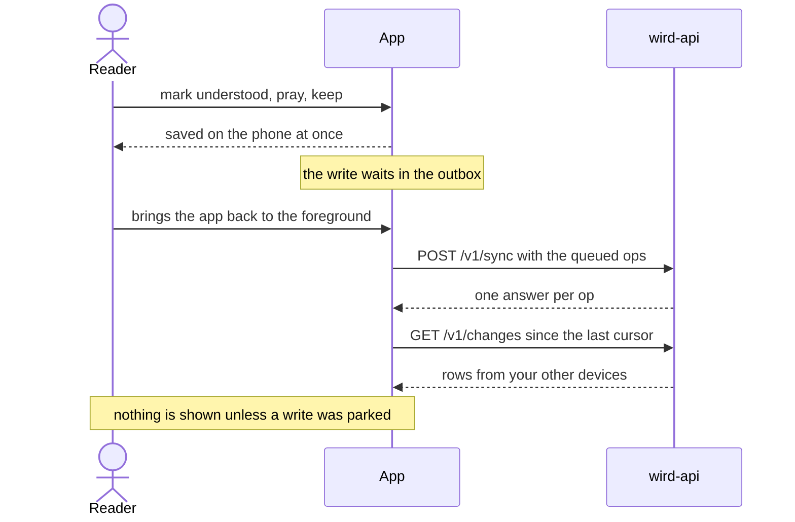
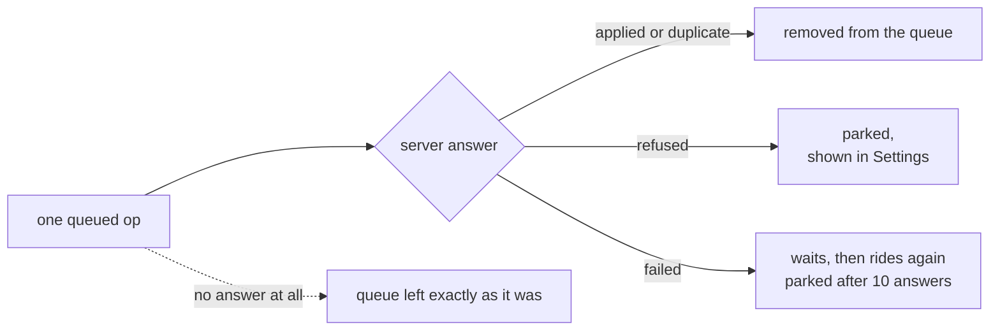
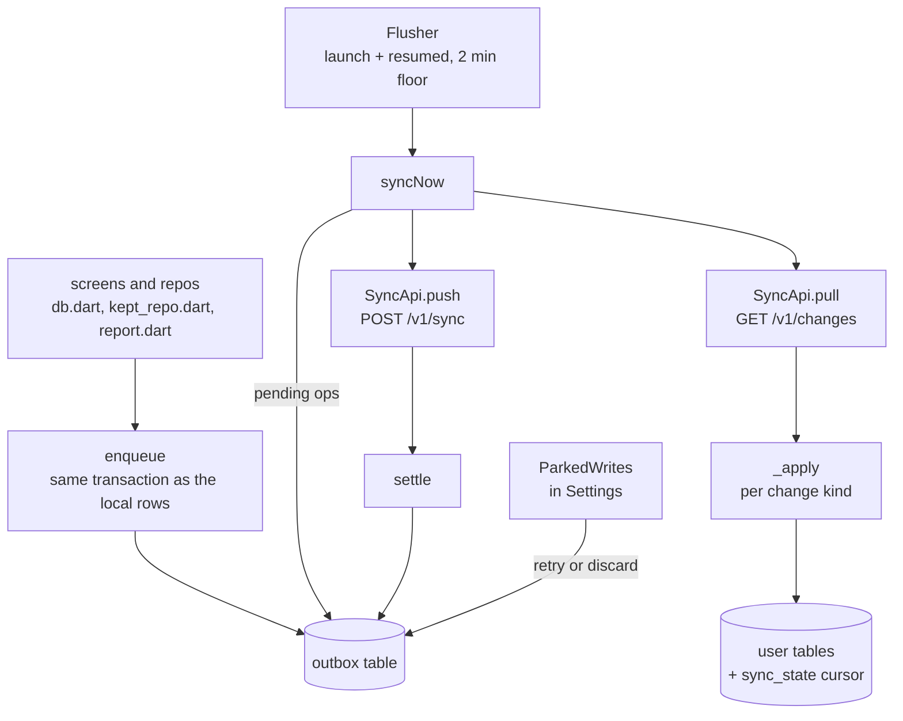
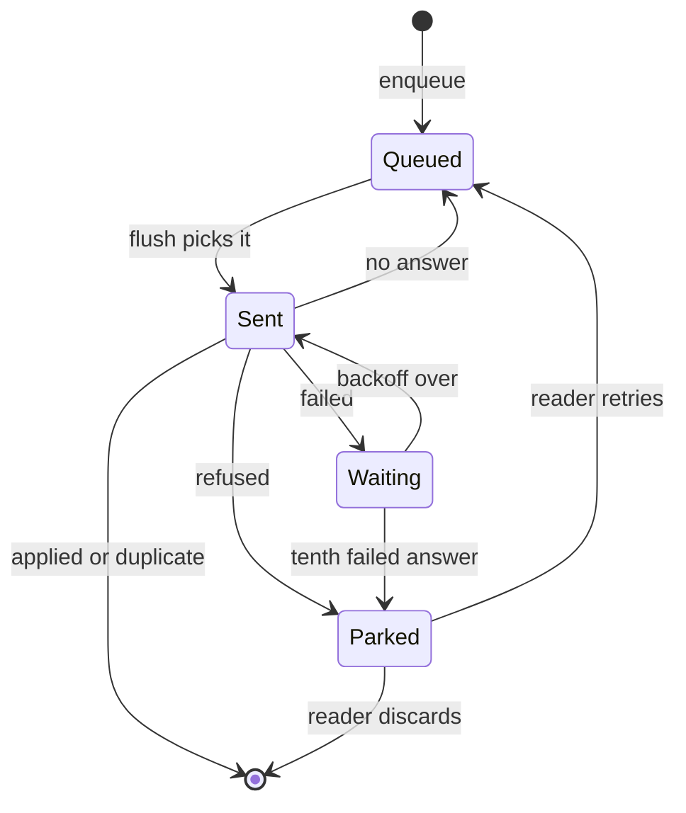

# Sync

> The outbox that holds every write, and the push and pull that carry it to the server and bring your other devices' rows back. Level L2 · Parent [App](../app.md) · Children none

## Black box

Every write the reader makes (an aya understood, a kept item, a prayer, the reading order, a report) is saved on the phone and queued in the **outbox** in one step. Later, when the app starts or comes back to the foreground, the queue is sent to `wird-api` and the rows your other devices wrote are pulled back. No screen ever waits on this, so a prayer with no signal looks exactly like one with a signal.

The caller is the app itself, not a screen. The server half is described in [Sync endpoints](../api/sync-endpoints.md).

| In | Out | Depends on |
|---|---|---|
| Writes from any screen, queued offline | `POST /v1/sync`: a batch of ops, each with its own id | `wird-api` at `wird.bnei.dev` |
| The app starting or coming back to the foreground | `GET /v1/changes`: rows since the last cursor, written locally | A signed-in account, for the bearer token |
| The reader's choice to send a parked write again, or drop it | A short list of parked writes in Settings | The op contract of [ADR 0002](../../adr/0002-set-identity.md) |



Each op gets one of four answers from the server, and each one ends differently on the phone:



No answer is never counted against a write. A week in airplane mode loses nothing.

## White box

Four files do the work: `outbox.dart` holds the queue, `flush.dart` decides when it moves, `sync.dart` talks to the server, and `parked_writes.dart` shows what could not land.



The life of one op:



### 1. A write and its op commit together

Every write goes through `enqueue`. When the write also changes local rows, `enqueue` runs inside that same transaction, so both commit or neither does. A report has no local rows and is only queued. The op id is the table's primary key, so pressing twice or replaying lands on the same row.

```dart
Future<void> enqueue(
  DatabaseExecutor db, {
  required String opId,
  required String kind,
  required Map<String, dynamic> body,
}) => db.insert('outbox', {
  'client_op_id': opId,
  'kind': kind,
  'body': jsonEncode(body),
  'created_at': DateTime.now().toIso8601String(),
}, conflictAlgorithm: ConflictAlgorithm.ignore);
```

[outbox.dart:105](../../../app/lib/data/outbox.dart#L105-L115) · the table: [db.dart:143](../../../app/lib/data/db.dart#L143-L150)

The callers, one per op kind:

| Op kind | Written by |
|---|---|
| `ayah_understood` | [markSetUnderstood, db.dart:195](../../../app/lib/data/db.dart#L195-L203) |
| `set_prayed` | [recordSetPrayed, db.dart:241](../../../app/lib/data/db.dart#L241) |
| `prefs_set` | [setReadingOrder, db.dart:312](../../../app/lib/data/db.dart#L312-L317) |
| `kept_upsert` | [kept_repo.dart:99](../../../app/lib/data/kept_repo.dart#L99-L109) |
| `kept_delete` | [kept_repo.dart:128](../../../app/lib/data/kept_repo.dart#L128-L133) |
| `report_written` | [report.dart:76](../../../app/lib/features/report/report.dart#L82-L92) |

The server still accepts `set_recorded` from older phones. This build no longer writes it.

Times on the phone carry no zone. An op body turns them into UTC with [wireTime, outbox.dart:222](../../../app/lib/data/outbox.dart#L222-L223), because the server reads RFC 3339.

### 2. The queue moves at launch and on return to the foreground

`Flusher` watches the app's lifecycle. It flushes once at start, since a launch delivers no `resumed` event, and again each time the app is resumed. It does not flush on every write: that would wake the radio once per aya.

```dart
  void start() {
    WidgetsBinding.instance.addObserver(this);
    _inTheBackground();
  }

  void stop() => WidgetsBinding.instance.removeObserver(this);

  @override
  void didChangeAppLifecycleState(AppLifecycleState state) {
    if (state == AppLifecycleState.resumed) _inTheBackground();
  }
```

[flush.dart:81](../../../app/lib/data/flush.dart#L81-L91) · the flush and the senses fetch start side by side and swallow their own errors: [flush.dart:100](../../../app/lib/data/flush.dart#L100-L103)

Only one flush runs at a time, and not more than once every two minutes. A caller that arrives mid-flush joins the flush already running, so no op is sent twice in one round.

```dart
  Future<SyncReport?> flush() {
    final running = _running;
    if (running != null) return running;
    final last = _last;
    if (last != null && DateTime.now().difference(last) < gap) {
      return Future.value(null);
    }
    _last = DateTime.now();
    final run = syncNow(db, api);
    _running = run;
    return run.whenComplete(() => _running = null);
  }
```

[flush.dart:161](../../../app/lib/data/flush.dart#L161-L172)

`Flushing`, a widget near the top of the tree, starts the flusher and stops it: [flush.dart:192](../../../app/lib/data/flush.dart#L192-L219).

### 3. The token is attached in one place

The flusher's HTTP client carries an interceptor that adds the bearer token when someone is signed in. Nothing above this line knows a token exists. A phone with nobody signed in is answered 401 and keeps its queue.

```dart
Flusher flusherFor(Database db) => Flusher(
  db,
  SyncApi(
    Dio(BaseOptions(baseUrl: syncOrigin))
      ..interceptors.add(AuthHeader(Account(db))),
  ),
);
```

[flush.dart:181](../../../app/lib/data/flush.dart#L181-L187) · the interceptor: [auth.dart:463](../../../app/lib/data/auth.dart#L463-L470)

### 4. Which ops ride

`pending` picks the oldest ops first. It skips an op that is parked or still serving its backoff. It takes at most 200, well under the server's cap of 500 per batch, because a batch over the cap is refused whole.

```dart
Future<List<PendingOp>> pending(Database db, {int limit = 200}) async {
  await ensureOutboxAttempts(db);
  final rows = await db.query(
    'outbox',
    where: 'dead_at IS NULL AND (retry_after IS NULL OR retry_after <= ?)',
    whereArgs: [DateTime.now().toIso8601String()],
    orderBy: 'created_at, client_op_id',
    limit: limit,
  );
  return rows.map(_op).toList();
}
```

[outbox.dart:124](../../../app/lib/data/outbox.dart#L124-L134)

### 5. Push first, one attempt per op per flush

`syncNow` sends batches until the queue is empty. It remembers which ops it already sent in this flush, so a failed op waits for the next flush instead of spending its whole budget in one.

```dart
    while (true) {
      final queue = [
        for (final op in await pending(db))
          if (!sent.contains(op.id)) op,
      ];
      if (queue.isEmpty) break;
      sent.addAll(queue.map((op) => op.id));
      final verdicts = await api.push(queue);
      await settle(db, verdicts);
      landed += verdicts.where((v) => v.landed).length;
      refused += verdicts.where((v) => !v.landed).length;
    }
```

[sync.dart:154](../../../app/lib/data/sync.dart#L154-L165) · the request itself: [SyncApi.push, sync.dart:57](../../../app/lib/data/sync.dart#L57-L73)

Push comes before pull so the pull already contains this phone's own writes.

### 6. Each answer settles its op

The four statuses are the server's own. `applied` and `duplicate` both mean the server has it. Only `refused` is permanent. `failed`, or any word this build has never heard, is read as "try again".

```dart
  bool get landed => status == 'applied' || status == 'duplicate';

  /// Permanent. Anything else the server answers — `failed`, or a status this
  /// build has never heard of — is read as transient, because retrying a write
  /// that cannot land costs a delay and dropping one that could costs the
  /// write.
  bool get permanent => status == 'refused';
```

[outbox.dart:71](../../../app/lib/data/outbox.dart#L71-L77)

`settle` then drops, parks or delays each op. An op the answer does not mention is left alone, so a truncated answer cannot lose a write.

```dart
        } else {
          final attempts = await _attempts(txn, verdict.id) + 1;
          await txn.update(
            'outbox',
            {
              'attempts': attempts,
              'retry_after': now.add(retryIn(attempts)).toIso8601String(),
              if (attempts >= maxAttempts) 'dead_at': now.toIso8601String(),
            },
            where: 'client_op_id = ?',
            whereArgs: [verdict.id],
          );
        }
```

[outbox.dart:172](../../../app/lib/data/outbox.dart#L172-L184) · the whole of `settle`: [outbox.dart:155](../../../app/lib/data/outbox.dart#L155-L186)

The delay doubles from one minute and stops growing at 256 minutes: [retryIn, outbox.dart:35](../../../app/lib/data/outbox.dart#L35-L36). The tenth `failed` answer parks the op: [maxAttempts, outbox.dart:30](../../../app/lib/data/outbox.dart#L30).

### 7. No answer is not an attempt

Any `DioException` ends the flush and leaves the queue as it was. That covers no network, a timeout, a 401 that one token refresh could not fix ([auth.dart:478](../../../app/lib/data/auth.dart#L478-L496)), a server error status, and a captive portal that answers 200 with its own page. The last one is turned into a `DioException` on purpose: [sync.dart:94](../../../app/lib/data/sync.dart#L94-L103).

```dart
  } on DioException {
    // No answer, or no server. The queue is exactly as it was.
    return SyncReport(
      landed: landed,
      refused: refused,
      applied: applied,
      deadLettered: (await deadLettered(db)).length,
      unknownKinds: unknownKinds,
    );
  }
```

[sync.dart:175](../../../app/lib/data/sync.dart#L175-L184)

Ops settled before the exception stay settled. Only the ones still in flight wait for the next flush.

### 8. Pull: rows since the cursor

The pull asks for changes since the saved cursor, page by page, and saves the new cursor after each page. The cursor lives in a one-row `sync_state` table.

```dart
    var cursor = await _cursor(db);
    while (true) {
      final page = await api.pull(cursor);
      applied += await _apply(db, page.changes, unknownKinds);
      cursor = page.cursor;
      await _saveCursor(db, cursor);
      if (!page.more) break;
    }
```

[sync.dart:167](../../../app/lib/data/sync.dart#L167-L174) · the request: [SyncApi.pull, sync.dart:75](../../../app/lib/data/sync.dart#L75-L83)

Each page is applied in one transaction, with a rule per change kind: [_apply, sync.dart:216](../../../app/lib/data/sync.dart#L216-L235).

| Change kind | How it lands |
|---|---|
| `ayah_understood` | Insert only. Understood stays understood; the older row wins. |
| `kept_items` | Last write wins on `updated_at`. A delete arrives as a row with `deleted_at` set, so it is never re-created: [sync.dart:261](../../../app/lib/data/sync.dart#L261-L292). |
| `sets`, `set_prayers` | Insert only. A set's id is derived, so the same range is the same row everywhere. |
| `user_prefs` | Last write wins on `updated_at`. |

A kind this build does not know fails an assert in debug and tests. In a release build it is skipped and named in the report, so an older phone keeps syncing the kinds it does know: [sync.dart:245](../../../app/lib/data/sync.dart#L245-L253).

### 9. Parked writes wait in Settings

A parked op stays in the table but never rides on its own. Settings lists them and offers two buttons: send again, which resets the op's count and backoff, or discard. The list draws nothing when there is nothing parked, and the prayer screen never shows it.

```dart
Future<void> retry(Database db, String opId) => db.update(
  'outbox',
  {'attempts': 0, 'retry_after': null, 'dead_at': null},
  where: 'client_op_id = ?',
  whereArgs: [opId],
);

/// Clears one parked op, for the settings panel that shows it.
Future<void> discard(Database db, String opId) =>
    db.delete('outbox', where: 'client_op_id = ?', whereArgs: [opId]);
```

[outbox.dart:201](../../../app/lib/data/outbox.dart#L201-L210) · the list: [deadLettered, outbox.dart:139](../../../app/lib/data/outbox.dart#L139-L147) · the widget: [parked_writes.dart:19](../../../app/lib/features/settings/parked_writes.dart#L19) · where Settings places it: [settings_screen.dart:233](../../../app/lib/features/settings/settings_screen.dart#L252)

### 10. The contract both sides answer to

The op body keys, the four statuses, the five change kinds and the two reading-order words are written once, in [0002-sync-contract-vectors.json](../../adr/0002-sync-contract-vectors.json). The app test [sync_contract_vectors_test.dart](../../../app/test/data/sync_contract_vectors_test.dart) and the server test [sync_contract_vectors_test.go](../../../server/internal/store/sync_contract_vectors_test.go) both read it, and neither computes what it asserts. Change a name on one side only and a suite goes red.

This matters because the server rejects unknown keys in an op body. A renamed key is a `refused` answer, and a refused op is parked, not retried. Change the vectors and both suites in the same commit.

## Why it is this way

- [ADR 0001](../../adr/0001-stack.md) — the phone keeps an outbox so the prayer screen never blocks on a socket.
- [ADR 0002](../../adr/0002-set-identity.md) — one op records a prayer, set ids are derived, and the sync contract is pinned by shared vectors.

## Go deeper

- Parent: [App](../app.md).
- Server side: [Sync endpoints](../api/sync-endpoints.md).
- Sibling that shares the foreground moment: [Senses in the app](senses.md).
- Tour: [A prayer, from tap to Postgres](../../tours/prayer-to-postgres.md).
