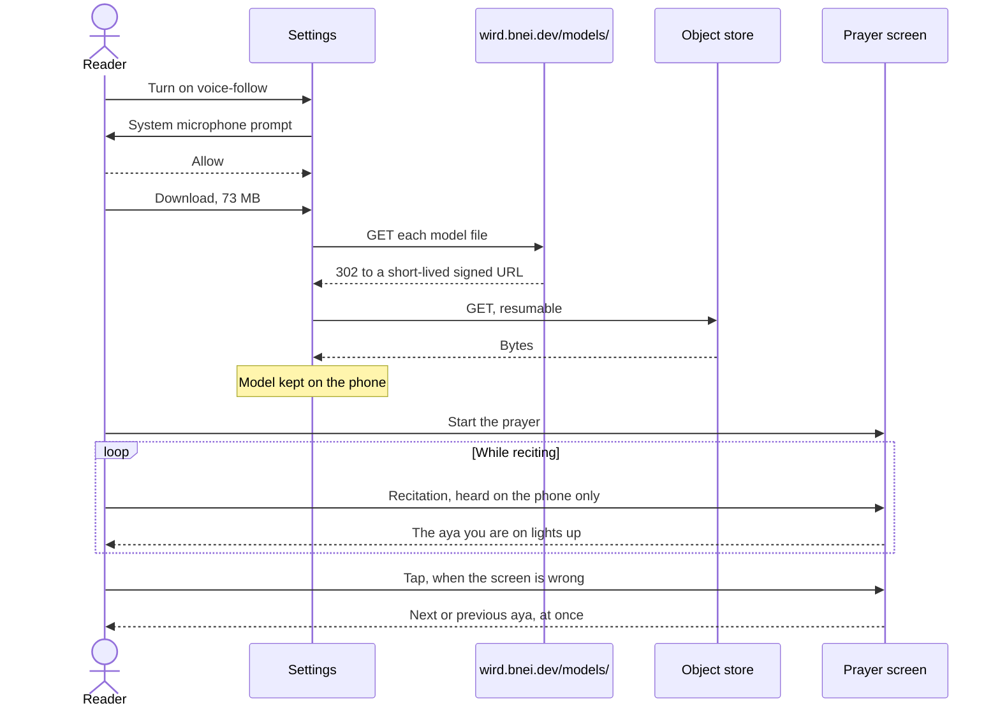
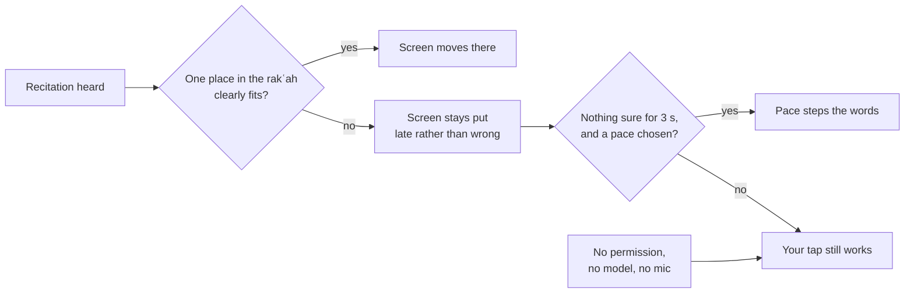
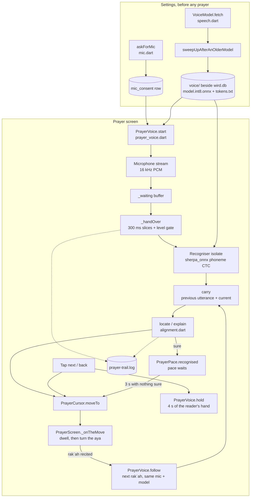
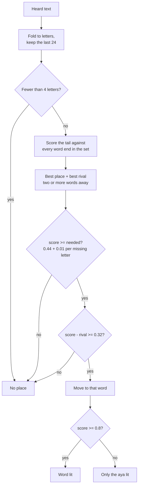
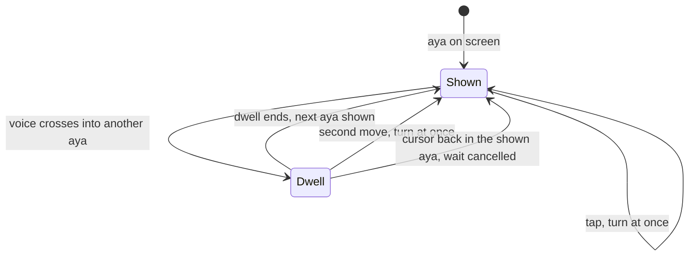
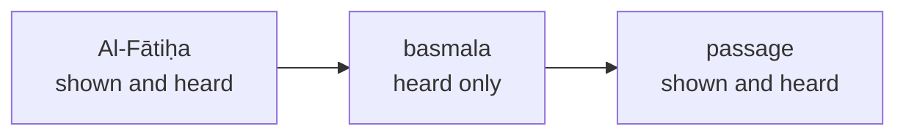
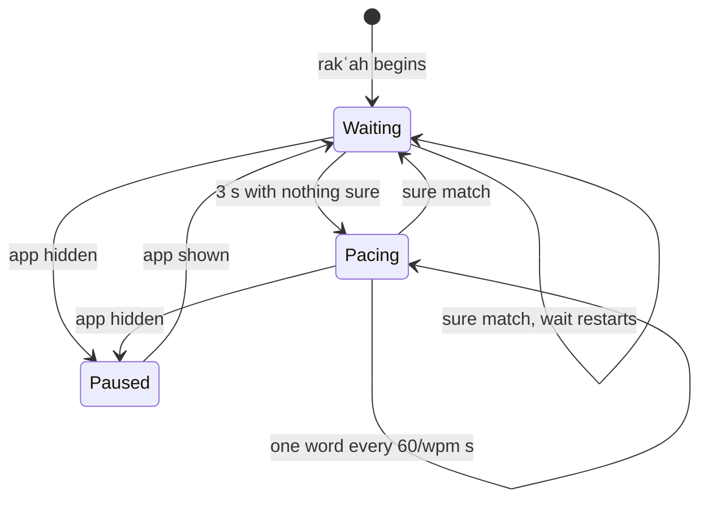

# Voice-follow

> The on-device recogniser that listens while you recite and lights the word you are on, with a steady pace and the tap as the fallbacks. Level L2 · Parent [App](../app.md) · Children none

## Black box

Voice-follow moves the prayer screen for you. You turn it on in Settings: you grant the microphone once and download a 73 MB model once. From then on, when you prepare a prayer with "follow my voice" on, the prayer screen listens while you recite each rakʿah, Al-Fātiḥa and then its passage, and lights the word you have reached. Your voice never leaves the phone. If the voice loses you and you also chose a pace, the pace carries the text until the voice finds you again. If anything is missing or goes wrong, the screen waits for your tap, as it always did.

| In | Out | Depends on |
|---|---|---|
| Your recitation, through the microphone | The aya (and, when sure, the word) you are on | Microphone permission, granted in Settings |
| The words of the rakʿah you are reciting | The moment the next rakʿah begins | The model files, fetched once from `wird.bnei.dev/models/` |
| Your taps on the prayer screen | A per-prayer log file on the phone, for reading afterwards | Nothing on the network during a prayer |



What you can count on, seen from outside:



- **Nothing appears in front of someone praying.** No dialog, no spinner, no error. A failure is silence.
- **A wrong place is worse than a late one.** The phone is on the floor during the prayer, so a wrong jump cannot be fixed by hand until the prayer ends. Voice-follow waits rather than guesses.
- **It follows you backwards too.** Repeating an aya is ordinary prayer.
- **Praise is not a rakʿah.** Between two rakʿahs only Al-Fātiḥa, recited, begins the next one. "Al-ḥamdu lillāh" said while bowing does not.

## White box



### 1. The microphone is asked for in Settings, never in a prayer

The answer is stored in the database, so the prayer screen only reads it. A device with no microphone is recorded as `unavailable`, which is different from a refusal.

```dart
Future<MicPermission> askForMic(
  Database db, {
  Future<bool> Function()? ask,
}) async {
  MicPermission answer;
  try {
    answer = await (ask ?? _prompt)()
        ? MicPermission.granted
        : MicPermission.denied;
  } on Object {
    answer = MicPermission.unavailable;
  }
  await setMicPermission(db, answer);
  return answer;
}
```

[mic.dart:41](../../../app/lib/data/mic.dart#L41-L55)

### 2. The model is downloaded on request, and resumes

Two files make the model: `model.int8.onnx` and `tokens.txt`, 72.7 MB together ([speech.dart:40](../../../app/lib/data/speech.dart#L40-L44)). The app holds a path on Wird's own host, never a signed URL, so a download resumed a week later simply asks again ([speech.dart:64](../../../app/lib/data/speech.dart#L64-L65)). The last path segment is a digest of the files, so new weights never land on a key a half-finished download is resuming against.

On the server, `/models/` needs no sign-in. It mints a signed URL to the object store and answers 302, so the bytes never pass through the API ([models.go:70](../../../server/internal/api/models.go#L70-L79)).

A stopped download keeps its `.part` file. The resume sends a `Range` header, and an `If-Range` with the stored ETag, so a swapped file restarts instead of being spliced onto the old half:

```dart
            headers: {
              // A server that ignores the range answers 200 and the whole
              // file, which would be appended to what is already there and
              // corrupt it.
              if (from > 0) 'range': 'bytes=$from-',
              // And one that honours it will happily continue a DIFFERENT
              // object under the same name. `If-Range` makes the store answer
              // 200 with the whole file instead of 206, so a swapped part
              // restarts rather than splicing two halves that do not belong
              // together. Length alone cannot see that.
              if (from > 0 && heldTag.isNotEmpty) 'if-range': heldTag,
            },
```

[speech.dart:249](../../../app/lib/data/speech.dart#L249-L260)

A failed fetch is reported to Settings as one of two things: `notServed` (the host answered, but not with the file) or `interrupted` (the bytes stopped) ([speech.dart:172](../../../app/lib/data/speech.dart#L172-L181)). Settings starts the fetch from its model panel ([settings_screen.dart:545](../../../app/lib/features/settings/settings_screen.dart#L545-L558)).

### 3. Old models are swept away

Every fetch first deletes any file in the `voice/` directory that this build does not use. Without it, a phone that once held an older recogniser keeps it forever; the transducer this model replaced was 339 MB.

```dart
  void sweepUpAfterAnOlderModel() {
    final keep = {
      for (final part in voiceModelParts) ...[part, '$part.part', '$part.etag'],
    };
    try {
      for (final entry in dir.listSync()) {
        if (entry is! File) continue;
        if (keep.contains(entry.uri.pathSegments.last)) continue;
        entry.deleteSync();
      }
    } on Object {
      // Disk the reader cannot see is not worth failing a download over.
    }
  }
```

[speech.dart:306](../../../app/lib/data/speech.dart#L306-L319)

The model is "ready" only when every part exists ([speech.dart:207](../../../app/lib/data/speech.dart#L207)). The reader can remove it again from Settings ([speech.dart:323](../../../app/lib/data/speech.dart#L323-L325)).

### 4. A prayer opens the microphone before the model loads

The prayer screen calls `PrayerVoice.start` when it opens, if the reader chose "follow my voice" ([prayer_screen.dart:178](../../../app/lib/features/prayer/prayer_screen.dart#L178-L180), [prayer_screen.dart:334](../../../app/lib/features/prayer/prayer_screen.dart#L334-L370)). It checks the stored permission and the model files, and returns `null` if either is missing. The microphone opens first and the model loads second, because loading takes seconds and the first words of the recitation must not be lost:

```dart
      if (await micPermission(db) != MicPermission.granted) return null;
      final model = await VoiceModel.beside(await getDatabasesPath());
      if (!model.ready) return null;
      mic = AudioRecorder();
      // Asked without a prompt. The reader already answered in Settings, and
      // a device that has since had the permission taken away answers false
      // here rather than raising anything over the prayer. Thrown rather than
      // returned: see above.
      if (!await mic.hasPermission(request: false)) {
        throw StateError('the microphone was taken away since Settings');
      }
      voice = PrayerVoice._(cursor, Recitation(words), mic, log, unseenAt);
      await voice._listen();
      log.note('microphone', 'listening, ${since()}');
      listening?.call(voice);
```

[prayer_voice.dart:275](../../../app/lib/features/prayer/prayer_voice.dart#L275-L289)

Audio that arrives while the model loads waits in a buffer. Every failure after the microphone opens throws into one handler that stops everything ([prayer_voice.dart:304](../../../app/lib/features/prayer/prayer_voice.dart#L304-L313)). The stream is 16 kHz mono PCM with no auto gain and no noise suppression ([prayer_voice.dart:329](../../../app/lib/features/prayer/prayer_voice.dart#L329-L343)).

### 5. The recogniser runs on its own isolate

`Recogniser.open` spawns an isolate and gives up if it has not answered within 20 seconds ([speech.dart:359](../../../app/lib/data/speech.dart#L359-L393)). The isolate builds a sherpa_onnx streaming zipformer CTC recogniser, with endpointing on, and only then answers ([speech.dart:460](../../../app/lib/data/speech.dart#L460-L487)). The model writes Qurʼanic phonemes: Arabic letters, short vowels and tajwīd marks, with no Latin letters at all ([speech.dart:25](../../../app/lib/data/speech.dart#L25-L30)). One stream and one model live for the whole prayer, every rakʿah of it. Each batch of samples goes in once, and the reply is the current utterance plus whether it has just ended:

```dart
      stream.acceptWaveform(samples: message, sampleRate: heardSampleRate);
      while (recogniser.isReady(stream)) {
        recogniser.decode(stream);
      }
      text = recogniser.getResult(stream).text;
      ended = recogniser.isEndpoint(stream);
      // Only the utterance now being said. What is worth carrying past the
      // end of one is the caller's business, which is where the matcher's
      // window lives.
      if (ended) recogniser.reset(stream);
```

[speech.dart:499](../../../app/lib/data/speech.dart#L499-L508)

`hear` never throws and never queues: a second ask while one is pending answers empty, and an ask times out after 10 seconds ([speech.dart:421](../../../app/lib/data/speech.dart#L421-L438)). Leaving the prayer asks the isolate to unwind, so the native weights are freed, and kills it after 2 seconds if it will not ([speech.dart:525](../../../app/lib/data/speech.dart#L525-L540)).

### 6. The drain hands audio over in 300 ms slices

`_handOver` takes the whole backlog at once and feeds it to the recogniser in slices of 300 ms ([prayer_voice.dart:350](../../../app/lib/features/prayer/prayer_voice.dart#L350-L526)). Before the reader's first word, quiet slices are skipped by a fixed level gate (`heardQuiet = 0.02`, [speech.dart:161](../../../app/lib/data/speech.dart#L161)). Once the reader begins, the gate latches open and every slice is heard, pauses included ([prayer_voice.dart:438](../../../app/lib/features/prayer/prayer_voice.dart#L438)). An answer that comes back after the screen has moved on to the next rakʿah is dropped: a generation counter, bumped by `follow`, tells the two apart.

```dart
          _speaking = true;
          final generation = _generation;
          final said = await hear(samples);
          // The rakʿah changed while this was being decoded. What it says is
          // about the rakʿah just finished, and the next one starts clean.
          if (generation != _generation) continue;
          // What the reciter has said, as far as this side is concerned: the
          // phrase before this one and the one now being spoken.
          final heard = '$_carried ${said.text}'.trim();
          // Read before it is replaced: this window is the old carry plus what
          // is being said now, and only the NEXT one is affected by an endpoint
          // here.
          _carried = carry(_carried, said);
```

[prayer_voice.dart:445](../../../app/lib/features/prayer/prayer_voice.dart#L445-L457)

The text judged is the previous utterance plus the current one, so the matcher can read across the breath between two ayas. When an utterance ends, the carry is replaced by what it said, even if that was nothing ([prayer_voice.dart:47](../../../app/lib/features/prayer/prayer_voice.dart#L47-L48)). That empty reset is the fix for a bystander's words being matched on the strength of the reader's own last aya.

Three more checks run before the matcher is asked ([prayer_voice.dart:479](../../../app/lib/features/prayer/prayer_voice.dart#L479-L499)): during a catch-up only the last slice moves the screen, an unchanged answer is not judged again, and for 4 seconds after a tap the reader's hand wins ([prayer_voice.dart:613](../../../app/lib/features/prayer/prayer_voice.dart#L613), [speech.dart:82](../../../app/lib/data/speech.dart#L82)). An unchanged answer that is still loud is a reciter holding a long vowel, so it tells the pace the reciter is still found, without moving anything ([prayer_voice.dart:488](../../../app/lib/features/prayer/prayer_voice.dart#L488-L494)). It is believed for 6 seconds after the last new words were found, the longest a madd is held. Past that, loud and unchanged is a recogniser that has stopped writing, a reciter lost or a neighbour praying aloud, and the pace is let take over ([prayer_voice.dart:57](../../../app/lib/features/prayer/prayer_voice.dart#L57-L66)).

### 7. Both sides are folded to the letters they agree on

The muṣḥaf writes fully vowelled Uthmani text; the recogniser writes sounds, with doubled letters and held vowels. `recitationKey` reduces both to bare letters: it folds alif and hamza forms together, drops the waṣl alif, and collapses a run of one letter to that letter ([voice_follow.dart:19](../../../app/lib/features/prayer/voice_follow.dart#L19-L65)).

```dart
    // Everything that is not a letter: the harakāt, the sukūn, the waqf marks,
    // tatwīl, and the tajwīd the recogniser rides above a letter — the qalqala
    // on ٱقْرَأْ is written ءِقڇرَء and is the ق echoing, not a sound of its own.
    if (folded < 0x0621 || folded > 0x064A || folded == 0x0640) continue;
    if (folded != last) letters.writeCharCode(folded);
    last = folded;
  }
  return letters.toString();
```

[voice_follow.dart:57](../../../app/lib/features/prayer/voice_follow.dart#L57-L64)

### 8. The matcher locates the reciter in the set

The matcher does not transcribe. It already knows the text and only asks where in the rakʿah the last few words fit. `Recitation` folds the rakʿah once, when it begins, into one run of letters, remembering which word each letter came from ([alignment.dart:77](../../../app/lib/features/prayer/alignment.dart#L77-L112)).



`explain` scores the heard tail against the text ending at every word end in the set, using edit distance ([alignment.dart:139](../../../app/lib/features/prayer/alignment.dart#L139-L190)). It searches the whole rakʿah, not a band ahead of the screen, so a reciter who repeats an aya is followed back into it. `locate` adds two gates:

```dart
({int word, double score})? locate(Recitation set, String heard) {
  final said = explain(set, heard);
  if (said == null) return null;
  if (said.score < said.needed) return null;
  if (said.score - said.rival < followMargin) return null;
  return (word: said.word, score: said.score);
}
```

[alignment.dart:124](../../../app/lib/features/prayer/alignment.dart#L124-L130)

The window is short on purpose, about four words ([alignment.dart:40](../../../app/lib/features/prayer/alignment.dart#L40)). A long window would drag a reciter who repeats an aya forward through the text. The thresholds are named constants with their reasons beside them ([alignment.dart:49](../../../app/lib/features/prayer/alignment.dart#L49-L65)). The margin is what refuses a phrase that appears twice in the rakʿah. Where the screen stands now is deliberately not an input.

Settings has a check screen that runs the same `locate` and `explain` on live audio, so a reader can see what is heard, where it lands and why it did not move, without praying ([voice_check.dart:134](../../../app/lib/features/settings/voice_check.dart#L134-L160)). It feeds the recogniser directly, with no slicing and no level gate, and it keeps the older carry rule that holds on to the last non-empty utterance ([voice_check.dart:128](../../../app/lib/features/settings/voice_check.dart#L128-L131)).

### 9. The cursor moves, and the screen turns the aya

A match moves the cursor, marking the word as sure only above `followSure` ([prayer_voice.dart:507](../../../app/lib/features/prayer/prayer_voice.dart#L507-L492)). Nothing else is drawn. The line that used to echo the matched words under the aya is gone: a reader glancing at the phone wants the word, not what the phone heard. The cursor moves in either direction and stays silent when nothing changed:

```dart
  void moveTo(int word, {bool sure = true}) {
    final next = word.clamp(0, words - 1);
    if (next == _at && sure == _sure) return;
    _at = next;
    _sure = sure;
    notifyListeners();
  }
```

[prayer_cursor.dart:58](../../../app/lib/features/prayer/prayer_cursor.dart#L58-L64)



The screen lets the aya just finished stand for a one-second dwell before turning ([prayer_screen.dart:104](../../../app/lib/features/prayer/prayer_screen.dart#L104)), unless the reciter keeps going or the move came from a tap ([prayer_screen.dart:258](../../../app/lib/features/prayer/prayer_screen.dart#L258-L289)). The word being recited is held about a third of the way down the field, whatever the Arabic size ([prayer_screen.dart:408](../../../app/lib/features/prayer/prayer_screen.dart#L408-L423)).

The two tap zones are there whatever moves the text, because the voice and the pace can both be wrong ([prayer_screen.dart:376](../../../app/lib/features/prayer/prayer_screen.dart#L376-L403)). The large zone goes to the start of the next aya. The narrow one goes back to the start of the aya you are in, or to the aya before when you are already at its start. Both call `hold`, so the voice does not pull the screen straight back, and restart the pace from where the hand put it. With neither voice nor pace chosen, the large zone steps one word, because the hand is then the only pace. A tap past the last aya ends the rakʿah.

### 10. The prayer trail records what happened

A prayer cannot be watched, so each one writes `prayer-trail.log` beside the database, truncated when the next prayer opens ([prayer_trail.dart:28](../../../app/lib/features/prayer/prayer_trail.dart#L28-L38)). Every line is stamped with seconds since the prayer opened, and writing never fails the prayer:

```dart
  void note(String what, String detail) {
    final sink = _sink;
    if (sink == null) return;
    try {
      final at = DateTime.now().difference(_began).inMilliseconds / 1000;
      sink.writeln('${at.toStringAsFixed(1)}s  $what  $detail');
    } on Object {
      // A prayer is not interrupted so that its diary can be kept.
    }
  }
```

[prayer_trail.dart:46](../../../app/lib/features/prayer/prayer_trail.dart#L46-L55)

The lines written include: a `prayer` line with the number of rakʿahs and the words in the first ([prayer_screen.dart:336](../../../app/lib/features/prayer/prayer_screen.dart#L336-L339)), `microphone` and `recogniser` load times ([prayer_voice.dart:288](../../../app/lib/features/prayer/prayer_voice.dart#L288-L297)), a `voice` line when voice-follow did not start ([prayer_screen.dart:358](../../../app/lib/features/prayer/prayer_screen.dart#L358)), `voice` when the reader begins, a `still here` heartbeat every 3 seconds with the range of batch levels ([prayer_voice.dart:421](../../../app/lib/features/prayer/prayer_voice.dart#L421-L433)), each `utterance ended`, each `held` for a new answer ignored during a hold, and each `heard` with the matcher's verdict: `too little heard`, `MOVE`, `stay` under the bar, or `stay` because the phrase was said twice ([prayer_voice.dart:618](../../../app/lib/features/prayer/prayer_voice.dart#L618-L630)). The trail is local only. On a Mac it lands next to `wird.db` in the app's sandboxed Documents folder ([Getting started](../../guides/getting-started.md#a-corpus-rebuild-reaches-your-machine-only-with-a-new-version)).

### 11. Leaving the prayer stops everything, once

`stop` is idempotent and swallows every error, because it is reached from both the screen's way out and `start`'s own failure handler ([prayer_voice.dart:644](../../../app/lib/features/prayer/prayer_voice.dart#L644-L666)). The screen tracks the voice from the moment the microphone is live, so backing out while the model still loads also closes the microphone ([prayer_screen.dart:137](../../../app/lib/features/prayer/prayer_screen.dart#L137-L141), [prayer_screen.dart:195](../../../app/lib/features/prayer/prayer_screen.dart#L195)).

### 12. One voice follows each rakʿah in turn

A prayer is recited one rakʿah at a time, each Al-Fātiḥa and then its passage. The microphone and the model are opened once, for the first rakʿah. When a rakʿah is recited, the screen builds the next one on a cursor of its own and points the same voice at it with `follow` ([prayer_screen.dart:318](../../../app/lib/features/prayer/prayer_screen.dart#L318)). Loading the model again could cost up to 20 seconds between two rakʿahs.

`follow` swaps the text and the cursor, clears what was carried and last heard, drops the reader's hold, and bumps the generation so an answer still being decoded for the old rakʿah is thrown away ([prayer_voice.dart:573](../../../app/lib/features/prayer/prayer_voice.dart#L573-L584)). The audio already waiting is kept: cutting a gap into the stream would cost the words on either side.

A rakʿah is over when the pace steps past its last word, when the reader taps past its last aya, or when the voice has rested on the last word for 2 seconds ([prayer_screen.dart:268](../../../app/lib/features/prayer/prayer_screen.dart#L268-L270)). The last rakʿah shows "Prayer complete" and closes itself after 2.4 seconds ([prayer_screen.dart:304](../../../app/lib/features/prayer/prayer_screen.dart#L304-L309)).

### 13. A rakʿah begins only on Al-Fātiḥa

Between two rakʿahs the reader bows, stands and prostrates, and says "al-ḥamdu lillāh" or "rabbanā wa laka l-ḥamd" on the way. To a short window that is the opening of Al-Fātiḥa. So while the next rakʿah waits, a match begins it only if it is sure, the window is full (`heardTailLetters`, 24 letters), and it lands within Al-Fātiḥa's first two ayas (`openingWords`, 8 words):

```dart
  bool _opens(int word, String heard) {
    var letters = 0;
    for (final w in heard.split(RegExp(r'\s+'))) {
      letters += recitationKey(w).length;
    }
    return _lastSure && letters >= heardTailLetters && word < openingWords;
  }
```

[prayer_voice.dart:594](../../../app/lib/features/prayer/prayer_voice.dart#L594-L600) · [openingWords](../../../app/lib/features/prayer/prayer_voice.dart#L70)

A tap on the waiting screen begins the rakʿah too ([prayer_screen.dart:377](../../../app/lib/features/prayer/prayer_screen.dart#L377)).

### 14. The voice hears a basmala the screen does not show

A reciter says the basmala before a sūra, and the muṣḥaf does not number it, so the screen never shows it there. Left out of what the voice listens for, the only place a basmala fits is Al-Fātiḥa's first aya, and a reciter starting the passage was pulled back to the top of the prayer: "بسم الله" alone scored 0.83 on word 1. So `rakahOf` puts Al-Fātiḥa's first aya into what the voice hears just before the passage, except before At-Tawba, which is recited without one ([prayer_plan.dart:83](../../../app/lib/features/prayer/prayer_plan.dart#L83-L101)). A basmala then fits two places equally well, and the margin refuses both: the screen waits a moment instead of jumping.



The voice lights nothing while the reciter is inside that basmala, and shifts every word after it back onto the screen's numbering ([prayer_voice.dart:605](../../../app/lib/features/prayer/prayer_voice.dart#L605-L609)).

### 15. The pace covers for a lost voice

The reader can choose the voice, a steady pace in words per minute, both, or neither. With both, the voice leads. `PrayerPace` waits 3 seconds (`lostAfter`) for something sure, then steps the words at the chosen pace from wherever the voice last put the cursor. Any sure match, the same word again included, stops the pace and restarts the wait. The pace's own steps never count as the reciter being found ([prayer_pace.dart:79](../../../app/lib/features/prayer/prayer_pace.dart#L79-L92)).



A tap restarts the clock from the word the hand chose ([prayer_pace.dart:63](../../../app/lib/features/prayer/prayer_pace.dart#L63-L66)). When the app is hidden the pace stops, because a prayer the phone left is not one the pace can recite alone ([prayer_screen.dart:169](../../../app/lib/features/prayer/prayer_screen.dart#L169-L176)).

### Known issues

The field walks are recorded in [the voice-follow walk](../../journal/voice-follow-walk.md). The open one is [finding 9](../../journal/voice-follow-walk.md#9-the-margin-rule-pins-the-cursor-on-any-set-that-says-a-phrase-twice): the margin rule refuses every window on a set that says one phrase twice, such as ٱلرَّحْمَـٰنِ ٱلرَّحِيمِ in al-Fātiḥa, so the cursor can stand still for many seconds. Every rakʿah now opens with Al-Fātiḥa, so every prayer meets it.

## Why it is this way

- [ADR 0005](../../adr/0005-voice-follow-locates-the-reciter-with-a-quran-model-on-the-phone.md) — locate, do not transcribe; the model runs on the phone; the tap stays the fallback.
- [ADR 0007](../../adr/0007-the-voice-model-is-published-where-its-weights-already-live.md) — superseded; kept for why a signed-out phone must be able to fetch the model.
- [ADR 0008](../../adr/0008-the-recogniser-is-served-from-wirds-own-host.md) — the model is served from `wird.bnei.dev/models/` as a redirect to the object store.
- [ADR 0009](../../adr/0009-the-recogniser-hears-quranic-phonemes-not-language.md) — an Arabic-only phoneme CTC model replaced a multilingual one that drifted into other languages.
- [ADR 0018](../../adr/0018-a-prayer-is-prepared-then-recited-one-rakah-at-a-time.md) — one voice per prayer, pointed at each rakʿah in turn; Al-Fātiḥa opens a rakʿah; the unseen basmala; the pace as fallback; the taps kept.

## Go deeper

- Parent: [App](../app.md). Sibling: [Sets and reader](sets-and-reader.md), which builds the set a prayer is usually prepared on.
- Tour: [Following your voice](../../tours/following-your-voice.md).
- Field log: [the voice-follow walk](../../journal/voice-follow-walk.md).
- Tests: [voice_follow_test.dart](../../../app/test/features/prayer/voice_follow_test.dart) (graded fixtures), [prayer_cursor_test.dart](../../../app/test/features/prayer/prayer_cursor_test.dart), [speech_test.dart](../../../app/test/data/speech_test.dart), [voice_model_test.dart](../../../app/test/features/settings/voice_model_test.dart), [rakah_voice_test.dart](../../../app/test/features/prayer/rakah_voice_test.dart), [prayer_pace_test.dart](../../../app/test/features/prayer/prayer_pace_test.dart).
