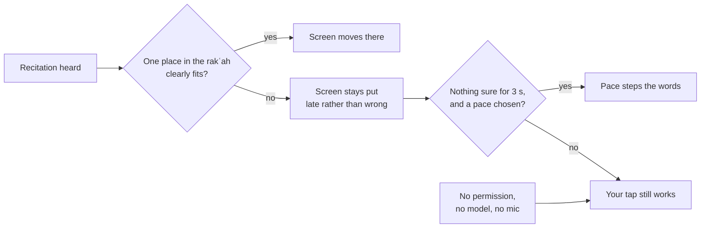
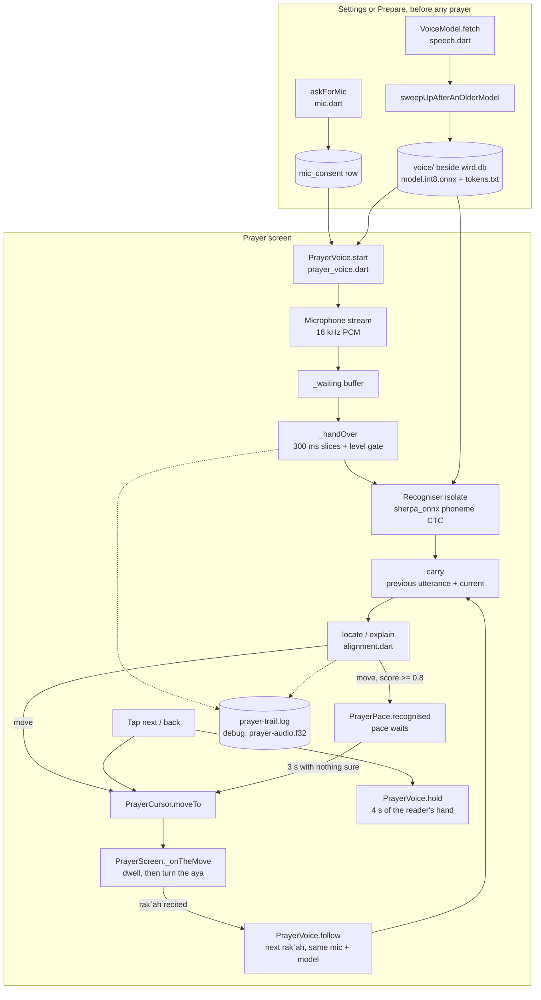
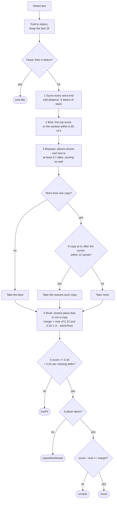
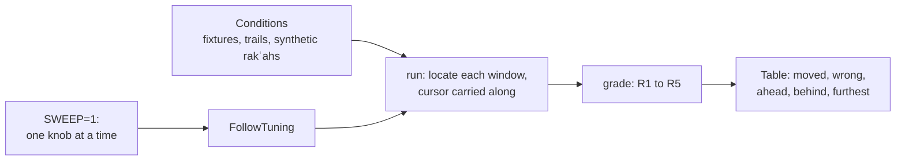
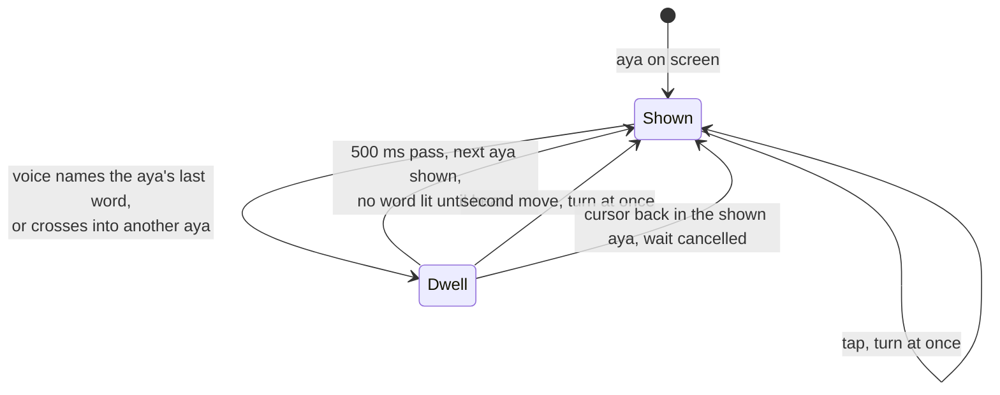
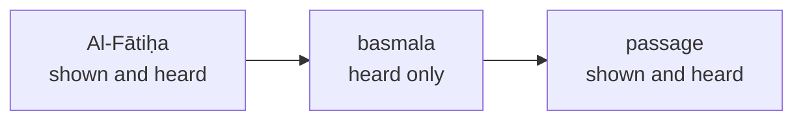
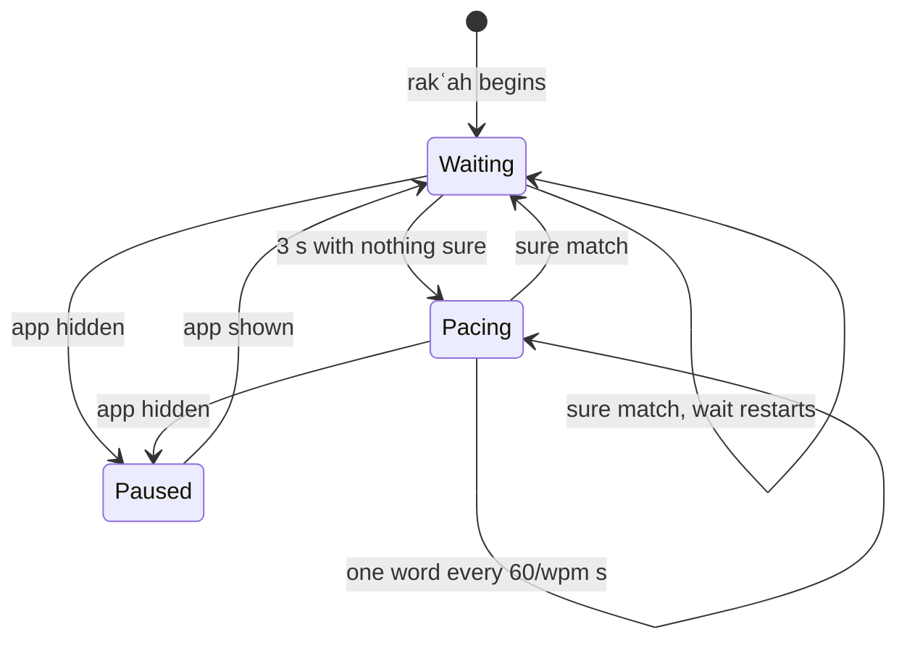

# Voice-follow

> The on-device recogniser that listens while you recite and lights the word you are on, with a steady pace and the tap as the fallbacks. Level L2 · Parent [App](../app.md) · Children none

## Black box

Voice-follow moves the prayer screen for you. You set it up once, in Settings or under "Follow my voice" on the prayer's preparation: you grant the microphone and download a 73 MB model. From then on, when you prepare a prayer with "follow my voice" on, the prayer screen listens while you recite each rakʿah, Al-Fātiḥa and then its passage, and lights the word you have reached. Your voice never leaves the phone. If the voice loses you and you also chose a pace, the pace carries the text until the voice finds you again. If anything is missing or goes wrong, the screen waits for your tap, as it always did.

| In | Out | Depends on |
|---|---|---|
| Your recitation, through the microphone | The aya and the word you are on | Microphone permission, granted before the prayer |
| The words of the rakʿah you are reciting | The moment the next rakʿah begins | The model files, fetched once from `wird.bnei.dev/models/` |
| Your taps on the prayer screen | A per-prayer log file on the phone, for reading afterwards | Nothing on the network during a prayer |


What you can count on, seen from outside:



- **Nothing appears in front of someone praying.** No dialog, no spinner, no error. A failure is silence.
- **A wrong place is worse than a late one.** The phone is on the floor during the prayer, so a wrong jump cannot be fixed by hand until the prayer ends. Voice-follow waits rather than guesses.
- **It follows you backwards too.** Repeating an aya is ordinary prayer.
- **A phrase the rakʿah says twice is taken in order.** Al-Fātiḥa says "ar-raḥmāni r-raḥīm" twice, and the passage's unseen basmala says it a third time. The voice takes the copy just ahead of where the screen stands.
- **Praise is not a rakʿah.** Between two rakʿahs only Al-Fātiḥa, recited, begins the next one. "Al-ḥamdu lillāh" said while bowing does not.

## White box



### 1. The microphone is asked for before the prayer, never in it

Two places ask: the voice panel in Settings, and the preparation screen, which shows "Allow microphone" and then the model's download right under "Follow my voice" until both are done ([prepare_screen.dart:745](../../../app/lib/features/prayer/prepare_screen.dart#L745-L764)). Once the model is on disk, the panel's `onReady` ticks "Follow my voice" without a second tap ([prepare_screen.dart:721](../../../app/lib/features/prayer/prepare_screen.dart#L721-L725), [settings_screen.dart:559](../../../app/lib/features/settings/settings_screen.dart#L593)). The answer is stored in the database, so the prayer screen only reads it. A device with no microphone is recorded as `unavailable`, which is different from a refusal.

```dart
Future<MicPermission> askForMic(
  Database db, {
  Future<bool> Function()? ask,
}) async {
  MicPermission answer;
  try {
    answer = await (ask ?? _prompt)()
        ? MicPermission.granted
        : MicPermission.denied;
  } on Object {
    answer = MicPermission.unavailable;
  }
  await setMicPermission(db, answer);
  return answer;
}
```

[mic.dart:41](../../../app/lib/data/mic.dart#L41-L55)

### 2. The model is downloaded on request, and resumes

Two files make the model: `model.int8.onnx` and `tokens.txt`, 72.7 MB together ([speech.dart:40](../../../app/lib/data/speech.dart#L40-L44)). The app holds a path on Wird's own host, never a signed URL, so a download resumed a week later simply asks again ([speech.dart:64](../../../app/lib/data/speech.dart#L64-L65)). The last path segment is a digest of the files, so new weights never land on a key a half-finished download is resuming against.

On the server, `/models/` needs no sign-in. It mints a signed URL to the object store and answers 302, so the bytes never pass through the API ([models.go:70](../../../server/internal/api/models.go#L70-L79)).

A stopped download keeps its `.part` file. The resume sends a `Range` header, and an `If-Range` with the stored ETag, so a swapped file restarts instead of being spliced onto the old half:

```dart
            headers: {
              // A server that ignores the range answers 200 and the whole
              // file, which would be appended to what is already there and
              // corrupt it.
              if (from > 0) 'range': 'bytes=$from-',
              // And one that honours it will happily continue a DIFFERENT
              // object under the same name. `If-Range` makes the store answer
              // 200 with the whole file instead of 206, so a swapped part
              // restarts rather than splicing two halves that do not belong
              // together. Length alone cannot see that.
              if (from > 0 && heldTag.isNotEmpty) 'if-range': heldTag,
            },
```

[speech.dart:249](../../../app/lib/data/speech.dart#L249-L260)

A failed fetch is reported to Settings as one of two things: `notServed` (the host answered, but not with the file) or `interrupted` (the bytes stopped) ([speech.dart:172](../../../app/lib/data/speech.dart#L172-L181)). Settings starts the fetch from its model panel ([settings_screen.dart:568](../../../app/lib/features/settings/settings_screen.dart#L602-L615)).

### 3. Old models are swept away

Every fetch first deletes any file in the `voice/` directory that this build does not use. Without it, a phone that once held an older recogniser keeps it forever; the transducer this model replaced was 339 MB.

```dart
  void sweepUpAfterAnOlderModel() {
    final keep = {
      for (final part in voiceModelParts) ...[part, '$part.part', '$part.etag'],
    };
    try {
      for (final entry in dir.listSync()) {
        if (entry is! File) continue;
        if (keep.contains(entry.uri.pathSegments.last)) continue;
        entry.deleteSync();
      }
    } on Object {
      // Disk the reader cannot see is not worth failing a download over.
    }
  }
```

[speech.dart:306](../../../app/lib/data/speech.dart#L306-L319)

The model is "ready" only when every part exists ([speech.dart:207](../../../app/lib/data/speech.dart#L207)). The reader can remove it again from Settings ([speech.dart:323](../../../app/lib/data/speech.dart#L323-L325)).

### 4. A prayer opens the microphone before the model loads

The prayer screen calls `PrayerVoice.start` when it opens, if the reader chose "follow my voice" ([prayer_screen.dart:199](../../../app/lib/features/prayer/prayer_screen.dart#L199-L201), [prayer_screen.dart:372](../../../app/lib/features/prayer/prayer_screen.dart#L372-L408)). It checks the stored permission and the model files, and returns `null` if either is missing. The microphone opens first and the model loads second, because loading takes seconds and the first words of the recitation must not be lost:

```dart
      if (await micPermission(db) != MicPermission.granted) return null;
      final model = await VoiceModel.beside(await getDatabasesPath());
      if (!model.ready) return null;
      mic = AudioRecorder();
      // Asked without a prompt. The reader already answered in Settings, and
      // a device that has since had the permission taken away answers false
      // here rather than raising anything over the prayer. Thrown rather than
      // returned: see above.
      if (!await mic.hasPermission(request: false)) {
        throw StateError('the microphone was taken away since Settings');
      }
      voice = PrayerVoice._(cursor, Recitation(words), mic, log, unseenAt);
      await voice._listen();
      log.note('microphone', 'listening, ${since()}');
      listening?.call(voice);
```

[prayer_voice.dart:277](../../../app/lib/features/prayer/prayer_voice.dart#L277-L291)

Audio that arrives while the model loads waits in a buffer. Every failure after the microphone opens throws into one handler that stops everything ([prayer_voice.dart:306](../../../app/lib/features/prayer/prayer_voice.dart#L306-L315)). The stream is 16 kHz mono PCM with no auto gain and no noise suppression ([prayer_voice.dart:331](../../../app/lib/features/prayer/prayer_voice.dart#L331-L345)).

### 5. The recogniser runs on its own isolate

`Recogniser.open` spawns an isolate and gives up if it has not answered within 20 seconds ([speech.dart:359](../../../app/lib/data/speech.dart#L359-L393)). The isolate builds a sherpa_onnx streaming zipformer CTC recogniser, with endpointing on, and only then answers ([speech.dart:460](../../../app/lib/data/speech.dart#L460-L487)). The model writes Qurʼanic phonemes: Arabic letters, short vowels and tajwīd marks, with no Latin letters at all ([speech.dart:25](../../../app/lib/data/speech.dart#L25-L30)). One stream and one model live for the whole prayer, every rakʿah of it. Each batch of samples goes in once, and the reply is the current utterance plus whether it has just ended:

```dart
      stream.acceptWaveform(samples: message, sampleRate: heardSampleRate);
      while (recogniser.isReady(stream)) {
        recogniser.decode(stream);
      }
      text = recogniser.getResult(stream).text;
      ended = recogniser.isEndpoint(stream);
      // Only the utterance now being said. What is worth carrying past the
      // end of one is the caller's business, which is where the matcher's
      // window lives.
      if (ended) recogniser.reset(stream);
```

[speech.dart:499](../../../app/lib/data/speech.dart#L499-L508)

`hear` never throws and never queues: a second ask while one is pending answers empty, and an ask times out after 10 seconds ([speech.dart:421](../../../app/lib/data/speech.dart#L421-L438)). Leaving the prayer asks the isolate to unwind, so the native weights are freed, and kills it after 2 seconds if it will not ([speech.dart:525](../../../app/lib/data/speech.dart#L525-L540)).

### 6. The drain hands audio over in 300 ms slices

`_handOver` takes the whole backlog at once and feeds it to the recogniser in slices of 300 ms ([prayer_voice.dart:352](../../../app/lib/features/prayer/prayer_voice.dart#L352-L532)). Before the reader's first word, quiet slices are skipped by a fixed level gate (`heardQuiet = 0.02`, [speech.dart:161](../../../app/lib/data/speech.dart#L161)). Once the reader begins, the gate latches open and every slice is heard, pauses included ([prayer_voice.dart:440](../../../app/lib/features/prayer/prayer_voice.dart#L440)). An answer that comes back after the screen has moved on to the next rakʿah is dropped: a generation counter, bumped by `follow`, tells the two apart.

```dart
          _speaking = true;
          final generation = _generation;
          trail.tape(samples);
          final said = await hear(samples);
          // The rakʿah changed while this was being decoded. What it says is
          // about the rakʿah just finished, and the next one starts clean.
          if (generation != _generation) continue;
          // What the reciter has said, as far as this side is concerned: the
          // phrase before this one and the one now being spoken.
          final heard = '$_carried ${said.text}'.trim();
          // Read before it is replaced: this window is the old carry plus what
          // is being said now, and only the NEXT one is affected by an endpoint
          // here.
          _carried = carry(_carried, said);
```

[prayer_voice.dart:447](../../../app/lib/features/prayer/prayer_voice.dart#L447-L460)

The text judged is the previous utterance plus the current one, so the matcher can read across the breath between two ayas. When an utterance ends, the carry is replaced by what it said, even if that was nothing ([prayer_voice.dart:46](../../../app/lib/features/prayer/prayer_voice.dart#L46-L47)). That empty reset is the fix for a bystander's words being matched on the strength of the reader's own last aya.

Three more checks run before the matcher is asked ([prayer_voice.dart:482](../../../app/lib/features/prayer/prayer_voice.dart#L482-L502)): during a catch-up only the last slice moves the screen, an unchanged answer is not judged again, and for 4 seconds after a tap the reader's hand wins ([prayer_voice.dart:623](../../../app/lib/features/prayer/prayer_voice.dart#L623), [speech.dart:82](../../../app/lib/data/speech.dart#L82)). An unchanged answer that is still loud is a reciter holding a long vowel, so it tells the pace the reciter is still found, without moving anything ([prayer_voice.dart:491](../../../app/lib/features/prayer/prayer_voice.dart#L491-L497)). It is believed for 6 seconds after the last new words were found, the longest a madd is held. Past that, loud and unchanged is a recogniser that has stopped writing, a reciter lost or a neighbour praying aloud, and the pace is let take over ([prayer_voice.dart:56](../../../app/lib/features/prayer/prayer_voice.dart#L56-L65)).

### 7. Both sides are folded to the letters they agree on

The muṣḥaf writes fully vowelled Uthmani text; the recogniser writes sounds, with doubled letters and held vowels. `recitationKey` reduces both to bare letters: it folds alif and hamza forms together, drops the waṣl alif, and collapses a run of one letter to that letter ([voice_follow.dart:19](../../../app/lib/features/prayer/voice_follow.dart#L19-L65)).

```dart
    // Everything that is not a letter: the harakāt, the sukūn, the waqf marks,
    // tatwīl, and the tajwīd the recogniser rides above a letter — the qalqala
    // on ٱقْرَأْ is written ءِقڇرَء and is the ق echoing, not a sound of its own.
    if (folded < 0x0621 || folded > 0x064A || folded == 0x0640) continue;
    if (folded != last) letters.writeCharCode(folded);
    last = folded;
  }
  return letters.toString();
```

[voice_follow.dart:57](../../../app/lib/features/prayer/voice_follow.dart#L57-L64)

### 8. The matcher locates the reciter in the set

The matcher does not transcribe. It already knows the text and only asks where in the rakʿah the last few words fit. `Recitation` folds the rakʿah once, when it begins, into one run of letters, remembering which word each letter came from, and carries the numbers it is matched with ([alignment.dart:184](../../../app/lib/features/prayer/alignment.dart#L184-L248)).



`explain` runs those five steps and returns a `Placing`: the verdict, the word, and the workings behind it ([alignment.dart:289](../../../app/lib/features/prayer/alignment.dart#L289-L379)).

1. **Score.** The heard tail is laid against the set's letters ending at every word end, by edit distance. The match must end where the word ends but may start anywhere, so letters of the set before what was heard cost nothing ([alignment.dart:428](../../../app/lib/features/prayer/alignment.dart#L428-L449)). The set is read 6 letters longer than what was heard, because connected recitation drops letters the muṣḥaf writes ([alignment.dart:306](../../../app/lib/features/prayer/alignment.dart#L306-L309)). The whole rakʿah is searched, not a band ahead of the screen, so a reciter who repeats an aya is followed back into it.
2. **Best.** The top score, or the earliest place within 0.05 of it: two places that close are one answer told twice, and the earlier is late rather than ahead ([alignment.dart:394](../../../app/lib/features/prayer/alignment.dart#L394-L397)).
3. **Repeats, and order.** `sameText` asks how alike the set's own text is at two places: 1 for a phrase said twice, near 0 for two places with nothing in common ([alignment.dart:239](../../../app/lib/features/prayer/alignment.dart#L239-L245)). Places at least 0.7 alike to the best, and scoring as well, are copies of one phrase. Audio cannot tell copies apart, only order can. So the nearest copy at or after the cursor, within 12 words, is taken ([alignment.dart:317](../../../app/lib/features/prayer/alignment.dart#L317-L331), [alignment.dart:401](../../../app/lib/features/prayer/alignment.dart#L401-L415)). A reciter is at or past the cursor, so that copy is never ahead of them. Where the screen stands settles nothing else.
4. **Rival, and margin.** Of the places that are not copies, the one that comes closest to the place taken is the rival. The margin asked of that pair shrinks as the set makes the two alike, `max(0.15, 0.32 × (1 − sameText))`. Two places with nothing in common need 0.32 between them; near-copies need less, never under 0.15 ([alignment.dart:312](../../../app/lib/features/prayer/alignment.dart#L312-L315), [alignment.dart:337](../../../app/lib/features/prayer/alignment.dart#L337-L354)).
5. **Verdict.** Under the bar is `lowFit`. The bar is 0.44, plus 0.01 for each letter a short window lacks ([alignment.dart:361](../../../app/lib/features/prayer/alignment.dart#L361)). Copies with none just ahead of the cursor are `repeatNotAhead`. Inside the margin is `unclear`. Anything else is `move` ([alignment.dart:363](../../../app/lib/features/prayer/alignment.dart#L363-L378)).

`locate` is `explain` read as a place or nothing:

```dart
({int word, double score})? locate(
  Recitation set,
  String heard, {
  int? cursor,
}) {
  final said = explain(set, heard, cursor: cursor);
  return said.verdict == Verdict.move
      ? (word: said.word, score: said.score)
      : null;
}
```

[alignment.dart:253](../../../app/lib/features/prayer/alignment.dart#L253-L262)

The window is short on purpose, about four words. A long window would drag a reciter who repeats an aya forward through the text, so two copies of a phrase are told apart by order and the margin instead ([alignment.dart:21](../../../app/lib/features/prayer/alignment.dart#L21-L31)).

Every number the matcher decides with is a field of `FollowTuning`, with the measurement that set it written beside it ([alignment.dart:47](../../../app/lib/features/prayer/alignment.dart#L47-L130)):

| Field | Default | What it decides |
|---|---|---|
| `tailLetters` | 24 | How many letters of what was heard are matched |
| `threshold` | 0.44 | The score below which nothing moves |
| `perLetterShort` | 0.01 | What each missing letter of a short window adds to the bar |
| `margin` | 0.32 | The margin asked of two places with nothing in common |
| `marginFloor` | 0.15 | The least margin asked of any pair that is not a copy |
| `repeat` | 0.7 | How alike two places must be to count as copies |
| `repeatReach` | 12 | How many words past the cursor a copy may be taken |
| `slack` | 6 | How many more letters of the set than were heard are read |
| `sure` | 0.8 | The score above which a move counts as sure for the pace |
| `tie` | 0.05 | How close two scores must be to count as one answer |

Settings has a check screen that runs the same `explain` on live audio, so a reader can see what is heard, where it lands and why it did not move, in the same five verdicts, without praying ([voice_check.dart:139](../../../app/lib/features/settings/voice_check.dart#L139-L158)). It feeds the recogniser directly, with no slicing and no level gate, and it keeps the older carry rule that holds on to the last non-empty utterance ([voice_check.dart:128](../../../app/lib/features/settings/voice_check.dart#L128-L131)).

#### The bench

The bench replays every condition voice-follow has to survive through `locate`, in a few seconds, and grades each against the same five requirements ([follow_bench_test.dart:14](../../../app/test/features/prayer/follow_bench_test.dart#L14-L27)):

- **R1**: the cursor never moves ahead of the reciter or back past where they are.
- **R2**: the cursor gets as far as the reciter got.
- **R3**: windows spent ahead of the reciter stay under the condition's ratchet.
- **R4**: speech that is not the set never moves the cursor.
- **R5**: windows spent behind the reciter stay under the condition's ratchet. A change may lower a ratchet, never raise it.

The conditions are studio reciters on Al-Fātiḥa, Ḥuṣarī on al-ʿAlaq, the owner's own recordings, two Mac trails, perfect and noisy rakʿahs of five short sūras, a repeated aya, a dropped word, another sūra, and the bowing praise ([follow_bench_test.dart:229](../../../app/test/features/prayer/follow_bench_test.dart#L229-L410)).



Run it from `app/` with `fvm flutter test test/features/prayer/follow_bench_test.dart`. It prints one row per condition and fails on any broken requirement. With `SWEEP=1` set it also runs every condition under other values of one knob at a time and prints wrong, ahead, behind and failing counts per value ([follow_bench_test.dart:436](../../../app/test/features/prayer/follow_bench_test.dart#L436-L482)). That table is what a change to `FollowTuning` is argued from.

To add a prayer trail as a condition, copy `prayer-trail.log` into `app/test/fixtures/` and add a `Condition` that reads its `heard` lines, as the al-Falaq trail does ([follow_bench_test.dart:315](../../../app/test/features/prayer/follow_bench_test.dart#L315-L330)). Give it `reach`, the furthest word the reciter said. A trail says nothing about where the reader was, so give `lo` bounds only where the recogniser's own words prove it, as the Al-Fātiḥa trail does ([follow_bench_test.dart:293](../../../app/test/features/prayer/follow_bench_test.dart#L293-L313)).

### 9. The cursor moves, and the screen turns the aya

A move names the word: every place the matcher moves to lights its word, whatever the score ([prayer_voice.dart:503](../../../app/lib/features/prayer/prayer_voice.dart#L503-L519)). The cursor's `sure` now only says whether a word has been named at all, by the voice, the pace or a tap. A rakʿah opens with nothing named, and its first aya is drawn as still to come ([prayer_cursor.dart:42](../../../app/lib/features/prayer/prayer_cursor.dart#L42-L49)). `FollowTuning.sure` (0.8) no longer touches the screen. It only tells the pace the reciter has been found. The cursor moves in either direction and stays silent when nothing changed:

```dart
  void moveTo(int word, {bool sure = true}) {
    final next = word.clamp(0, words - 1);
    if (next == _at && sure == _sure) return;
    _at = next;
    _sure = sure;
    notifyListeners();
  }
```

[prayer_cursor.dart:57](../../../app/lib/features/prayer/prayer_cursor.dart#L57-L63)



The screen wants the next aya as soon as the voice names the last word of the one shown: the reciter has finished it and is about to begin the next ([prayer_screen.dart:270](../../../app/lib/features/prayer/prayer_screen.dart#L270-L281)). It turns after a 500 ms dwell, counted from that last word, unless the reciter keeps going or the move came from a tap ([prayer_screen.dart:103](../../../app/lib/features/prayer/prayer_screen.dart#L103), [prayer_screen.dart:296](../../../app/lib/features/prayer/prayer_screen.dart#L296-L327)). Two flags decide how the shown aya is drawn ([prayer_screen.dart:661](../../../app/lib/features/prayer/prayer_screen.dart#L661-L668), [prayer_screen.dart:889](../../../app/lib/features/prayer/prayer_screen.dart#L889-L936)):

- `behind`: the cursor has left this aya and it stands for the dwell. All of it is drawn as recited.
- `named`: a word of this aya has been named. An aya shown because the one before it was finished has none yet, so it is drawn as still to come, with no word lit until its first word is heard.

The ayas before and after the one shown are drawn faded. Where that neighbour belongs to another sūra, a sūra mark is drawn instead, named for the later sūra, so Al-Fātiḥa's last aya does not run into the passage's first ([prayer_screen.dart:832](../../../app/lib/features/prayer/prayer_screen.dart#L832-L887)). On a turn the aya before, the shown one and the one after travel the same distance together, up when the reader moves on and down when they step back; a new rakʿah fades instead ([prayer_screen.dart:779](../../../app/lib/features/prayer/prayer_screen.dart#L779-L826)). Each turn has its own key, so an aya brought back while it is still leaving is never the same widget twice. The word being recited is held about a third of the way down the field, whatever the Arabic size ([prayer_screen.dart:446](../../../app/lib/features/prayer/prayer_screen.dart#L446-L461)).

The two tap zones are there whatever moves the text, because the voice and the pace can both be wrong ([prayer_screen.dart:414](../../../app/lib/features/prayer/prayer_screen.dart#L414-L441)). The large zone goes to the start of the next aya. The narrow one goes back to the start of the aya you are in, or to the aya before when you are already at its start. Both call `hold`, so the voice does not pull the screen straight back, and restart the pace from where the hand put it. With neither voice nor pace chosen, the large zone steps one word, because the hand is then the only pace. A tap past the last aya ends the rakʿah.

### 10. The prayer trail records what happened

A prayer cannot be watched, so each one writes `prayer-trail.log` beside the database, truncated when the next prayer opens ([prayer_trail.dart:36](../../../app/lib/features/prayer/prayer_trail.dart#L36-L49)). Every line is stamped with seconds since the prayer opened, and writing never fails the prayer:

```dart
  void note(String what, String detail) {
    final sink = _sink;
    if (sink == null) return;
    try {
      final at = DateTime.now().difference(_began).inMilliseconds / 1000;
      sink.writeln('${at.toStringAsFixed(1)}s  $what  $detail');
    } on Object {
      // A prayer is not interrupted so that its diary can be kept.
    }
  }
```

[prayer_trail.dart:57](../../../app/lib/features/prayer/prayer_trail.dart#L57-L66)

The lines written include: a `prayer` line with the number of rakʿahs and the words in the first ([prayer_screen.dart:374](../../../app/lib/features/prayer/prayer_screen.dart#L374-L377)), `microphone` and `recogniser` load times ([prayer_voice.dart:290](../../../app/lib/features/prayer/prayer_voice.dart#L290-L299)), a `voice` line when voice-follow did not start ([prayer_screen.dart:396](../../../app/lib/features/prayer/prayer_screen.dart#L396)), `voice` when the reader begins, a `still here` heartbeat every 3 seconds with the range of batch levels ([prayer_voice.dart:423](../../../app/lib/features/prayer/prayer_voice.dart#L423-L435)), each `utterance ended`, and each `held` for a new answer ignored during a hold.

Each `heard` line carries the matcher's verdict, worded from the same `Verdict` the Settings check shows ([prayer_voice.dart:630](../../../app/lib/features/prayer/prayer_voice.dart#L630-L643)):

| Verdict | Trail wording |
|---|---|
| `tooLittle` | `too little heard` |
| `move` | `MOVE to word N at S`, plus `said K times` for a phrase the set repeats |
| `lowFit` | `stay: word N at S under B` |
| `unclear` | `stay: word N at S but elsewhere R, margin M` |
| `repeatNotAhead` | `stay: word N at S, said K times, none just ahead of the cursor` |

Debug builds also tape the audio. Every slice handed to the recogniser is appended to `prayer-audio.f32` beside the trail, as raw 32-bit floats at 16 kHz, mono, and the tape stops at 20 minutes, about 77 MB ([prayer_trail.dart:68](../../../app/lib/features/prayer/prayer_trail.dart#L68-L86)). What the recogniser was given can then be replayed off the device, rather than guessed at from what it answered. Release builds never write it.

The trail is local only. On a Mac it lands next to `wird.db` in the app's sandboxed Documents folder ([Getting started](../../guides/getting-started.md#a-corpus-rebuild-reaches-your-machine-only-with-a-new-version)).

### 11. Leaving the prayer stops everything, once

`stop` is idempotent and swallows every error, because it is reached from both the screen's way out and `start`'s own failure handler ([prayer_voice.dart:657](../../../app/lib/features/prayer/prayer_voice.dart#L657-L679)). The screen tracks the voice from the moment the microphone is live, so backing out while the model still loads also closes the microphone ([prayer_screen.dart:140](../../../app/lib/features/prayer/prayer_screen.dart#L140-L144), [prayer_screen.dart:216](../../../app/lib/features/prayer/prayer_screen.dart#L216)).

### 12. One voice follows each rakʿah in turn

A prayer is recited one rakʿah at a time, each Al-Fātiḥa and then its passage. The microphone and the model are opened once, for the first rakʿah. When a rakʿah is recited, the screen builds the next one on a cursor of its own and points the same voice at it with `follow` ([prayer_screen.dart:356](../../../app/lib/features/prayer/prayer_screen.dart#L356)). Loading the model again could cost up to 20 seconds between two rakʿahs.

`follow` swaps the text and the cursor, clears what was carried and last heard, drops the reader's hold, and bumps the generation so an answer still being decoded for the old rakʿah is thrown away ([prayer_voice.dart:579](../../../app/lib/features/prayer/prayer_voice.dart#L579-L590)). The audio already waiting is kept: cutting a gap into the stream would cost the words on either side.

A rakʿah is over when the pace steps past its last word, when the reader taps past its last aya, or when the voice has rested on the last word for 2 seconds ([prayer_screen.dart:306](../../../app/lib/features/prayer/prayer_screen.dart#L306-L308)). The last rakʿah shows "Prayer complete" and closes itself after 2.4 seconds ([prayer_screen.dart:342](../../../app/lib/features/prayer/prayer_screen.dart#L342-L347)).

### 13. A rakʿah begins only on Al-Fātiḥa

Between two rakʿahs the reader bows, stands and prostrates, and says "al-ḥamdu lillāh" or "rabbanā wa laka l-ḥamd" on the way. To a short window that is the opening of Al-Fātiḥa. So while the next rakʿah waits, only a move begins it, and only one whose window holds at least a basmala's letters (`openingLetters`, 12) and lands within Al-Fātiḥa's first two ayas (`openingWords`, 8 words). The window no longer has to be full and sure: a reader whose basmala placed at 0.73 had to recite two ayas before the rakʿah began.

```dart
  bool _opens(Placing said) =>
      said.letters >= openingLetters && said.word < openingWords;
```

[prayer_voice.dart:602](../../../app/lib/features/prayer/prayer_voice.dart#L602-L603) · [openingWords and openingLetters](../../../app/lib/features/prayer/prayer_voice.dart#L69-L72)

A tap on the waiting screen begins the rakʿah too ([prayer_screen.dart:415](../../../app/lib/features/prayer/prayer_screen.dart#L415)).

### 14. The voice hears a basmala the screen does not show

A reciter says the basmala before a sūra, and the muṣḥaf does not number it, so the screen never shows it there. Left out of what the voice listens for, the only place a basmala fits is Al-Fātiḥa's first aya, and a reciter starting the passage was pulled back to the top of the prayer: "بسم الله" alone scored 0.83 on word 1. So `rakahOf` puts Al-Fātiḥa's first aya into what the voice hears just before the passage, except before At-Tawba, which is recited without one ([prayer_plan.dart:87](../../../app/lib/features/prayer/prayer_plan.dart#L87-L105)).



A basmala then fits two places equally well: a repeat, which the matcher settles by order ([the matcher](#8-the-matcher-locates-the-reciter-in-the-set)). The cursor is first turned into the voice's numbering, which counts the unseen basmala ([prayer_voice.dart:607](../../../app/lib/features/prayer/prayer_voice.dart#L607-L610)). A reciter who has finished Al-Fātiḥa stands past 1:1, so the copy just ahead is the one before the passage, and the voice takes it. The voice lights nothing while the reciter is inside that basmala, and shifts every word after it back onto the screen's numbering ([prayer_voice.dart:615](../../../app/lib/features/prayer/prayer_voice.dart#L615-L619)).

### 15. The pace covers for a lost voice

The reader can choose the voice, a steady pace in words per minute, both, or neither. With both, the voice leads. `PrayerPace` waits 3 seconds (`lostAfter`) for something sure, then steps the words at the chosen pace from wherever the voice last put the cursor. Any sure match, the same word again included, stops the pace and restarts the wait. The pace's own steps never count as the reciter being found ([prayer_pace.dart:79](../../../app/lib/features/prayer/prayer_pace.dart#L79-L92)).



A tap restarts the clock from the word the hand chose ([prayer_pace.dart:63](../../../app/lib/features/prayer/prayer_pace.dart#L63-L66)). When the app is hidden the pace stops, because a prayer the phone left is not one the pace can recite alone ([prayer_screen.dart:190](../../../app/lib/features/prayer/prayer_screen.dart#L190-L197)).

### Known issues

The field walks are recorded in [the voice-follow walk](../../journal/voice-follow-walk.md). [Finding 9](../../journal/voice-follow-walk.md#9-the-margin-rule-pins-the-cursor-on-any-set-that-says-a-phrase-twice) is fixed: the margin rule refused every window on a set that says one phrase twice, such as ٱلرَّحْمَـٰنِ ٱلرَّحِيمِ in Al-Fātiḥa, and pinned the cursor. The margin is now asked per pair and copies are settled by order ([ADR 0021](../../adr/0021-the-margin-is-asked-per-pair-and-repeats-are-settled-by-order.md)). On the walk-two Mac trail the cursor moves in 21 of 49 windows, against 8 before.

What remains open is what the bench can see. Its real trails carry no truth about where the reader was, so a wrong jump on a trail is not graded. The floor under the margin was set by such a jump, and is pinned by a test of its own rather than by the bench ([follow_bench_test.dart:483](../../../app/test/features/prayer/follow_bench_test.dart#L483-L506)).

## Why it is this way

- [ADR 0005](../../adr/0005-voice-follow-locates-the-reciter-with-a-quran-model-on-the-phone.md) — locate, do not transcribe; the model runs on the phone; the tap stays the fallback.
- [ADR 0007](../../adr/0007-the-voice-model-is-published-where-its-weights-already-live.md) — superseded; kept for why a signed-out phone must be able to fetch the model.
- [ADR 0008](../../adr/0008-the-recogniser-is-served-from-wirds-own-host.md) — the model is served from `wird.bnei.dev/models/` as a redirect to the object store.
- [ADR 0009](../../adr/0009-the-recogniser-hears-quranic-phonemes-not-language.md) — an Arabic-only phoneme CTC model replaced a multilingual one that drifted into other languages.
- [ADR 0020](../../adr/0020-a-prayer-is-prepared-then-recited-one-rakah-at-a-time.md) — one voice per prayer, pointed at each rakʿah in turn; Al-Fātiḥa opens a rakʿah; the unseen basmala; the pace as fallback; the taps kept.
- [ADR 0021](../../adr/0021-the-margin-is-asked-per-pair-and-repeats-are-settled-by-order.md) — the margin is asked per pair of places, a repeated phrase is settled by order from the cursor, and every number lives in `FollowTuning`, argued from the bench.

## Go deeper

- Parent: [App](../app.md). Sibling: [Sets and reader](sets-and-reader.md), which builds the set a prayer is usually prepared on.
- Tour: [Following your voice](../../tours/following-your-voice.md).
- Field log: [the voice-follow walk](../../journal/voice-follow-walk.md).
- The bench: [follow_bench_test.dart](../../../app/test/features/prayer/follow_bench_test.dart), described in [the bench](#the-bench).
- Tests: [voice_follow_test.dart](../../../app/test/features/prayer/voice_follow_test.dart) (graded fixtures), [prayer_cursor_test.dart](../../../app/test/features/prayer/prayer_cursor_test.dart), [speech_test.dart](../../../app/test/data/speech_test.dart), [voice_model_test.dart](../../../app/test/features/settings/voice_model_test.dart), [rakah_voice_test.dart](../../../app/test/features/prayer/rakah_voice_test.dart), [prayer_pace_test.dart](../../../app/test/features/prayer/prayer_pace_test.dart), [prayer_turn_test.dart](../../../app/test/features/prayer/prayer_turn_test.dart).
