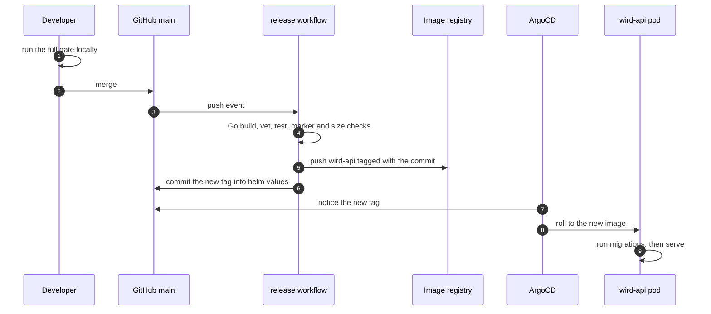
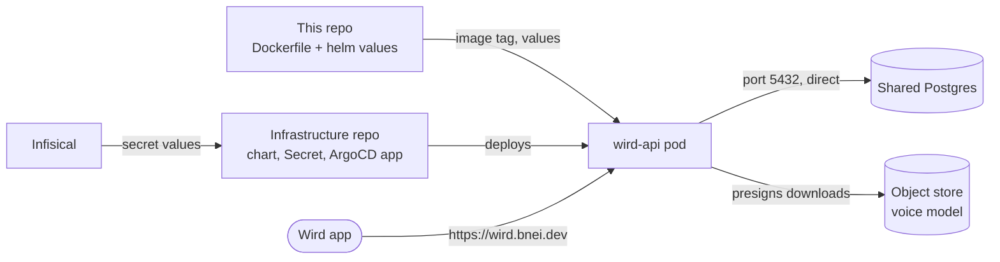
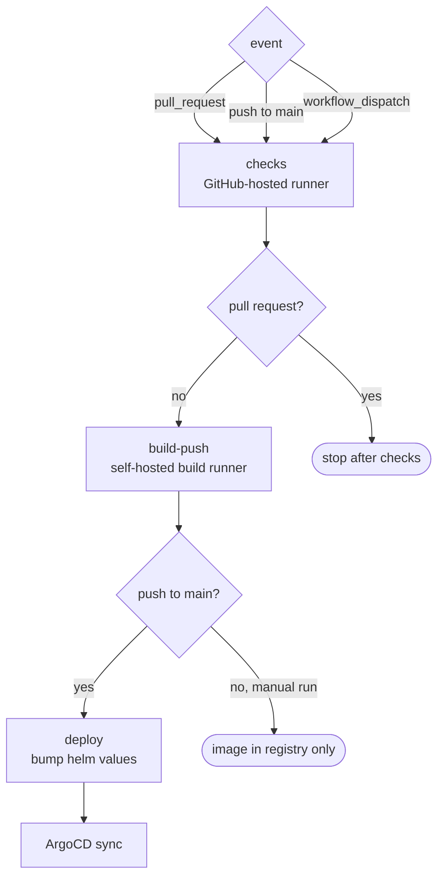
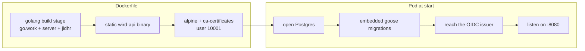

# Deploy

> From a merged commit to a running pod: CI checks, one container image tagged with the commit, a helm values bump, and ArgoCD. Level L1 · Parent [Overview](../README.md) · Children none

## Black box

A merge to `main` is a release. Nobody cuts a version or presses a button. CI runs the Go half of **the gate**, builds one container image holding `wird-api`, and writes that image's tag into this repo. ArgoCD sees the new tag and rolls the pod. A pull request runs the checks and stops there.

| In | Out | Depends on |
|---|---|---|
| A push to `main` | A new `wird-api` pod answering on `https://wird.bnei.dev` | GitHub Actions, a self-hosted build runner, the cluster's image registry |
| A pull request | A pass or fail on the Go checks, nothing deployed | A GitHub-hosted runner and a throwaway Postgres 18 |
| The database address and object store keys | Environment variables in the pod | A Kubernetes Secret assembled outside this repo, from Infisical |
| Any pull request or push to `main` | A pass or fail on doc links and diagrams | The `docs` workflow |



Only the API ships through this pipeline. The app is built and installed outside it. The admin web and jidhr are built by nothing and deployed by nothing today.



## White box





### 1. What triggers a release

The workflow runs on pull requests, on pushes to `main`, and by hand. Pushes that only touch markdown or `helm/` are ignored. That stops the deploy job's own commit from starting another release. Two releases in flight cancel the older one, so the newest tag always wins. A pull request runs in a group of its own, so a push to `main` no longer cancels its checks.

```yaml
on:
  workflow_dispatch:
  pull_request:
  push:
    branches:
      - main
    paths-ignore:
      # The deploy job's own bump touches helm/. Pushes made with the built-in
      # GITHUB_TOKEN do not trigger workflows either, so the loop is closed
      # twice — the same belt and braces editable-blog uses.
      - '**.md'
      - 'helm/**'
    tags-ignore:
      - '*'
```

[release.yml:34-47](../../.github/workflows/release.yml#L34-L47) · concurrency at [release.yml:53-55](../../.github/workflows/release.yml#L53-L55)

### 2. The checks: the Go half of the gate

`checks` starts Postgres 18 from the repo's own `docker-compose.yml`, then builds, vets and tests both Go modules. It names the modules because `./...` fails at a workspace root. Two shell checks follow: every marker comment carries an issue number, and `corpus.db` stays under 60 MB.

```yaml
      - run: go build ./jidhr/... ./server/...
      - run: go vet ./jidhr/... ./server/...
```

[release.yml:106-116](../../.github/workflows/release.yml#L106-L116) · marker rule [release.yml:121-126](../../.github/workflows/release.yml#L121-L126) · corpus budget [release.yml:130-134](../../.github/workflows/release.yml#L130-L134)

The Flutter half of the gate never runs in CI. It needs fvm and a device, and the runners have neither. That is why you run `./scripts/qa.sh` yourself before you push. The one Go test that drives the Flutter client skips itself when fvm is missing: [zz_gate_e2e_test.go:24](../../server/internal/api/zz_gate_e2e_test.go#L24).

### 3. The image tag is the commit

`build-push` never runs on a pull request, because a pull request has nothing to push. It tags the image with the first 12 characters of the commit hash. There is no semver and no `latest` tag.

```yaml
      - name: Compute the image tag
        id: tag
        run: echo "value=$(git rev-parse --short=12 HEAD)" >> "$GITHUB_OUTPUT"
```

[release.yml:156-158](../../.github/workflows/release.yml#L156-L158)

It builds with buildah on a runner that has no cluster access, then pushes to the cluster's registry. The registry password is read from Infisical over OIDC at build time. It is never stored in the repo.

```yaml
          sudo buildah bud \
            --isolation chroot \
            --format docker \
            -t "$REGISTRY/$IMAGE:$TAG" \
            .
          sudo buildah push --tls-verify=false "$REGISTRY/$IMAGE:$TAG"
```

[release.yml:218-223](../../.github/workflows/release.yml#L218-L223) · job guard [release.yml:136-144](../../.github/workflows/release.yml#L136-L144) · password step [release.yml:168-185](../../.github/workflows/release.yml#L168-L185)

### 4. One binary per image

The Dockerfile copies the Go workspace and builds `server/cmd/api` only. The public page is part of that binary: `server/internal/site/static` is embedded, so it ships with every image and needs no other workload ([ADR 0018](../adr/0018-the-public-site-is-served-by-the-api.md)). The `app/` folder is never copied, so the bundled **corpus** cannot end up in the image. CGO is off, so the binary is static.

```dockerfile
RUN CGO_ENABLED=0 go build -trimpath -ldflags='-s -w' -o /out/wird-api ./server/cmd/api
```

[Dockerfile:31](../../Dockerfile#L31)

The final stage is Alpine, for two reasons. It carries CA certificates, which the OIDC client needs to fetch the issuer's keys over HTTPS. And it keeps a shell for debugging. The process runs as an unprivileged user.

```dockerfile
FROM alpine:3.22

RUN apk add --no-cache ca-certificates \
 && adduser -D -u 10001 wird

COPY --from=build /out/wird-api /usr/local/bin/wird-api

USER wird
EXPOSE 8080
ENTRYPOINT ["/usr/local/bin/wird-api"]
```

[Dockerfile:38-47](../../Dockerfile#L38-L47)

### 5. Bump the tag, and only after the push

`deploy` runs on a push to `main`, once the image exists. It rewrites one line of `helm/values.yaml` and commits it. Bumping earlier would let ArgoCD pull a tag that is still being built. If the edit silently matches nothing, the job fails instead of going green.

```yaml
      - name: Bump the pinned image tag
        run: |
          set -euo pipefail
          sed -i -E "s/^(  tag: \")[^\"]+(\")/\1${TAG}\2/" helm/values.yaml
          # A no-op sed is the real failure mode: if the pattern stops matching,
          # values.yaml keeps naming the previous build, ArgoCD redeploys
          # nothing, and this workflow is green. Silence would read as success.
          grep -q "^  tag: \"${TAG}\"$" helm/values.yaml || {
            echo "::error::image.tag was not bumped — check the sed against the file's actual indentation"
            exit 1
          }
```

[release.yml:253-263](../../.github/workflows/release.yml#L253-L263) · commit and push [release.yml:268-279](../../.github/workflows/release.yml#L268-L279) · the line it edits [values.yaml:23](../../helm/values.yaml#L23)

A manual run builds and pushes an image but skips this job, so it never deploys.

### 6. What the pod is told

`helm/values.yaml` is the only deployment file in this repo. The chart itself lives in the infrastructure repo, and ArgoCD there reads this file. It sets the host, the port, and health probes on `/healthz`, a route that answers without a token.

```yaml
  hostname: wird.bnei.dev
```

[values.yaml:45](../../helm/values.yaml#L45) · probes [values.yaml:49-60](../../helm/values.yaml#L49-L60) · the route [api.go:39](../../server/internal/api/api.go#L41)

Values that are not secret are written in the file: the OIDC issuer and audience, and the Android app-link fingerprint ([values.yaml:118-154](../../helm/values.yaml#L118-L154)). Everything secret arrives from one Kubernetes Secret, loaded whole with `envFrom` ([values.yaml:114-116](../../helm/values.yaml#L114-L116)). That Secret is built in the infrastructure repo from Infisical. It holds the database address and the object store keys for the voice model. This repo names only that Secret. It never mounts a whole Infisical project, which would hand the pod every password on the platform ([values.yaml:109-113](../../helm/values.yaml#L109-L113)).

The pod runs one replica. The API runs two cleanup timers inside its own process, and two replicas would race them ([values.yaml:72-76](../../helm/values.yaml#L72-L76)).

### 7. Postgres, and the first thing the pod does

The database is a shared Postgres, not one of its own. The pod connects straight to port 5432, not through the connection pooler, because transaction pooling breaks pgx's prepared statements and goose's advisory lock ([ADR 0005](../adr/0005-deploying-the-api.md#the-database-comes-from-infisical-assembled-in-one-place)).

On start, the API opens the database and runs the migrations embedded in the binary before it serves anything. There is no migration job and no goose binary.

```go
func Open(ctx context.Context, url string) (*Store, error) {
	pool, err := pgxpool.New(ctx, url)
	if err != nil {
		return nil, err
	}
	if err := Migrate(ctx, url); err != nil {
		pool.Close()
		return nil, err
	}
	return New(pool), nil
}
```

[store.go:31-41](../../server/internal/store/store.go#L31-L41) · called from [main.go:20](../../server/cmd/api/main.go#L20)

### 8. Knowing your commit is live

ArgoCD can report "Synced Healthy" for a while after the bump, against the revision it saw before. To check a release, compare the image tag the running Deployment uses with the tag in `helm/values.yaml`, or call the route you changed ([ADR 0005](../adr/0005-deploying-the-api.md#consequences)).

### 9. The docs workflow

A second workflow, `docs`, runs on every pull request and every push to `main`, whatever the change touches. It checks relative links and heading anchors offline with lychee. Then it runs `scripts/docs-check.sh`, which checks `#L` line links against file lengths and renders every mermaid block. On a pull request it also warns when a change edits code that a doc links into.

```yaml
      - name: Line anchors, mermaid, and links into changed code
        env:
          DOCS_BASE: ${{ github.event_name == 'pull_request' && format('origin/{0}', github.base_ref) || '' }}
        run: scripts/docs-check.sh
```

[docs.yml:35-38](../../.github/workflows/docs.yml#L35-L38) · lychee step [docs.yml:18-29](../../.github/workflows/docs.yml#L18-L29)

## Why it is this way

- [ADR 0005](../adr/0005-deploying-the-api.md) — one image with the API only, the commit hash as tag, secrets assembled in one place, and only the Go half of the gate in CI.
- [ADR 0018](../adr/0018-the-public-site-is-served-by-the-api.md) — the public page is embedded in that same image, and the APK is published by digest-named key.

### Publishing the Android build

The page's Download button answers 503 until a build is published. The release button publishes one: [`release-app.yml`](../../.github/workflows/release-app.yml) checks the app, bumps the pubspec and tags it, then [`apk.yml`](../../.github/workflows/apk.yml) builds and signs the APK, uploads it to the models bucket as `android/wird-<first 12 of its sha256>.apk`, and sets `WIRD_APK_KEY`, and `WIRD_APK_VERSION` beside it for the page to print, in `helm/values.yaml` on main. ArgoCD does the rest. [Releasing the APK](../guides/releasing-the-apk.md) walks through it, and [ADR 0019](../adr/0019-the-apk-is-built-on-a-tag-and-published-by-ci.md) and [ADR 0022](../adr/0022-a-release-is-cut-by-one-button-from-the-pubspec.md) record why.

Never overwrite a published key: a phone resuming a download would get half of one build and half of another. A new build is a new key.
- [ADR 0008](../adr/0008-the-recogniser-is-served-from-wirds-own-host.md) — the pod also answers voice model downloads, so the object store keys joined the Secret.
- [ADR 0011](../adr/0011-two-doc-families.md) — why the human docs have a workflow of their own.

## Go deeper

- [API](api.md) — what the deployed binary serves.
- [Getting started](../guides/getting-started.md) — run the gate and the API on your own machine.
- [Tour: shipping a change](../tours/shipping-a-change.md) — this pipeline, walked end to end.
- [Toolchain](../toolchain.md) — what the gate expects on a developer machine.
