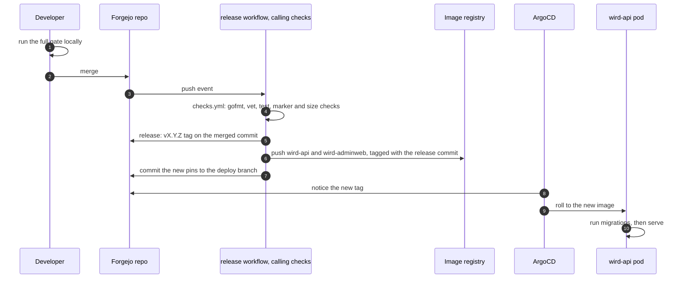
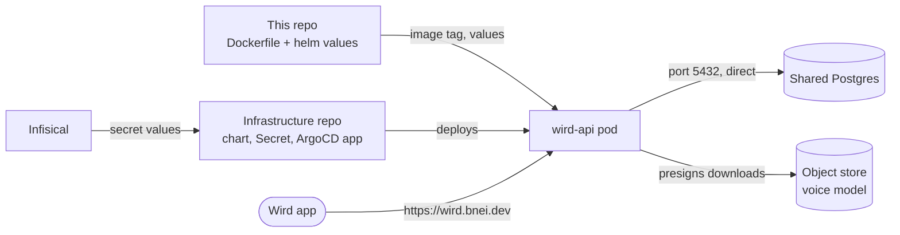
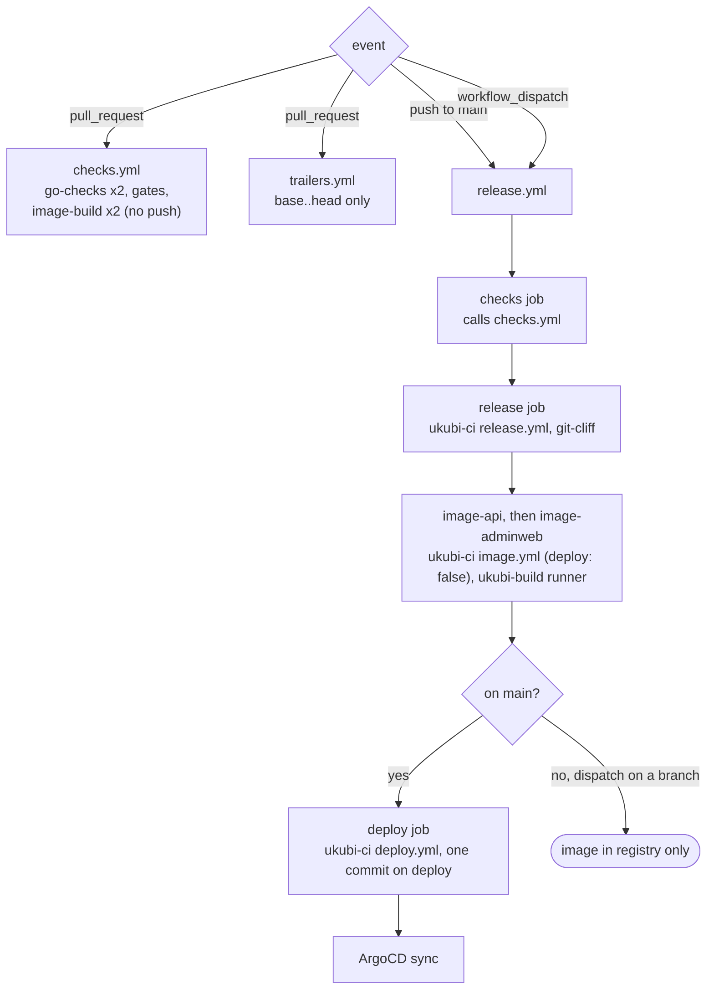
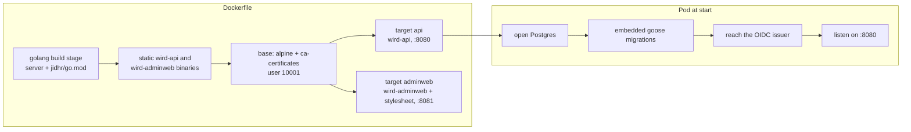

# Deploy

> From a merged commit to a running pod: CI checks, a semver release, two container images tagged with the commit, a helm values bump, and ArgoCD. Level L1 · Parent [Overview](../README.md) · Children none

## Black box

A merge to `main` is a release. Nobody types a version or presses a button. CI runs the Go half of **the gate**, cuts the next version from the commit subjects (an annotated `vX.Y.Z` tag on the merged commit; nothing is committed to `main`), builds two container images from one Dockerfile, `wird-api` and `wird-adminweb`, and pins their tag on this repo's `deploy` branch. ArgoCD sees the new tag and rolls the pod. A pull request runs the checks, builds both images without pushing them, and stops there.

| In | Out | Depends on |
|---|---|---|
| A push to `main` | A `vX.Y.Z` tag, and a new `wird-api` pod answering on `https://wird.bnei.dev` that says that version at `/version` | Forgejo Actions, the `ukubi-build` runner, the cluster's image registry |
| A pull request | A pass or fail on the Go checks, both image builds and the commit rules, nothing deployed | Forgejo's container runner, a throwaway Postgres 18, and the shared workflows in [ukubi-ci](https://github.com/MohammadBnei/ukubi-ci) |
| The database address and object store keys | Environment variables in the pod | A Kubernetes Secret assembled outside this repo, from Infisical |
| Any pull request or push to `main` | A pass or fail on doc links and diagrams | The `docs` workflow |


```mermaid
sequenceDiagram
  autonumber
  participant Dev as Developer
  participant GH as Forgejo repo
  participant CI as release workflow, calling checks
  participant Reg as Image registry
  participant Argo as ArgoCD
  participant Pod as wird-api pod
  Dev->>Dev: run the full gate locally
  Dev->>GH: merge
  GH->>CI: push event
  CI->>CI: checks.yml: gofmt, vet, test, marker and size checks
  CI->>GH: release: vX.Y.Z tag on the merged commit
  CI->>Reg: push wird-api and wird-adminweb, tagged with the release commit
  CI->>GH: commit the new pins to the deploy branch
  Argo->>GH: notice the new tag
  Argo->>Pod: roll to the new image
  Pod->>Pod: run migrations, then serve
```

Only the API is deployed through this pipeline today. The admin web image is built and its tag bumped on every release, but its values file does nothing until the infrastructure repo registers it ([Admin web](adminweb.md#deployment)). The app is built and installed outside this pipeline. jidhr is built by nothing and deployed by nothing.


```mermaid
flowchart LR
  repo["This repo<br/>Dockerfile + helm values"]
  infra["Infrastructure repo<br/>chart, Secret, ArgoCD app"]
  vault["Infisical"]
  pg[("Shared Postgres")]
  store[("Object store<br/>voice model")]
  pod["wird-api pod"]
  phone(["Wird app"])
  repo -->|image tag, values| pod
  infra -->|deploys| pod
  vault -->|secret values| infra
  pod -->|"port 5432, direct"| pg
  pod -->|presigns downloads| store
  phone -->|"https://wird.bnei.dev"| pod
```

## White box


```mermaid
flowchart TD
  ev{"event"}
  pr["checks.yml<br/>go-checks x2, gates,<br/>image-build x2 (no push)"]
  tr["trailers.yml<br/>base..head only"]
  rel["release.yml"]
  checks["checks job<br/>calls checks.yml"]
  release["release job<br/>ukubi-ci release.yml, git-cliff"]
  build["image-api, then image-adminweb<br/>ukubi-ci image.yml (deploy: false), ukubi-build runner"]
  push{"on main?"}
  deploy["deploy job<br/>ukubi-ci deploy.yml, one commit on deploy"]
  argo["ArgoCD sync"]
  done(["image in registry only"])
  ev -->|pull_request| pr
  ev -->|pull_request| tr
  ev -->|push to main| rel
  ev -->|workflow_dispatch| rel
  rel --> checks
  checks --> release
  release --> build
  build --> push
  push -->|"no, dispatch on a branch"| done
  push -->|yes| deploy
  deploy --> argo
```


```mermaid
flowchart LR
  subgraph image["Dockerfile"]
    b["golang build stage<br/>server + jidhr/go.mod"] --> bin["static wird-api and<br/>wird-adminweb binaries"]
    bin --> base["base: alpine + ca-certificates<br/>user 10001"]
    base --> a["target api<br/>wird-api, :8080"]
    base --> aw["target adminweb<br/>wird-adminweb + stylesheet, :8081"]
  end
  subgraph pod["Pod at start"]
    s["open Postgres"] --> m["embedded goose migrations"] --> o["reach the OIDC issuer"] --> l["listen on :8080"]
  end
  a --> s
```

### 1. What triggers a release

`release.yml` runs on pushes to `main` and by hand. Pushes that only touch markdown or `helm/` are ignored. Runs on the same branch queue and are never cancelled, so a pushed tag is always built. A run on another branch never waits on `main`'s.

The filter has a cost. A Markdown-only push is not released, and neither is a code commit whose run sees a human commit land after it: that run leaves the newer commits to their own run, which a Markdown-only push never gets. The next code push releases them all. To release now, run the `release` workflow by hand on `main` from Forgejo's Actions tab ([ADR 0041](../adr/0041-one-version-line-cut-by-git-cliff.md#consequences)).

Pull requests do not run `release.yml`. They run `checks.yml` (the Go half of the gate and two image builds) and `trailers.yml` (the commit rules). Both are short callers of the reusable workflows in [ukubi-ci](https://github.com/MohammadBnei/ukubi-ci), pinned by commit hash.

```yaml
on:
  workflow_dispatch:
  push:
    branches:
      - main
    paths-ignore:
      # The bump goes to the deploy branch, and pushes made with the job token
      # trigger no workflow, so nothing here loops.
      - '**.md'
      - 'helm/**'
    tags-ignore:
      - '*'
```

[release.yml:49-60](../../.github/workflows/release.yml#L49-L60) · concurrency at [release.yml:65-67](../../.github/workflows/release.yml#L65-L67)

### 2. The checks: the Go half of the gate

`checks.yml` runs on every pull request, and `release.yml` calls it before it builds anything. It calls the shared `go-checks` workflow once per Go module: `gofmt`, `go vet`, then `go test -race -count=1 -p 1`. For `server` it first installs and starts Postgres 18 inside the job's container (the runner has no docker daemon). Before the tests run, it sets `GOWORK=off` and `GOTOOLCHAIN=local` and builds every package of the module, so a local `go.work` cannot hide a missing require in `server/go.mod`, a module asking for a newer Go fails instead of downloading one, and every binary still links. Two shell checks follow in the `gates` job: every marker comment carries an issue number, and `corpus.db` stays under 60 MB.

```yaml
  server:
    uses: MohammadBnei/ukubi-ci/.github/workflows/go-checks.yml@9af316b5d779b2d5ef3f55b9f11e20b8bf3f6ce8 # v0.11.1
    with:
      working-directory: server
      test-flags: '-p 1'
      govulncheck: true
      pre-test: |
        apt-get update -qq
        # ... postgresql-18 from PGDG, then the wird role and database
        export GOWORK=off GOTOOLCHAIN=local
        echo GOWORK=off >> "$GITHUB_ENV"
        echo GOTOOLCHAIN=local >> "$GITHUB_ENV"
        go -C server build ./...
```

[checks.yml:24-44](../../.github/workflows/checks.yml#L24-L44) · gates job [checks.yml:59-80](../../.github/workflows/checks.yml#L59-L80) · image builds on pull requests [checks.yml:82-99](../../.github/workflows/checks.yml#L82-L99)

On a pull request the two images are also built, without pushing, on the `ukubi-build` runner, so a Dockerfile that no longer builds fails before the merge. The commit rules live in [trailers.yml](../../.github/workflows/trailers.yml): Conventional subjects, and no AI attribution of any kind.

Only part of the Flutter half of the gate runs in CI: `app-checks.yml` runs `flutter analyze` and the tests minus the goldens on pull requests that touch `app/`. The goldens and the e2e journeys need fvm, a Mac and a device, and the runners have none of them. That is why you run `./scripts/qa.sh` yourself before you push. The one Go test that drives the Flutter client skips itself when fvm is missing: [zz_gate_e2e_test.go:24](../../server/internal/api/zz_gate_e2e_test.go#L24).

### 3. The release, then the image

After the checks, the `release` job calls ukubi-ci's `release.yml`. git-cliff reads the Conventional Commit subjects since the last `vX.Y.Z` tag. A `feat` raises the minor version, anything else the patch, and a breaking change at `0.x` the minor. It pushes an annotated `vX.Y.Z` tag on the commit that triggered the run, with the release notes as its message (`git tag -n99 vX.Y.Z`); nothing is committed to `main`, and `CHANGELOG.md` stays as history. On a branch it is a dry run: the run summary says what it would release, and nothing is pushed. If it fails, nothing is built.

```yaml
  release:
    needs: checks
    permissions:
      contents: write # pushes the release tag
    uses: MohammadBnei/ukubi-ci/.github/workflows/release.yml@9af316b5d779b2d5ef3f55b9f11e20b8bf3f6ce8 # v0.11.1
```

[release.yml:80-84](../../.github/workflows/release.yml#L80-L84)

Then `release.yml` calls ukubi-ci's `image.yml` twice, once per image, both with `deploy: false`: `image-api` builds `--target api` as `wird-api`, `image-adminweb` builds `--target adminweb` as `wird-adminweb`. Each call checks out the release commit and tags the image with the first 12 characters of its hash; there is no `latest` tag. The version goes in as a build-arg instead (`version-arg: true`, with the release's version as input), checked first: `X.Y.Z` for a release, `X.Y.Z+<sha>` on `main` when nothing was released, `X.Y.Z-dev+<sha>` on a branch. Neither call runs on a pull request: a pull request has nothing to push, and `release.yml` does not run on one at all.

```yaml
  image-api:
    needs: release
    permissions:
      contents: write
      id-token: write
    uses: MohammadBnei/ukubi-ci/.github/workflows/image.yml@9af316b5d779b2d5ef3f55b9f11e20b8bf3f6ce8 # v0.11.1
    with:
      runs-on: '["ukubi-build"]'
      image: wird-api
      target: api
      values-file: helm/image-api.yaml
      ref: ${{ needs.release.outputs.tag }}
      version: ${{ needs.release.outputs.version }}
      version-arg: true
      cancel-in-progress: false
      deploy: false
```

[release.yml:99-116](../../.github/workflows/release.yml#L99-L116) · `image-adminweb` [release.yml:118-134](../../.github/workflows/release.yml#L118-L134)

`image.yml` builds with buildah on a runner that has no cluster access, then pushes to the cluster's registry. The registry password is read from Infisical over OIDC after the build, so it is never in the environment while the Dockerfile's `RUN` steps execute. It is never stored in the repo.

The two images come from the same Dockerfile and the same commit, but in two calls, one after the other: `image-adminweb` needs `image-api`. `--layers` lets the second build reuse the first one's build stage instead of compiling both binaries again, and `pull-newer: false` on the second makes it reuse the base image the first just refreshed. The cached layers are left to the build box's weekly prune.

### 4. One binary per image

The Dockerfile builds inside the `server` module and copies `jidhr/go.mod` beside it, because `server/go.mod` replaces jidhr with `../jidhr` ([ADR 0035](../adr/0035-server-takes-jidhr-from-the-same-commit.md)). There is no `go.work`. It builds two binaries, `server/cmd/api` and `server/cmd/adminweb`. Each final image holds one of them. The public page is part of that binary: `server/internal/site/static` is embedded, so it ships with every image and needs no other workload ([ADR 0018](../adr/0018-the-public-site-is-served-by-the-api.md)). The `app/` folder is never copied, so the bundled **corpus** cannot end up in the image. CGO is off, so the binaries are static. The one file outside the Go tree that is copied is the Nocturne stylesheet, which admin web reads at start. It is copied in the admin web stage rather than the build stage, so a stylesheet edit does not rebuild both binaries ([Dockerfile:66](../../Dockerfile#L66)). The version build-arg is written into `server/internal/buildinfo/version.txt` before the build, because the binaries embed it, and set as the `org.opencontainers.image.version` label in the shared base ([Dockerfile:37-38](../../Dockerfile#L37-L38), [Dockerfile:57-58](../../Dockerfile#L57-L58)).

```dockerfile
RUN CGO_ENABLED=0 go build -trimpath -ldflags='-s -w' -o /out/wird-api ./cmd/api \
 && CGO_ENABLED=0 go build -trimpath -ldflags='-s -w' -o /out/wird-adminweb ./cmd/adminweb
```

[Dockerfile:42-43](../../Dockerfile#L42-L43)

Both final images start from one Alpine base, for two reasons. It carries CA certificates, which the OIDC client needs to fetch the issuer's keys over HTTPS. And it keeps a shell for debugging. The process runs as an unprivileged user. The `api` target comes last, so a plain `docker build .` still produces `wird-api`.

```dockerfile
FROM base AS adminweb
COPY --from=build /out/wird-adminweb /usr/local/bin/wird-adminweb
# adminweb reads the Nocturne stylesheet from disk at start and refuses to run
# without it. Copied by name, like everything else here, and in this stage
# rather than the build one, so a stylesheet edit does not rebuild both
# binaries. .dockerignore lets this one file through.
COPY docs/design/nocturne-styles.css /usr/share/wird/nocturne-styles.css
ENV NOCTURNE_CSS=/usr/share/wird/nocturne-styles.css
EXPOSE 8081
ENTRYPOINT ["/usr/local/bin/wird-adminweb"]
```

[Dockerfile:60-69](../../Dockerfile#L60-L69) · the `api` target [Dockerfile:71-75](../../Dockerfile#L71-L75) · the shared base [Dockerfile:50-54](../../Dockerfile#L50-L54)

### 5. Bump the tag, and only after the push

One `deploy` job calls ukubi-ci's `deploy.yml`, after both image calls succeeded. It runs on `main`, from a push or a dispatch. It writes the tag of both pin files on the `deploy` branch, `helm/image-api.yaml` for `wird-api` and `helm/image-adminweb.yaml` for `wird-adminweb`, as `<12-character sha>@sha256:<digest>`, in one commit, so ArgoCD rolls the two out together. ArgoCD layers each pin file over the matching values file on `main` (`helm/values.yaml`, `helm/adminweb-values.yaml`); `main` itself is never written by CI. Bumping earlier would let ArgoCD pull a tag that is still being built. The digest makes a rebuild of the same commit (a base-image fix) roll out. `deploy.yml` refuses a missing file, a pin from another commit than `built-commit`, and an edit that changes anything other than exactly one line per file.

If either build fails or the run is cancelled, nothing is bumped and the running pair stays as it was. `image-adminweb` still waits for `image-api` so the shared build stage comes from the layer cache; the chain costs wall time only.

```yaml
  deploy:
    needs: [image-api, image-adminweb]
    uses: MohammadBnei/ukubi-ci/.github/workflows/deploy.yml@9af316b5d779b2d5ef3f55b9f11e20b8bf3f6ce8 # v0.11.1
    with:
      built-commit: ${{ needs.image-api.outputs.commit }}
      pins: |
        helm/image-api.yaml ${{ needs.image-api.outputs.tag }}@${{ needs.image-api.outputs.digest }}
        helm/image-adminweb.yaml ${{ needs.image-adminweb.outputs.tag }}@${{ needs.image-adminweb.outputs.digest }}
```

[release.yml:138-147](../../.github/workflows/release.yml#L138-L147) · the pins they replace [values.yaml:24](../../helm/values.yaml#L24), [adminweb-values.yaml:16](../../helm/adminweb-values.yaml#L16)

A dispatch on `main` deploys like a push, because it cut a release. A dispatch on another branch builds and pushes both images but skips the deploy job, so it never deploys.

### 6. What the pod is told

`helm/values.yaml` is the API's deployment file. The chart itself lives in the infrastructure repo, and ArgoCD there reads this file. Admin web has its own, `helm/adminweb-values.yaml`, described on [its page](adminweb.md#deployment). It sets the host, the port, and health probes on `/healthz`, a route that answers without a token.

```yaml
  hostname: wird.bnei.dev
```

[values.yaml:45](../../helm/values.yaml#L45) · probes [values.yaml:49-60](../../helm/values.yaml#L49-L60) · the route [api.go:82](../../server/internal/api/api.go#L82)

Values that are not secret are written in the file: the OIDC issuer and audience, and the Android app-link fingerprint ([values.yaml:118-158](../../helm/values.yaml#L118-L158)). Everything secret arrives from one Kubernetes Secret, loaded whole with `envFrom` ([values.yaml:114-116](../../helm/values.yaml#L114-L116)). That Secret is built in the infrastructure repo from Infisical. It holds the database address and the object store keys for the voice model. This repo names only that Secret. It never mounts a whole Infisical project, which would hand the pod every password on the platform ([values.yaml:109-113](../../helm/values.yaml#L109-L113)).

The API refuses to start on a configuration that is only partly there ([ADR 0036](../adr/0036-each-binary-refuses-a-partial-configuration.md)). A Secret row that renders empty, such as one of the four object store values, is a pod that exits with `config refused` naming the variable, not a healthy pod whose Download button answers 503. The chart's default rolling update keeps the old pod serving while the new one crashloops, so ArgoCD can show Synced with a rollout that never finished: check that the new ReplicaSet is Ready.

The pod runs one replica. The API runs two cleanup timers inside its own process, and two replicas would race them ([values.yaml:72-76](../../helm/values.yaml#L72-L76)).

### 7. Postgres, and the first thing the pod does

The database is a shared Postgres, not one of its own. The pod connects straight to port 5432, not through the connection pooler, because transaction pooling breaks pgx's prepared statements and goose's advisory lock ([ADR 0005](../adr/0005-deploying-the-api.md#the-database-comes-from-infisical-assembled-in-one-place)).

On start, the API opens the database and runs the migrations embedded in the binary before it serves anything. There is no migration job and no goose binary.

```go
func Open(ctx context.Context, url string) (*Store, error) {
	pool, err := pgxpool.New(ctx, url)
	if err != nil {
		return nil, err
	}
	if err := Migrate(ctx, url); err != nil {
		pool.Close()
		return nil, err
	}
	return New(pool), nil
}
```

[store.go:31-41](../../server/internal/store/store.go#L31-L41) · called from [main.go:63](../../server/cmd/api/main.go#L63)

### 8. Knowing your commit is live

ArgoCD can report "Synced Healthy" for a while after the bump, against the revision it saw before. To check a release, call `https://wird.bnei.dev/version`, which answers the version the running binary was built as, and compare it with the newest tag. Or compare the image tag the running Deployment uses with the tag in `helm/values.yaml`, or call the route you changed ([ADR 0005](../adr/0005-deploying-the-api.md#consequences)).

### 9. The docs workflow

A second workflow, `docs`, runs on every pull request and every push to `main`, whatever the change touches. It checks relative links and heading anchors offline with lychee. Then it runs `scripts/docs-check.sh`, which checks `#L` line links against file lengths and renders every mermaid block. On a pull request it also warns when a change edits code that a doc links into.

```yaml
      - name: Line anchors, mermaid, and links into changed code
        env:
          DOCS_BASE: ${{ github.event_name == 'pull_request' && format('origin/{0}', github.base_ref) || '' }}
        run: scripts/docs-check.sh
```

[docs.yml:52-55](../../.github/workflows/docs.yml#L52-L55) · lychee step [docs.yml:26-37](../../.github/workflows/docs.yml#L26-L37)

## Why it is this way

- [ADR 0005](../adr/0005-deploying-the-api.md) — one binary per image, the commit hash as tag, secrets assembled in one place, and only the Go half of the gate in CI.
- [ADR 0041](../adr/0041-one-version-line-cut-by-git-cliff.md) — one version line cut by git-cliff, carried by the image and its binaries, and shipped by the app.
- [ADR 0026](../adr/0026-reports-are-triaged-and-turned-into-issues.md) — the operations view became a second image from the same build, inert until the infrastructure work it lists is done.
- [ADR 0018](../adr/0018-the-public-site-is-served-by-the-api.md) — the public page is embedded in that same image, and the APK is published by digest-named key.

### Publishing the Android build

The page's Download button answers 503 until a build is published. The release button publishes one: [`release-app.yml`](../../.github/workflows/release-app.yml) checks the app and picks the newest release tag, then [`apk.yml`](../../.github/workflows/apk.yml) builds and signs the APK, uploads it to the models bucket as `android/wird-<first 12 of its sha256>.apk`, and sets `WIRD_APK_KEY`, and `WIRD_APK_VERSION` beside it for the page to print, in `helm/values.yaml` on main. ArgoCD does the rest. [Releasing the APK](../guides/releasing-the-apk.md) walks through it, and [ADR 0019](../adr/0019-the-apk-is-built-on-a-tag-and-published-by-ci.md) [ADR 0022](../adr/0022-a-release-is-cut-by-one-button-from-the-pubspec.md) and [ADR 0041](../adr/0041-one-version-line-cut-by-git-cliff.md) record why.

Never overwrite a published key: a phone resuming a download would get half of one build and half of another. A new build is a new key.
- [ADR 0008](../adr/0008-the-recogniser-is-served-from-wirds-own-host.md) — the pod also answers voice model downloads, so the object store keys joined the Secret.
- [ADR 0011](../adr/0011-two-doc-families.md) — why the human docs have a workflow of their own.

## Go deeper

- [API](api.md) — what the deployed binary serves.
- [Getting started](../guides/getting-started.md) — run the gate and the API on your own machine.
- [Tour: shipping a change](../tours/shipping-a-change.md) — this pipeline, walked end to end.
- [Toolchain](../toolchain.md) — what the gate expects on a developer machine.
