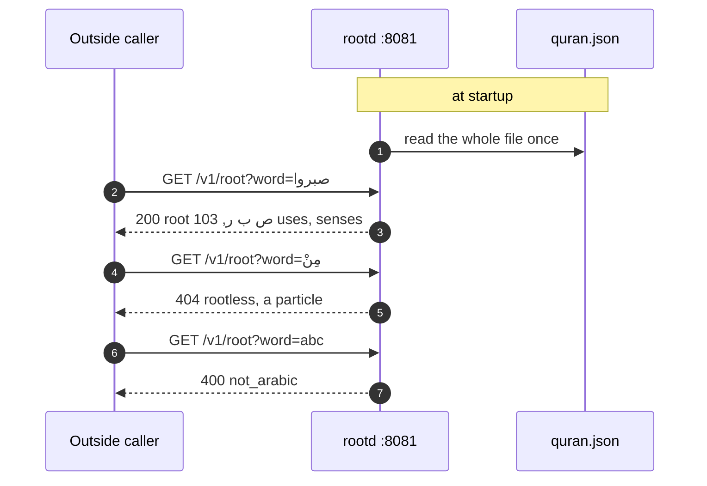
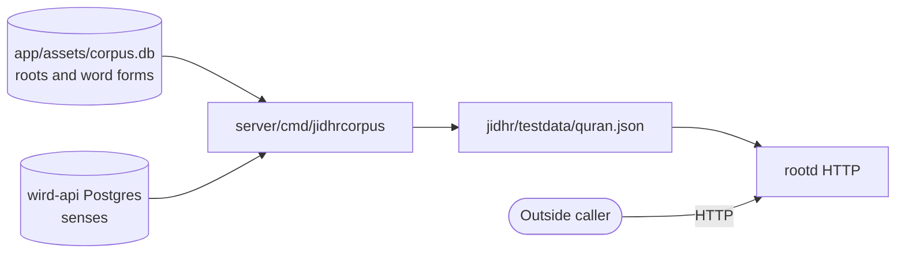
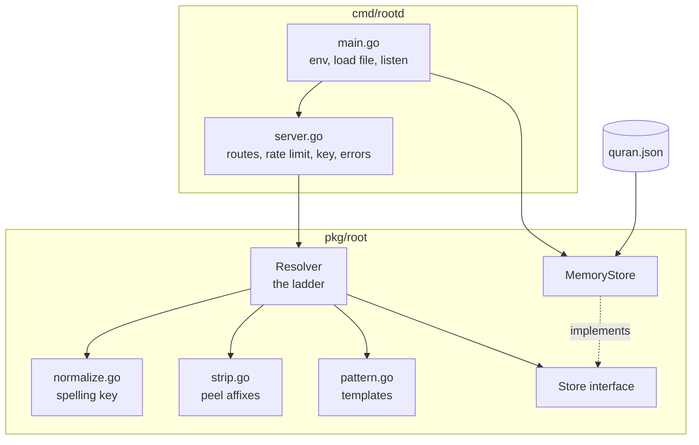
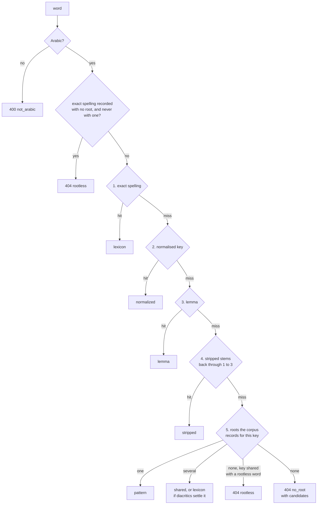

# jidhr

> The Arabic root engine: word in, root out, from one file held in memory, with no database. Level L1 · Parent [Overview](../README.md) · Children none

## Black box

jidhr answers one question: which **root** is this Arabic word built on? It is a Go library first and an HTTP service second. The service, `rootd`, lets anyone outside Wird ask the same question over HTTP. Both read the same file, so they give the same answer.

Today nothing in Wird calls it at run time. The app finds roots in its own **corpus**, and the API serves **senses** from Postgres. jidhr is a standalone product that shares Wird's data.

| In | Out | Depends on |
|---|---|---|
| A written Arabic word, with or without diacritics | The root, how often the Qur'an uses it, and the senses written for it in `en` and `fr` | `jidhr/testdata/quran.json`, read once at startup |
| A root's letters | That root and its senses | The same file |
| Words that are not Arabic, or have no root | A clear error that says which of the two it is | Nothing else: no network, no key by default |



The file is not written by hand. A pipeline tool builds it from two sources: the morphology in the app's **corpus**, and the senses in the API's Postgres.



The full HTTP contract, with request and response examples, lives in the [rootd README](../../jidhr/cmd/rootd/README.md). In short:

| Route | What it does |
|---|---|
| `GET /v1/root?word=&lang=` | Resolve one word |
| `POST /v1/roots:batch` | Resolve up to 100 words; one bad word does not sink the rest |
| `GET /v1/roots/{letters}` | Look up a root by its joined letters, such as `صبر` |
| `GET /healthz` | Always 200, outside the key and the rate limit |

Every answer carries a `method` field. It names the step that found the root, and that step is the confidence. There is no numeric score. Errors come in two kinds on purpose: 400 means the input was not an Arabic word, 404 means it was, and no root was found. A 404 `rootless` means the corpus records the word as a particle or pronoun with no root. A 404 `no_root` means the engine never met it.

**Deployment.** `rootd` is not deployed. It has no image and no helm entry, because nothing calls it over the network ([ADR 0005](../adr/0005-deploying-the-api.md#one-image-and-it-holds-servercmdapi)). The helm values say so in their header ([values.yaml:6](../../helm/values.yaml#L6-L7)). CI still builds, vets and tests the module in the release workflow ([release.yml:107](../../.github/workflows/release.yml#L107-L117)). To run it yourself, use `go run ./jidhr/cmd/rootd` from the repo root.

## White box

`jidhr/` is its own Go module. `go.work` joins it with `server/`, which is how `jidhrcorpus` can import its types. It has two packages: `pkg/root`, the resolver, and `cmd/rootd`, the thin HTTP layer.



The resolver walks a ladder of rungs and stops at the first that hits. The rung that hits becomes `method`.



### 1. rootd loads the file and serves it

`main` reads `ROOTD_CORPUS`, which defaults to `jidhr/testdata/quran.json` ([main.go:23](../../jidhr/cmd/rootd/main.go#L23)). It loads the whole file into a `MemoryStore`. If the file is missing or broken, the process stops rather than serving empty answers.

```go
	f, err := os.Open(corpusPath)
	if err != nil {
		log.Error("open the corpus", "path", corpusPath, "err", err)
		os.Exit(1)
	}
	store, err := root.LoadMemoryStore(f)
	f.Close()
	if err != nil {
		log.Error("load the corpus", "path", corpusPath, "err", err)
		os.Exit(1)
	}
```

[main.go:29](../../jidhr/cmd/rootd/main.go#L29-L39)

It then sets up the rate limit (`ROOTD_RATE`, 5 per second by default, with a burst of four seconds' worth) and the optional shared key (`ROOTD_API_KEY`) ([main.go:41](../../jidhr/cmd/rootd/main.go#L41-L51)). It binds the port before it logs that it is listening ([main.go:67](../../jidhr/cmd/rootd/main.go#L67-L75)).

### 2. Routes sit behind the limit and the key

The three `/v1` routes go through the rate limiter and then the key check. `/healthz` is mounted outside both, so a probe can never be throttled ([server.go:43](../../jidhr/cmd/rootd/server.go#L43-L55)). The languages offered are the ones the file actually holds, not a list kept somewhere else ([store.go:310](../../jidhr/pkg/root/store.go#L310-L321)).

Callers are told apart by network address only ([server.go:291](../../jidhr/cmd/rootd/server.go#L291-L297)). Behind a proxy, every caller looks like the proxy.

### 3. The word is checked, then keyed

`Resolve` first decides between 400 and 404. A word needs at least one Arabic letter and no letter from another script ([root.go:322](../../jidhr/pkg/root/root.go#L322-L338)). It then computes the normalised key.

```go
func (r *Resolver) Resolve(ctx context.Context, word string, langs []string) (Result, error) {
	word = strings.TrimSpace(word)
	if !IsArabicWord(word) {
		return Result{}, ErrNotArabic
	}

	res := Result{Input: word, Normalized: word}
	if n := key(word); n != "" {
		res.Normalized = n
	}
```

[root.go:86](../../jidhr/pkg/root/root.go#L86-L95)

The key drops diacritics and tatweel, folds alef, ya and ha variants to one letter each, and removes the pause and sajda marks of recitation. It never removes the article or a prefix. That is the job of rung four.

```go
func key(word string) string {
	n, err := normalize(TrimMarks(word))
	if err != nil {
		return ""
	}
	return strings.TrimSpace(n)
}
```

[normalize.go:120](../../jidhr/pkg/root/normalize.go#L120-L126)

A word written with a dagger alef is indexed under two keys, one with the alef dropped and one with it spelled out. So `العالمين` and the Uthmani spelling reach the same entry ([normalize.go:136](../../jidhr/pkg/root/normalize.go#L136-L146)).

### 4. A word the corpus records with no root stops here

Particles and pronouns such as `مِنْ` have no root in the morphology. Without diacritics, some of them look like real words with a root. So this check runs before any rung, on the exact spelling the caller sent.

```go
	surfaceRootless, err := r.store.RootlessSurface(ctx, word)
	if err != nil {
		return Result{}, err
	}
	if surfaceRootless {
		exact, err := r.store.AttestsSurface(ctx, word)
		if err != nil {
			return Result{}, err
		}
		if len(exact) == 0 {
			return Result{}, &NoRootError{Word: word, Normalized: res.Normalized, Rootless: true}
		}
	}
```

[root.go:113](../../jidhr/pkg/root/root.go#L113-L125)

### 5. Rungs one to three: exact, normalised, lemma

`lookup` tries the exact spelling, then the normalised key, then the lemma ([root.go:237](../../jidhr/pkg/root/root.go#L237-L261)). A store error other than "not found" stops the whole call. A broken file must never look like a word with no root.

```go
func (r *Resolver) lookup(ctx context.Context, surface, normalized string) (Entry, Method, error) {
	if surface != "" {
		e, err := r.store.EntryBySurface(ctx, surface)
		if err == nil {
			return e, MethodLexicon, nil
		}
		if !errors.Is(err, ErrNotFound) {
			return Entry{}, "", err
		}
	}

	e, err := r.store.EntryByNormalized(ctx, normalized)
	if err == nil {
		return e, MethodNormalized, nil
	}
```

[root.go:237](../../jidhr/pkg/root/root.go#L237-L251)

The Qur'anic file has no lexicon entries, so these rungs only hit for a file that carries them. The small worked example `jidhr/testdata/corpus.json` does.

### 6. Rung four: peel affixes

`stripAffixes` peels known prefixes and suffixes off the key and returns candidate stems, most likely first ([strip.go:69](../../jidhr/pkg/root/strip.go#L69)). It never goes below three letters ([strip.go:13](../../jidhr/pkg/root/strip.go#L13)). Each stem goes back through rungs one to three ([root.go:146](../../jidhr/pkg/root/root.go#L146-L160)).

### 7. Rung five: what the corpus records for this spelling

This rung is where the Qur'anic file answers almost every word. It asks which roots the corpus records this spelling under. One root gives `pattern`. Several give `shared`, with every root listed, most-used first ([store.go:215](../../jidhr/pkg/root/store.go#L215-L222)). No root, on a key that a rootless word also has, is a 404 `rootless`. A key a rootless word shares never answers `pattern` straight away; it answers `shared`, or `lexicon` when the caller's diacritics settle it.

```go
	attested, err := r.store.Attests(ctx, res.Normalized)
	if err != nil {
		return Result{}, err
	}
	if len(attested) == 0 && keyRootless {
		// The corpus knows this spelling and gives it no root. That is an answer and
		// not the miss that says we have never met the word.
		return Result{}, &NoRootError{Word: word, Normalized: res.Normalized, Rootless: true}
	}
	if len(attested) == 1 && !keyRootless {
		return r.fromLetters(ctx, res, attested[0], MethodPattern, langs)
	}
```

[root.go:176](../../jidhr/pkg/root/root.go#L176-L187)

When several roots share the key, the caller's own diacritics can settle it. `قل` is shared by two roots, but `قُلْ` as the corpus writes it has one, so that answer comes back as `lexicon` ([root.go:188](../../jidhr/pkg/root/root.go#L188-L205)).

### 8. A miss reports what it tried

If nothing is attested, the templates in `pattern.go` propose readings ([pattern.go:252](../../jidhr/pkg/root/pattern.go#L252-L277)). They never decide the answer. They only fill the `candidates` list of the 404, with roots the file knows listed first ([root.go:212](../../jidhr/pkg/root/root.go#L212-L231)). So `باريس` stays a 404 however well it fits a shape.

### 9. Errors become HTTP codes in one place

`apiErrorFor` maps resolver errors to the status and code the README documents ([server.go:184](../../jidhr/cmd/rootd/server.go#L184-L204)): `ErrNotArabic` to 400, a rootless `NoRootError` to 404 `rootless`, any other `NoRootError` or a bare `ErrNoRoot` to 404 `no_root`, and everything else to 500 `internal`.

### 10. How the file is rebuilt

`server/cmd/jidhrcorpus` reads the roots and word forms from `app/assets/corpus.db`, and the senses from the API's Postgres through the same read `GET /v1/senses` uses ([jidhrcorpus/main.go:83](../../server/cmd/jidhrcorpus/main.go#L83)). Its flags are `-db`, `-pg` (default from `DATABASE_URL`) and `-out` ([jidhrcorpus/main.go:54](../../server/cmd/jidhrcorpus/main.go#L54-L57)). It refuses a sense written for a root the morphology does not record.

```go
	for _, sn := range senses {
		if !known[sn.Root] {
			return c, fmt.Errorf("a meaning is written for %q, which the roots table does not record, so no caller could ever reach it", sn.Root)
		}
		by := map[string]root.Meaning{}
		if sn.En != "" {
			by["en"] = root.Meaning{Plain: sn.En}
		}
		if sn.Fr != "" {
			by["fr"] = root.Meaning{Plain: sn.Fr}
		}
		if len(by) > 0 {
			c.Meanings[sn.Root] = by
		}
	}
```

[jidhrcorpus/main.go:212](../../server/cmd/jidhrcorpus/main.go#L212-L226)

The file checked in today holds 1,642 roots, 17,934 attested forms, 1,189 rootless forms, and senses in `en` and `fr` for all 1,642 roots, all in the plain register. The file carries a `note` saying the senses are drafts written by a language model and checked by no person ([jidhrcorpus/main.go:42](../../server/cmd/jidhrcorpus/main.go#L42-L47)). Editing the JSON by hand is undone by the next rebuild.

## Why it is this way

- [ADR 0010](../adr/0010-the-server-owns-the-roots-and-their-senses.md) — senses live in the API's Postgres. `rootd` keeps reading an exported file rather than Postgres, so it stays a service with no database.
- [ADR 0005](../adr/0005-deploying-the-api.md) — only the API is deployed. `rootd` has no caller, so it gets no image.

## Go deeper

- [rootd README](../../jidhr/cmd/rootd/README.md) — the full HTTP contract, every error code, and what the engine cannot do. Its numbers about senses (523 roots with a meaning, "never generated") predate ADR 0010; the code and this page are current.
- [Pipelines](pipelines.md) and [Corpus](pipelines/corpus.md) — where `corpus.db` comes from.
- [Senses](pipelines/senses.md) — how senses are drafted and stored.
- [API](api.md) — the service that serves senses to the app.
- Tour: [How a word finds its root and its sense](../tours/word-to-sense.md).
