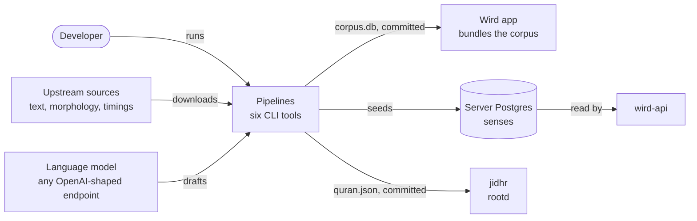
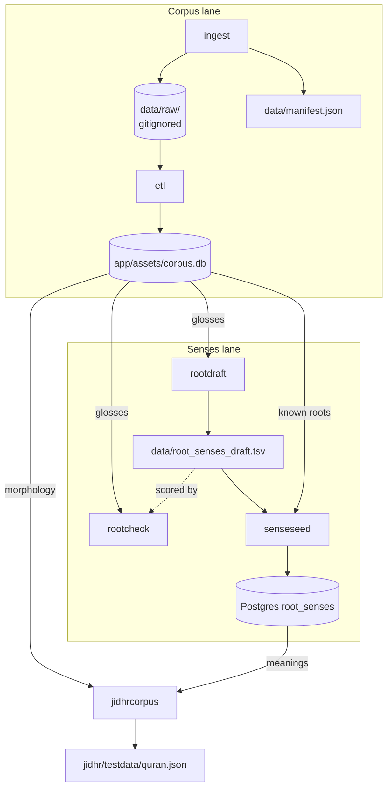

# Pipelines

> The offline tools that build the corpus, draft the senses and export jidhr's data. Level L1 · Parent [Overview](../README.md) · Children [Corpus](pipelines/corpus.md), [Senses](pipelines/senses.md)

## Black box

The pipelines are six command-line tools that run on a developer's machine, never in the deployed image. Two of them turn licensed upstream data into the **corpus** the app bundles. The others draft the **senses** of each **root**, check them, load them into the server's Postgres, and export a file for **jidhr**. A person runs them by hand when the data has to change.

| In | Out | Depends on |
|---|---|---|
| Quran text and word data from a public API, the Quranic Arabic Corpus morphology file, quran-align word timings, a language model endpoint, Lane's Lexicon (read, never shipped) | `app/assets/corpus.db` (the corpus), `data/manifest.json`, a drafts log of senses, the senses in the server's Postgres, `jidhr/testdata/quran.json` | A checkout with `data/raw/` filled, and a reachable Postgres for the sense tools |



Nothing here runs on a schedule. Both things that ship, the corpus and the senses, are rebuilt on purpose and reviewed like code.

## White box



Every tool after `etl` reads the corpus the app bundles, so the corpus lane runs first.

| Tool | Reads | Writes | Page |
|---|---|---|---|
| `ingest` | the Quran Foundation API, the quran-align release, the morphology file placed by hand | `data/raw/`, `data/manifest.json` | [Corpus](pipelines/corpus.md) |
| `etl` | `data/raw/` | `app/assets/corpus.db` | [Corpus](pipelines/corpus.md) |
| `rootdraft` | corpus glosses, Lane's articles, `data/root-sense-prompt.md` | appends to `data/root_senses_draft.tsv` | [Senses](pipelines/senses.md) |
| `rootcheck` | corpus glosses, a senses TSV, Lane's articles | reports, and a checked senses JSON | [Senses](pipelines/senses.md) |
| `senseseed` | the drafts log, the corpus roots | replaces every row of `root_senses` | [Senses](pipelines/senses.md) |
| `jidhrcorpus` | corpus morphology, senses from Postgres | `jidhr/testdata/quran.json` | step 4 below |

### 1. The corpus is built in two steps

`ingest` downloads and `etl` transforms. Downloads land in `data/raw/`, which git ignores. Git keeps the manifest instead: sources, checksums and counts. The lane has its own page, [Corpus](pipelines/corpus.md).

```go
in := flag.String("in", "./data/raw/", "ingest directory")
out := flag.String("out", "./app/assets/corpus.db", "corpus.db to write")
```

[etl/main.go:12](../../server/cmd/etl/main.go#L12-L13)

### 2. Senses are drafted, then logged

`rootdraft` asks a language model about one root at a time, giving it that root's glosses from the corpus and its Lane article. Rows go into an append-only log, and the last row for a root wins. `rootcheck` scores a proposed English sense against the corpus glosses of that root's words. See [Senses](pipelines/senses.md).

```go
flag.StringVar(&c.out, "out", "", "rows land here, for a person to read and promote; append-only, last row for a root wins")
```

[rootdraft/main.go:64](../../server/cmd/rootdraft/main.go#L64)

### 3. The seed is the correction path

`senseseed` replaces the server's senses with what the log says. It is a command and not a migration, so a fixed sense reaches readers without a deploy.

```go
if err := db.ReplaceSenses(ctx, senses); err != nil {
	log.Fatalf("write the senses: %v", err)
}
```

[senseseed/main.go:85](../../server/cmd/senseseed/main.go#L85-L87)

### 4. jidhr gets both halves in one file

`jidhrcorpus` reads the roots and spellings out of the corpus and the meanings out of Postgres. It uses the same read as `GET /v1/senses`, so the file and the route cannot hold different prose. It opens Postgres without migrating it: a read-only tool should not change the database it reads.

```go
pack, err := store.New(pool).Senses(ctx)
if err != nil {
	log.Fatalf("read the senses from %s: %v", *dsn, err)
}
```

[jidhrcorpus/main.go:83](../../server/cmd/jidhrcorpus/main.go#L83-L86) · [its flags](../../server/cmd/jidhrcorpus/main.go#L54-L57) · [why no migration](../../server/cmd/jidhrcorpus/main.go#L67-L71)

## Why it is this way

- [ADR 0001](../adr/0001-stack.md) — offline-first: the phone carries the whole corpus, so it is built ahead of time.
- [ADR 0010](../adr/0010-the-server-owns-the-roots-and-their-senses.md) — upstream data is bundled, Wird's own senses are served. That split is why there are two lanes.
- [ADR 0005, deploying the API](../adr/0005-deploying-the-api.md) — one image, the API only. The tools never ship in it.

## Go deeper

- [Corpus](pipelines/corpus.md) — ingest, ETL, tables, licences.
- [Senses](pipelines/senses.md) — drafting, checking, seeding, serving.
- [jidhr](jidhr.md) — what reads `quran.json`.
- [Where every piece of data comes from](../../data/SOURCES.md)
- Tours: [Where the Quran text comes from](../tours/where-the-text-comes-from.md), [How a word finds its root and its sense](../tours/word-to-sense.md)
