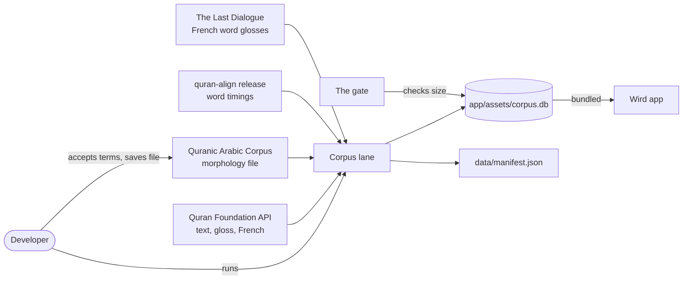
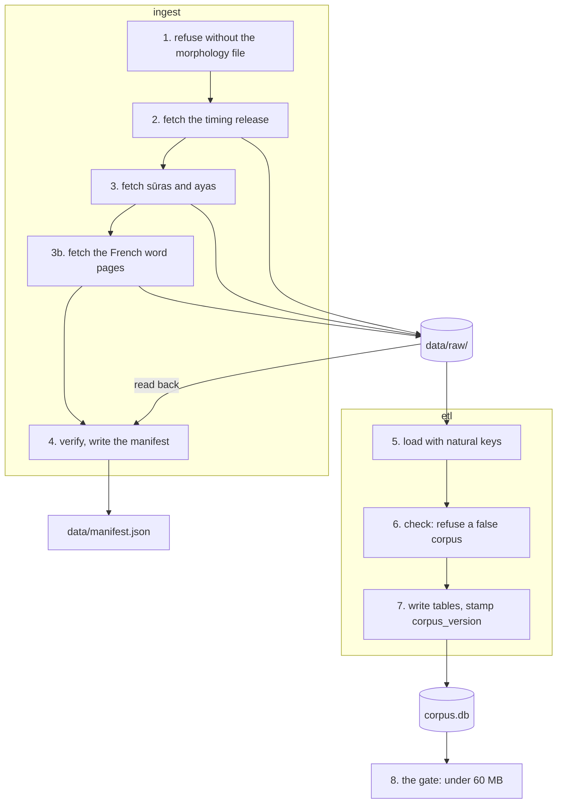
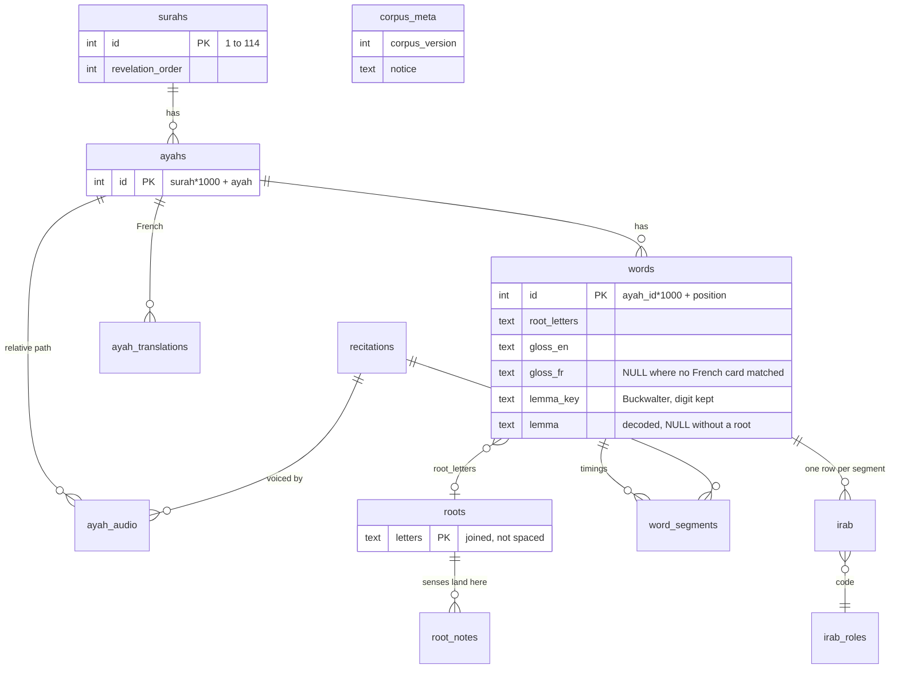
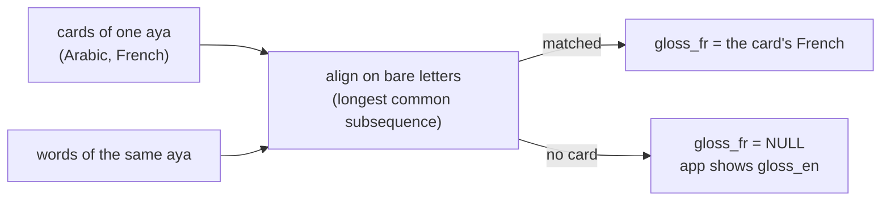

# Corpus

> From licensed upstream sources to the `corpus.db` the app bundles, by way of `ingest` and `etl`. Level L2 · Parent [Pipelines](../pipelines.md) · Children none

## Black box

The corpus lane turns public Quran data into one SQLite file, `app/assets/corpus.db`, that ships inside the app. A developer runs it by hand when a source changes or the app needs new data. The result is committed like code. Every other pipeline tool, and every screen that shows Quran text, reads it.

| In | Out | Depends on |
|---|---|---|
| Sūra and aya data with word-by-word gloss and a French translation, from the Quran Foundation API · the French word-by-word pages of The Last Dialogue · the Quranic Arabic Corpus 0.4 morphology file, saved by a person · the quran-align timing release | `app/assets/corpus.db` · `data/manifest.json` (what was downloaded, checksums, counts) | Network for the downloads, a person to accept the morphology licence, the gate for the size check |



The corpus holds only upstream data that does not change after release. The **senses** are not in it: they come from the server ([ADR 0010](../../adr/0010-the-server-owns-the-roots-and-their-senses.md)).

## White box



The file holds twelve tables. Ids are natural, so a rebuild never renumbers what the app already joins against.



| Key | Rule | Example |
|---|---|---|
| aya | sūra × 1000 + aya | 2:255 → `2255` |
| word | aya id × 1000 + position | first word of 2:255 → `2255001` |
| root | its letters joined | `وصي`, not `و ص ي` |

### 1. The morphology file is fetched by a person

The morphology download page asks for an email and for the terms to be accepted. That is a person taking a licence, so `ingest` will not do it. It stops before any download if the file is missing, or if its copyright block was removed.

```go
// Before 38 MB of downloads: the one file a person has to put there by hand.
if err := requireCorpusMorphology(filepath.Join(dir, corpusFile)); err != nil {
	return err
}
```

[ingest/main.go:61](../../../server/cmd/ingest/main.go#L61-L64) · [the copyright check](../../../server/cmd/ingest/verify.go#L103-L134)

### 2. Timings come from the quran-align release

The Quran Foundation API serves the same timings, but its terms forbid storing them for more than a week. The quran-align release carries its own grant, so `ingest` downloads that zip and extracts one recitation with its licence and readme.

```go
if err := f.download(ctx, alignURL, filepath.Join(dir, alignZip), force); err != nil {
	return err
}
if err := extractTimings(filepath.Join(dir, alignZip), dir, recitation); err != nil {
	return err
}
```

[ingest/main.go:70](../../../server/cmd/ingest/main.go#L70-L75) · [the release URL](../../../server/cmd/ingest/align.go#L17-L21)

### 3. Sūras and ayas, one file each

`ingest` fetches the sūra list, then one JSON file per sūra with its ayas, words, gloss, transliteration and the French translation. A run can ask for a few sūras only. Such a run is refused if it would overwrite a manifest that covers all 114.

```go
if len(suras) != 114 {
	if err := refusePartialOverwrite(manifestPath); err != nil {
		return err
	}
}
```

[ingest/main.go:89](../../../server/cmd/ingest/main.go#L89-L93) · [the refusal](../../../server/cmd/ingest/main.go#L141-L154)

### 3b. The French under each word, from The Last Dialogue

quran.com has no French word-by-word, so a full run also saves The Last Dialogue's "Coran Mot à Mot" pages under `data/raw/tld/`: the index, the 114 sūra pages it links, and the section pages the seven long sūras are split into. They are used by permission ([ADR 0012](../../adr/0012-french-word-glosses-from-the-last-dialogue.md), [SOURCES.md](../../../data/SOURCES.md#french-word-glosses-the-last-dialogue)).

The ETL reads each word card and matches it to a word by its Arabic, never by its place in the aya. The pages skip a word here and there, and matching by place would give every later word its neighbour's meaning. A word no card matches keeps its English gloss.



[ingest/tld.go](../../../server/cmd/ingest/tld.go) · [etl/glosses_fr.go](../../../server/cmd/etl/glosses_fr.go)

### 4. Verify what is on disk, then write the manifest

`verify` trusts nothing it just downloaded. It reads the files back from disk and counts the words in every aya, in the text, in the morphology and in the timings. If they disagree anywhere, it stops and writes no manifest. Otherwise it writes `data/manifest.json`, with the sources, checksums and counts. That file is what git holds in place of `data/raw/`.

```go
// verify reads back what is on disk and refuses to write a manifest for a corpus
// that would mis-highlight. Nothing here trusts the download that just ran: a
// resumed run verifies files it did not fetch.
func verify(dir string, suras []int, chapters []chapter, recitation string, now time.Time) (*manifest, error) {
```

[ingest/verify.go:158](../../../server/cmd/ingest/verify.go#L158-L161) · [the word counts compared](../../../server/cmd/ingest/verify.go#L204-L218)

### 5. Load with natural keys

`etl` reads `data/raw/` into memory. Ids come from the text's own numbering. If the text and the morphology split an aya into a different number of words, the load stops: mixing two segmentations would light the wrong word during recitation.

```go
// Ids are natural, never generated: a re-run of this ETL must not renumber what a
// shipped corpus.db already joins against.
func ayahID(surah, ayah int) int   { return surah*1000 + ayah }
func wordID(ayahID, pos int) int64 { return int64(ayahID)*1000 + int64(pos) }
```

[etl/load.go:21](../../../server/cmd/etl/load.go#L21-L24) · [the segmentation guard](../../../server/cmd/etl/load.go#L256-L259)

### 6. Check: refuse a corpus that would mislead

The check is a build gate, not a report. Among other things, it refuses a corpus whose notice does not credit both licensed sources, a partial Quran, an aya without audio, a word pointing at an unknown root, timings that jump backwards, French for some ayas but not all, an aya none of whose words carries a French gloss, and a rooted word with no lemma. On a full build it also holds the three commonest lemmas of r-ḥ-m to 116, 114 and 57, the counts corpus.quran.com gives, so a lemma read from the wrong segment or two lemmas merged into one cannot ship.

```go
if full {
	if len(c.Surahs) != quranSurahs {
		errs = append(errs, fmt.Errorf("%d suras, want %d", len(c.Surahs), quranSurahs))
	}
	if len(c.Ayahs) != quranAyahs {
		errs = append(errs, fmt.Errorf("%d ayas, want %d", len(c.Ayahs), quranAyahs))
	}
	if len(c.Audio) != len(c.Ayahs) {
		errs = append(errs, fmt.Errorf("%d ayas but %d audio rows: an aya would play nothing",
			len(c.Ayahs), len(c.Audio)))
	}
}
```

[etl/check.go:37](../../../server/cmd/etl/check.go#L37-L48) · [the notice check](../../../server/cmd/etl/check.go#L23-L35) · [the whole check](../../../server/cmd/etl/check.go#L18-L117)

### 7. Write the tables and stamp the version

`Write` deletes the old file, creates the schema, inserts in one transaction and vacuums. `corpus_meta` gets the version, the build time and the licence notice. `root_notes` is created and left empty: it is where the app stores senses fetched from the server.

```go
if _, err := tx.Exec(`INSERT INTO corpus_meta VALUES (?,?,?)`,
	version, builtAt.UTC().Format(time.RFC3339), c.Notice); err != nil {
	return err
}
```

[etl/write.go:192](../../../server/cmd/etl/write.go#L192-L195) · [the schema](../../../server/cmd/etl/write.go#L16-L134) · [why root_notes is empty](../../../server/cmd/etl/write.go#L235-L249)

`corpus_version` is the number the API groups reports by. It is a flag whose default is the current version, 6. The documented rebuild passes no flag, so the default is what ships. A test in the app checks the bundled file agrees.

It is also how a phone already holding an older corpus gets the new one. The app carries the same number as `bundledCorpusVersion`. When the installed file's version is lower, the app fills the new corpus beside it, copies the reader's own tables and the fetched senses across, and swaps the file in by rename. A failed upgrade keeps the old file. A rebuild that keeps the same number is therefore never delivered: bump it.

```go
version := flag.Int("corpus-version", 6, "corpus_version the API negotiates")
```

[etl/main.go:24](../../../server/cmd/etl/main.go#L24)

### 8. The gate keeps it under 60 MB

The file is about 30 MB today. The gate fails once it passes 60 MB, the budget for a bundled asset. Going over it is a decision to ask about first, not a number to raise.

```bash
corpus_under_budget() {
	local bytes limit=$((60 * 1024 * 1024))
	bytes=$(wc -c <"$ROOT/app/assets/corpus.db")
	[ "$bytes" -le "$limit" ] && return 0
```

[qa.sh:108](../../../scripts/qa.sh#L108-L111)

### Licences

Each source has its own terms. They are recorded, with the date they were read, in `data/SOURCES.md`. This page does not repeat them.

| Data | Where its terms are |
|---|---|
| Morphology, roots, parsing | [The morphology: Quranic Arabic Corpus 0.4](../../../data/SOURCES.md#the-morphology-quranic-arabic-corpus-04) |
| French translation | [French reaches a reader one ayah at a time, and why](../../../data/SOURCES.md#french-reaches-a-reader-one-ayah-at-a-time-and-why) |
| French word glosses | [French word glosses: The Last Dialogue](../../../data/SOURCES.md#french-word-glosses-the-last-dialogue) |
| Text, gloss, transliteration | [Provenance and licence](../../../data/SOURCES.md#provenance-and-licence), [The one-week rule](../../../data/SOURCES.md#the-one-week-rule) |
| Word timings | [The word timings](../../../data/SOURCES.md#the-word-timings-cpfairquran-align) |
| Recitation audio, not bundled | [The recitation audio](../../../data/SOURCES.md#the-recitation-audio) |
| Questions still open | [What is still open](../../../data/SOURCES.md#what-is-still-open) |

The morphology's licence is GPL, which is why the whole repository is AGPL-3.0.

## Why it is this way

- [ADR 0001](../../adr/0001-stack.md) — offline-first: the whole text lives on the phone, so it is built once and bundled.
- [ADR 0010](../../adr/0010-the-server-owns-the-roots-and-their-senses.md) — what came from upstream is bundled, what Wird wrote is served. So the corpus carries no senses.
- Natural ids, so a rebuilt corpus joins with data already on a device ([etl/load.go:21](../../../server/cmd/etl/load.go#L21-L24)).
- Audio paths stay relative, so moving the audio host never needs an app release ([etl/check.go:57](../../../server/cmd/etl/check.go#L57-L63)).
- [ADR 0012](../../adr/0012-french-word-glosses-from-the-last-dialogue.md) — the French under each word comes from The Last Dialogue, matched by its Arabic.
- [ADR 0005, deploying the API](../../adr/0005-deploying-the-api.md) — `corpus.db` is not in the server image.

## Go deeper

- [Pipelines](../pipelines.md) — the other tools that read this file.
- [Senses](senses.md) — how the empty `root_notes` gets filled on a device.
- [Where every piece of data comes from](../../../data/SOURCES.md), including [the reconciliation numbers](../../../data/SOURCES.md#reconciliation-from-datamanifestjson).
- Tour: [Where the Quran text comes from](../../tours/where-the-text-comes-from.md)
