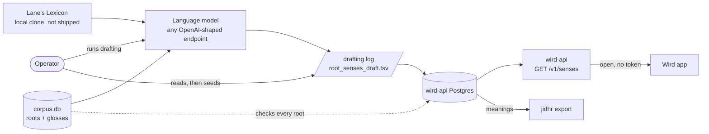
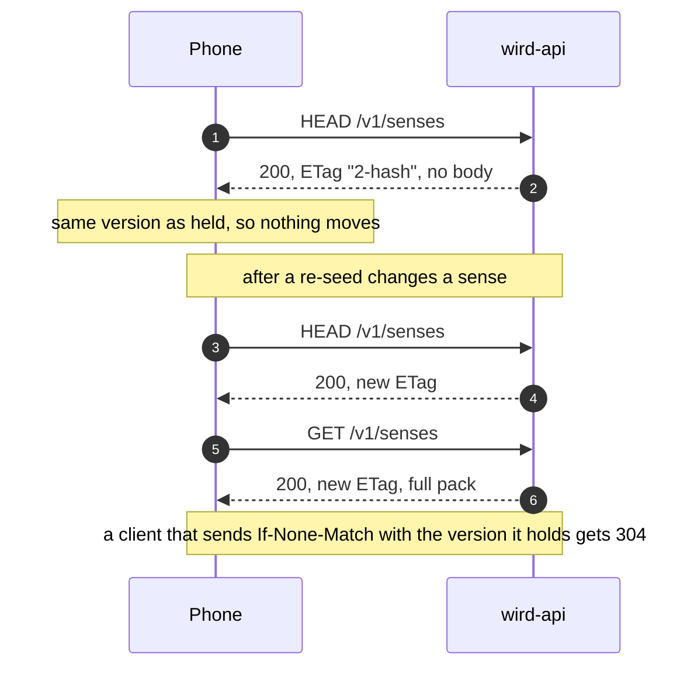
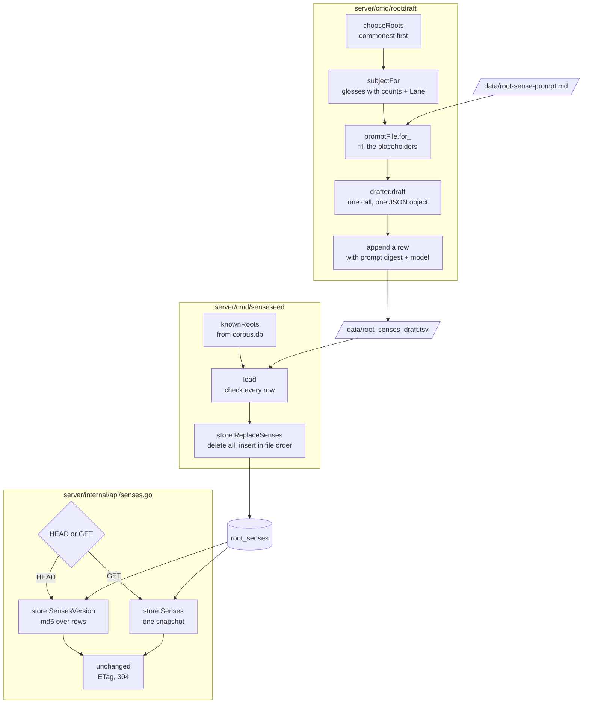
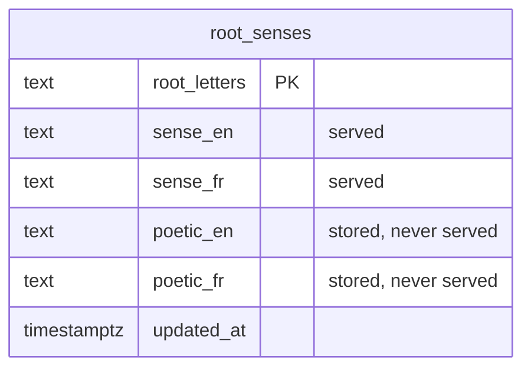

# Senses

> From a prompt to `/v1/senses`: a language model drafts each root's sense, a seeder writes the drafts into Postgres, and the API serves them to every phone. Level L2 · Parent [Pipelines](../pipelines.md) · Children none

## Black box

A sense is Wird's own sentence about a root, so the server owns it. An operator drafts senses on a laptop with a language model, reads the drafting log, and seeds it into the server's database. The API then serves every sense in one open answer that any phone can fetch without an account. A correction is one re-seed, and it reaches readers without a new app release.

| In | Out | Depends on |
|---|---|---|
| The prompt file `data/root-sense-prompt.md` | The drafting log `data/root_senses_draft.tsv`, append-only | Any OpenAI-shaped model endpoint |
| Lane's Lexicon, consulted and never shipped | The senses in the server's Postgres | The bundled corpus, for its roots and glosses |
| `HEAD` and `GET /v1/senses` from the app | One pack: version, provenance prose, a sense per root | Postgres |





## White box





### 1. Draft one root at a time

`rootdraft` reads the prompt from a file, never from code. By default it drafts every root in the corpus, commonest first, so a run cut short still covers the roots readers meet most. Roots already in the log are skipped unless `-force`, and `-dry` prints each assembled prompt and calls nothing ([main.go:75](../../../server/cmd/rootdraft/main.go#L75-L76), [main.go:294](../../../server/cmd/rootdraft/main.go#L294)).

```go
	if c.prompt == "" {
		c.prompt = "./data/root-sense-prompt.md"
	}
	if c.out == "" {
		c.out = "./data/root_senses_draft.tsv"
	}
```
[main.go:79](../../../server/cmd/rootdraft/main.go#L79-L84)

The model is reached through any OpenAI-shaped endpoint, chosen with `-base-url` and `-model` ([main.go:67](../../../server/cmd/rootdraft/main.go#L67-L71)). Several roots are drafted at once, and one lock keeps each row whole in the file ([main.go:252](../../../server/cmd/rootdraft/main.go#L252-L284)).

### 2. Fill the prompt with what the root is checked against

For each root, `subjectFor` gathers the number of times it occurs, the English glosses the corpus gives its words with a count for each, and Lane's article when there is one. The counts show the model which branch of meaning a reader actually meets.

```go
	rows, err := db.Query(
		`SELECT gloss_en, COUNT(*) n FROM words
		  WHERE root_letters = ? AND gloss_en IS NOT NULL AND gloss_en <> ''
		  GROUP BY LOWER(gloss_en) ORDER BY n DESC, gloss_en
		  LIMIT 40`, root)
```
[prompt.go:86](../../../server/cmd/rootdraft/prompt.go#L86-L90)

The prompt file uses `{{ROOT}}`, `{{OCCURRENCES}}`, `{{GLOSSES}}` and `{{LANE}}` placeholders ([prompt.go:56](../../../server/cmd/rootdraft/prompt.go#L56-L68)). HTML comments in it are notes for its editor and are stripped before sending. The digest, though, covers the whole file, so any edit gives the next rows a new digest.

```go
	sum := sha256.Sum256(raw)
	return promptFile{
		text: strings.TrimSpace(comments.ReplaceAllString(string(raw), "")),
		sha:  hex.EncodeToString(sum[:])[:12],
	}, nil
```
[prompt.go:49](../../../server/cmd/rootdraft/prompt.go#L49-L53)

### 3. Accept one JSON object, or nothing

The model must answer with one JSON object holding four fields: the sense and the poetic register, each in English and French ([draft.go:27](../../../server/cmd/rootdraft/draft.go#L27-L32)). A reply that does not parse as that object, leaves a field empty, or cites a verse is an error, and no row is written. A sense is a claim about the word, never about a verse.

```go
	var out drafted
	if err := json.Unmarshal([]byte(text), &out); err != nil {
		return drafted{}, text, fmt.Errorf("not the one JSON object the prompt asks for: %w", err)
	}
	if err := out.complete(); err != nil {
		return out, text, err
	}
	if err := out.aboutTheWordOnly(); err != nil {
		return out, text, err
	}
	return out, text, nil
```
[draft.go:111](../../../server/cmd/rootdraft/draft.go#L111-L121)

A run ends by naming the roots that failed, and whether the provider refused or the answer was wrong ([main.go:163](../../../server/cmd/rootdraft/main.go#L163-L179)).

### 4. Append to the drafting log

Each good draft becomes one line in the drafting log. The last line for a root is the current one. A re-run with an edited prompt writes a newer line beside the old, so two prompt versions can be read side by side. Every line records the prompt digest and the model that wrote it.

```go
			fmt.Fprintf(s.file, "%s\t%s\t%s\t%s\t%s\t%s\t%s\t%s\n",
				root, tab(got.SenseEn), tab(got.SenseFr), tab(got.PoeticEn), tab(got.PoeticFr),
				subject.LaneHow, s.prompt.sha, c.model)
```
[main.go:277](../../../server/cmd/rootdraft/main.go#L277-L279)

The columns are `root`, `sense_en`, `sense_fr`, `poetic_en`, `poetic_fr`, `lane`, `prompt`, `model` ([main.go:49](../../../server/cmd/rootdraft/main.go#L49)).

### 5. Check the log, then seed Postgres

`senseseed` reads the log in file order. It skips the header and refuses the whole run if any row names a root the corpus does not record, lacks English or French, or cites a verse ([main.go:186](../../../server/cmd/senseseed/main.go#L186-L191)). It lists every bad row, not just the first. A file with no senses is refused too, because a seed of nothing would unpublish every sense ([main.go:199](../../../server/cmd/senseseed/main.go#L199-L203)).

```go
		switch {
		case !known[s.Root]:
			// By name, because the answer is almost always a spelling: a root
			// the corpus does not record is a sense no reader could reach.
			errs = append(errs, fmt.Errorf("line %d: the corpus records no root %q", line, s.Root))
		case s.En == "":
			errs = append(errs, fmt.Errorf("line %d: root %s has no English, and a sense ships in both languages or neither", line, s.Root))
		case s.Fr == "":
			errs = append(errs, fmt.Errorf("line %d: root %s has no French, and a sense ships in both languages or neither", line, s.Root))
		}
```
[main.go:176](../../../server/cmd/senseseed/main.go#L176-L185)

The known roots come from the bundled corpus ([main.go:211](../../../server/cmd/senseseed/main.go#L211-L238)). The database comes from `DATABASE_URL`, and `-dry` checks the file and touches no database ([main.go:43](../../../server/cmd/senseseed/main.go#L43-L47)). The seeder does not run migrations: the deployed API does that when it starts ([main.go:71](../../../server/cmd/senseseed/main.go#L71-L83)).

### 6. Replace the whole table in one transaction

`ReplaceSenses` deletes every row, then inserts the log's rows in order. The primary key on the root turns "the last row for a root wins" into `ON CONFLICT ... DO UPDATE`, with no selection code. A root the log no longer carries is gone afterwards.

```go
	if _, err := tx.Exec(ctx, `DELETE FROM root_senses`); err != nil {
		return err
	}
	for _, sn := range senses {
		// NULLIF: an unwritten poetic register is absent, never blank — the
		// same distinction jidhrcorpus makes when it exports meanings.
		if _, err := tx.Exec(ctx, `
			INSERT INTO root_senses (root_letters, sense_en, sense_fr, poetic_en, poetic_fr)
			VALUES ($1, $2, $3, NULLIF($4, ''), NULLIF($5, ''))
			ON CONFLICT (root_letters) DO UPDATE
			   SET sense_en = EXCLUDED.sense_en, sense_fr = EXCLUDED.sense_fr,
			       poetic_en = EXCLUDED.poetic_en, poetic_fr = EXCLUDED.poetic_fr,
			       updated_at = now()`,
```
[senses.go:149](../../../server/internal/store/senses.go#L149-L161)

The table has no `reviewed` column, and the poetic register is stored but never served ([00009_the_server_owns_the_senses.sql:35](../../../server/migrations/00009_the_server_owns_the_senses.sql#L35-L42)). After seeding, `senseseed` prints the new hash so the operator can compare it with what the route answers ([main.go:88](../../../server/cmd/senseseed/main.go#L88-L96)).

### 7. Hash only what is served

The pack version is an md5 over each root, its English and its French, in byte order (`COLLATE "C"`). A plain UPDATE to one sense changes it. A re-seed that changes nothing does not. The poetic columns are left out, so they never make a phone download again.

```go
const sensesVersionSQL = `
	SELECT md5(COALESCE(string_agg(
	         root_letters || E'\x1f' || sense_en || E'\x1f' || sense_fr,
	         E'\x1e' ORDER BY root_letters COLLATE "C"), ''))
	  FROM root_senses`
```
[senses.go:67](../../../server/internal/store/senses.go#L67-L71)

For a GET, the hash and the rows are read in one read-only, repeatable-read snapshot. A re-seed landing between the two reads can then never label one pack's rows with another pack's version ([senses.go:96](../../../server/internal/store/senses.go#L96-L125)).

### 8. Serve the pack, open and cacheable

The route sits on the outer mux, so the bearer-token middleware never sees it ([api.go:69](../../../server/internal/api/api.go#L69)). HEAD reads only the hash. GET reads the rows. Both set the ETag and answer 304 when the phone already has that version.

```go
func (h *Handler) senses(w http.ResponseWriter, r *http.Request) {
	if r.Method == http.MethodHead {
		digest, err := h.store.SensesVersion(r.Context())
		if err != nil {
			h.unavailable(w, "senses version", err)
			return
		}
		if unchanged(w, r, packVersion(digest)) {
			return
		}
		w.Header().Set("Content-Type", "application/json")
		w.WriteHeader(http.StatusOK)
		return
	}
```
[senses.go:105](../../../server/internal/api/senses.go#L105-L118)

The body is `{version, source, attribution, basis, senses: [{root, en, fr}]}` ([senses.go:82](../../../server/internal/api/senses.go#L82-L88)). The route never answers 404: an empty table is a 200 with an empty list, and errors go through a helper that has no 404 branch ([senses.go:167](../../../server/internal/api/senses.go#L166-L169)). The Go server has no rate limiter; the ingress in front of it limits the whole host ([senses.go:23](../../../server/internal/api/senses.go#L23-L28)).

### 9. The version carries the provenance prose

The three strings a reader sees around a sense (source, attribution, basis) are Go constants beside the handler, not rows in Postgres ([senses.go:62](../../../server/internal/api/senses.go#L62-L80)). The basis says plainly that a sense is a machine draft no person has read. The version starts with a hand-bumped revision, so a change to that prose reaches phones even when no sense changed.

```go
func packVersion(digest string) string {
	return strconv.Itoa(provenanceRevision) + "-" + digest
}
```
[senses.go:145](../../../server/internal/api/senses.go#L144-L146)

Whoever edits `sensesSource`, `sensesAttribution` or `sensesBasis` must bump `provenanceRevision` in the same change ([senses.go:45](../../../server/internal/api/senses.go#L45)).

### 10. The same senses feed jidhr

`jidhrcorpus` exports the roots from the bundled corpus and the meanings from this same Postgres table into the file the jidhr engine reads ([main.go:1](../../../server/cmd/jidhrcorpus/main.go#L1-L6)). One table, two readers. The engine and the app agree only when `-pg` points at the same database the route serves; aimed anywhere else, the export carries whatever was last seeded there ([main.go:11](../../../server/cmd/jidhrcorpus/main.go#L11-L13)).

## Why it is this way

- [ADR 0010](../../adr/0010-the-server-owns-the-roots-and-their-senses.md) — what Wird wrote is served, what came from upstream is bundled. Postgres is the one holder of the senses, so the app and jidhr read the same prose.
- Seeding is a command, not a migration. A correction must not need a new file, a review and a deploy ([main.go:4](../../../server/cmd/senseseed/main.go#L4-L9)).
- Drafts ship unsigned on purpose ([ADR 0010](../../adr/0010-the-server-owns-the-roots-and-their-senses.md#a-human-signs-every-sense-before-any-of-it-ships)). The reader's verdict is the review, and the served basis says so. A human signing step is deferred, not rejected.
- One model call per root, no revise pass. A second pass that told the model what it had "missed" made senses worse by pasting glosses in as clauses ([main.go:3](../../../server/cmd/rootdraft/main.go#L3-L8)).

## Go deeper

- [Senses in the app](../app/senses.md): how a phone fetches, stores and shows the pack.
- [Corpus pipeline](corpus.md): where the roots and glosses the drafts are checked against come from.
- [API](../api.md): the service that serves `/v1/senses`.
- [jidhr](../jidhr.md): the root engine that reads the exported meanings.
- Background: [Root meanings research](../../research/root-meanings-research.md#the-bar-as-it-now-stands) and [Lane's Lexicon: the licence, and the join](../../research/lane-lexicon.md#part-one-the-licence).
- Tour: [How a word finds its root and its sense](../../tours/word-to-sense.md).
- Where the data comes from, and its licence: [SOURCES.md](../../../data/SOURCES.md).
