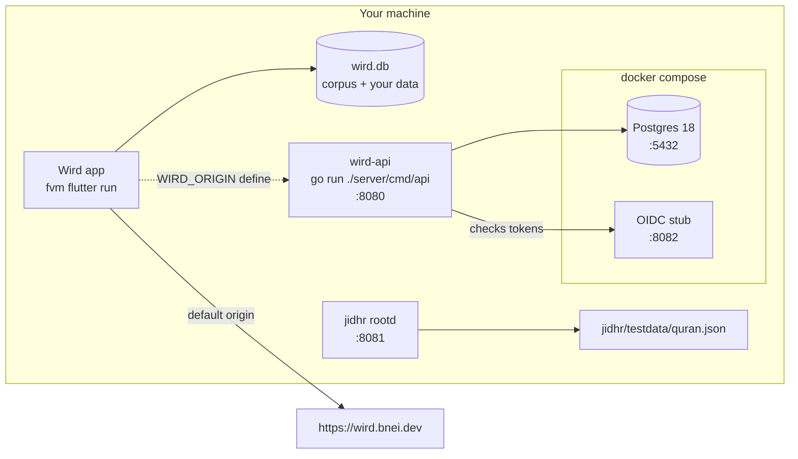

# Getting started

> Set up a machine, run each part of Wird locally, and check a change the way the gate will. Guide · Parent [Overview](../README.md)

This guide takes you from a fresh clone to a green gate. Each section stands alone, so skip what you do not need. If you only touch the app, you never have to start the API.



## 1. Install the toolchain

[toolchain.md](../toolchain.md) lists everything the build machine needs and why: Go, Docker, Xcode, fvm, jq and a few more. Install with Homebrew only, and never with `sudo`. If you add a tool for Wird, add it to the list under [What QA check 7 diffs](../toolchain.md#what-qa-check-7-diffs) in the same commit. **The gate** checks that list against what is installed.

Flutter is never installed directly. fvm pins it from `.fvmrc` at the repo root, so always type `fvm flutter`, never plain `flutter`. Screenshots used by tests depend on the exact Flutter version, and an unpinned upgrade breaks all of them.

```bash
cd app && fvm install && fvm flutter pub get
```

## 2. Run the gate

```bash
./scripts/qa.sh
```

[scripts/qa.sh](../../scripts/qa.sh) is the gate. Its exit code is the verdict, and it writes `qa-report.json` with one entry per check. It runs the Go build and tests, the Flutter analyzer and tests, the end-to-end journeys on a device, and the shell checks: the toolchain record, the corpus size budget, and the rule that every marker comment names an issue. It starts Postgres for you if Docker is installed ([qa.sh:442-445](../../scripts/qa.sh#L442-L445)).

Run it before every push. CI only runs the Go half, as [Deploy](../architecture/deploy.md#2-the-checks-the-go-half-of-the-gate) explains, so a broken Flutter test is yours to catch.

## 3. Run the app

```bash
cd app && fvm flutter run -d macos
```

The macOS build is the only local target where **voice-follow** really works. A simulator's microphone hears nothing useful. To let the scripts pick a target for you, `scripts/device.sh` prints one device id: a cabled iPhone first, then the iPhone 16 simulator, then macOS.

The app talks to `https://wird.bnei.dev` by default. A compile-time define points it somewhere else ([flush.dart:21-24](../../app/lib/data/flush.dart#L21-L24)):

```bash
fvm flutter run -d macos --dart-define=WIRD_ORIGIN=http://localhost:8080
```

### A corpus rebuild reaches your machine only with a new version

On first launch the app copies the bundled **corpus** into a file called `wird.db`, and adds your own tables beside it. After that, it replaces the corpus only when the app's version number is higher than the installed one.

```dart
  if (!file.existsSync()) {
    await installCorpus(file, await _bundledCorpus());
  } else if (await installedCorpusVersion(path) < bundledCorpusVersion) {
```

[db.dart:32-34](../../app/lib/data/db.dart#L32-L34)

So a rebuild of `app/assets/corpus.db` must bump the ETL's `-corpus-version` default and `bundledCorpusVersion` in `app/lib/data/db.dart` together; a test fails when they disagree. Your progress and kept items are carried across. A rebuild that keeps the same number is not picked up: delete the installed file and launch again.

```bash
rm ~/Library/Containers/dev.bnei.wird/Data/Documents/wird.db
```

That wipes your local progress. The downloaded voice model sits in a `voice/` folder next to it and survives.

## 4. Run the API locally

The API needs Postgres and an OIDC issuer. Both come from [docker-compose.yml](../../docker-compose.yml). The stub stands in for Authentik and signs a token for any login.

```bash
docker compose up -d postgres oidc-stub
go run ./server/cmd/api
```

The API runs its migrations at startup, so there is no separate step. It reads four variables, and each has a default that matches the compose file ([main.go:20-39](../../server/cmd/api/main.go#L20-L39)):

| Variable | Local default |
|---|---|
| `DATABASE_URL` | the compose Postgres on port 5432 |
| `OIDC_ISSUER` | the stub on port 8082 |
| `OIDC_AUDIENCE` | `wird` |
| `API_ADDR` | `:8080` |

Moving onto the real Authentik changes `OIDC_ISSUER` and `OIDC_AUDIENCE`, nothing else. The audience must be the client id there. See [Authentik wiring](authentik-wiring.md).

Tafsir, iʿrāb and lexicon endpoints answer 404 until someone seeds them ([api.go:192-193](../../server/internal/api/api.go#L204-L205)). That is by design: nothing is licensed yet, and Wird never invents commentary.

## 5. Run jidhr

jidhr needs no database, no network and no key.

```bash
go run ./jidhr/cmd/rootd
curl -sG localhost:8081/v1/root --data-urlencode 'word=صَبَرُوا'
```

It serves `jidhr/testdata/quran.json` from memory. The [rootd README](../../jidhr/cmd/rootd/README.md) is the whole HTTP contract. To rebuild the file, run `go run ./server/cmd/jidhrcorpus`. It reads the roots from the app's **corpus** and the meanings from the API's Postgres, so the meanings are whatever that database last had seeded ([main.go:53-57](../../server/cmd/jidhrcorpus/main.go#L53-L57)).

## 6. Run the tests

```bash
# Go: both modules by name, one package at a time
docker compose up -d postgres
go build ./server/... ./jidhr/...
go test -p 1 ./server/... ./jidhr/...

# App
cd app && fvm flutter analyze && fvm flutter test

# End-to-end journeys, from app/
DEV=$(../scripts/device.sh) && fvm flutter test integration_test/ -d "$DEV"
```

Two habits save time here:

- Never use `./...` at the repo root. The root is a Go workspace, not a module, and Go rejects the pattern.
- Keep `-p 1`. The server tests share one Postgres.

Test names state the failure they prevent. [CONTRIBUTING.md](../../CONTRIBUTING.md) has the rest of the conventions. For any change you can see on screen, the gate also asks you to look at it: [the visual gate](gate-visual.md).

## 7. Check the docs

```bash
./scripts/docs-check.sh
```

[scripts/docs-check.sh](../../scripts/docs-check.sh) checks that every `#L` link lands inside its file and that every mermaid diagram renders. It needs `npx`, and the first run downloads the mermaid renderer, so give it a few minutes. CI runs the same script, plus an offline link checker, on every pull request.

## Where to go next

- [Overview](../README.md) — the glossary and the map of every page.
- [App](../architecture/app.md), [API](../architecture/api.md), [jidhr](../architecture/jidhr.md), [Pipelines](../architecture/pipelines.md) — the container page for the area you are changing.
- [Deploy](../architecture/deploy.md) — what happens after you merge.
- [Decisions](../adr/README.md) — why things are the way they are.
