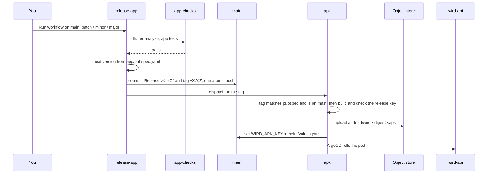

# Releasing the APK

A release is one button. It checks the app, raises the version, tags it, and builds and publishes a signed Android APK at `https://wird.bnei.dev/download/android`, the link behind the public page's Download button. Nobody edits a version or types a tag. iOS is not built in CI; [ADR 0019](../adr/0019-the-apk-is-built-on-a-tag-and-published-by-ci.md) records why, and [ADR 0022](../adr/0022-a-release-is-cut-by-one-button-from-the-pubspec.md) records the button.

## Where the version lives

In one line: `version:` in [`app/pubspec.yaml`](../../app/pubspec.yaml), as `X.Y.Z+N`. The part before `+` is what people see, and `N` is Android's build number. The release build passes `X.Y.Z` into the app as `--dart-define=WIRD_VERSION`, which is what a bug report names ([report.dart](../../app/lib/features/report/report.dart#L13-L19)). Any other build, a laptop run or a walk build, reports `dev`.

Never edit that line by hand. The release workflow raises it.

## Cut a release

1. Merge what should ship to `main`, after `./scripts/qa.sh` passes on a Mac.
2. Open **Actions → release-app → Run workflow**, keep the branch on `main`, and pick **patch**, **minor** or **major**.
3. Watch it. [`release-app.yml`](../../.github/workflows/release-app.yml) runs [`app-checks.yml`](../../.github/workflows/app-checks.yml), then commits `Release vX.Y.Z` and the tag `vX.Y.Z` and pushes them together. The build number rises by one every time, so Android always accepts the update.
4. It then starts [`apk.yml`](../../.github/workflows/apk.yml) on the tag. That run ends with a `chore(deploy)` commit on `main`, and the new build is live once ArgoCD syncs it.

Nothing is tagged when the checks fail, or when `main` moved while they ran: the push is refused, and running the button again releases the newer `main`. `apk.yml` refuses a tag that disagrees with the pubspec or is not on `main`, any missing signing value, and an APK signed with the debug key. Nothing is published then.

A tag pushed by hand publishes nothing: `apk.yml` no longer starts on a tag push.

The object key carries the first 12 characters of the APK's sha256. A published key is never overwritten, so a phone resuming a download never gets half of one build and half of another. The route is served by [`apk.go`](../../server/internal/api/apk.go#L21).

## The checks, and where the rest of the gate runs

`app-checks.yml` runs `flutter analyze` and `flutter test --exclude-tags golden` on Linux, on every pull request that touches `app/` and before every release. The screenshot tests carry the `golden` tag ([dart_test.yaml](../../app/dart_test.yaml)) because they are drawn on macOS and differ by a few pixels elsewhere. They, the end-to-end journeys and the audits run in `./scripts/qa.sh` on a Mac, which stays the merge gate.

## Installing over an older build

- **A phone with a debug-signed build** cannot take a release APK as an update. Android refuses it because the signing key differs. Uninstall first. That deletes the app's local data, including the downloaded voice model.
- **A phone with a release APK** refuses a later local walk build. The release APK carries version code 2001 (`2 × 1000 + build number`), and a walk build passes `force-version-code-ignoring-abi`, which makes it 1. Install the walk build with `adb install -d`, or uninstall first.

## A build without a release

Run the `apk` workflow by hand from the Actions tab, on `main`. It builds and uploads, and the run summary names the key, but it does not publish: only a release moves `/download/android`. That build reports itself as `dev`.

## Who can read the signing key

The workflow reads the release keystore and the store key over OIDC, from Wird's own secret project. The machine identity it uses can read only that project, and accepts only this workflow file, run from a tag or from `main`. It is never the identity the image build uses: that one can read a project every app shares, and the keystore must never live there.
