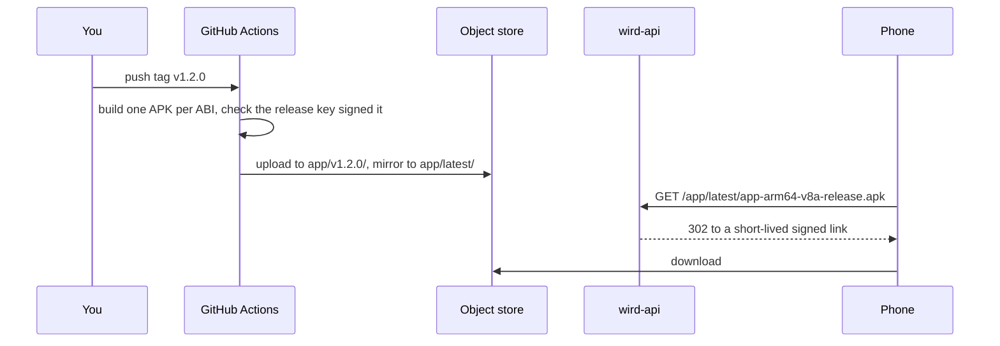

# Releasing the APK

A version tag builds a signed Android APK and publishes it behind a link that never expires. iOS is not built in CI. [ADR 0019](../adr/0019-the-apk-is-built-on-a-tag-and-served-like-the-recogniser.md) records why.



## Cut a release

1. Bump `version:` in `app/pubspec.yaml`. Raise the build number after `+` every time: Android refuses an update whose version code is not higher.
2. Merge to main.
3. Tag the merge commit with the same version and push it:

   ```sh
   git tag v1.2.0
   git push origin v1.2.0
   ```

4. Watch the `apk` workflow. Its summary lists the download links.

The workflow stops if the tag and the pubspec disagree, if any signing value is missing, or if the APK came out signed with the debug key.

## The links

- `https://wird.bnei.dev/app/latest/app-arm64-v8a-release.apk` always points at the newest tag. Most phones want this one.
- `https://wird.bnei.dev/app/v1.2.0/app-arm64-v8a-release.apk` stays pinned to one release. Use it when you send a build to someone.
- `armeabi-v7a` and `x86_64` builds sit beside it, for old 32-bit phones and emulators.

The route is served by [`models.go`](../../server/internal/api/models.go#L46) and works like the voice model download.

## Installing over an older build

- **A phone with a debug-signed build** cannot take a release APK as an update. Android refuses it because the signing key differs. Uninstall first. That deletes the app's local data, including the downloaded voice model.
- **A phone with a release APK** refuses a later local walk build. The release arm64 APK carries version code 2001 (`2 × 1000 + build number`), and a walk build passes `force-version-code-ignoring-abi`, which makes it 1. Install the walk build with `adb install -d`, or uninstall first.

## A build without a tag

Run the `apk` workflow by hand from the Actions tab. It uploads to `app/dispatch-<commit>/` and leaves `latest` alone.

## One-time setup

The workflow reads the release keystore and the store key over OIDC, with a machine identity that only this repository may use. Until that identity exists and its id replaces the placeholder in `.github/workflows/apk.yml`, the secret step fails. The identity is never the one the image build uses: that one can read a project every app shares, and the keystore must never live there.

After the first release, add the release certificate's SHA-256 to `WIRD_ANDROID_SHA256` in `helm/values.yaml`. The workflow log prints it. Without it, Android will not hand sign-in back to a release build.
