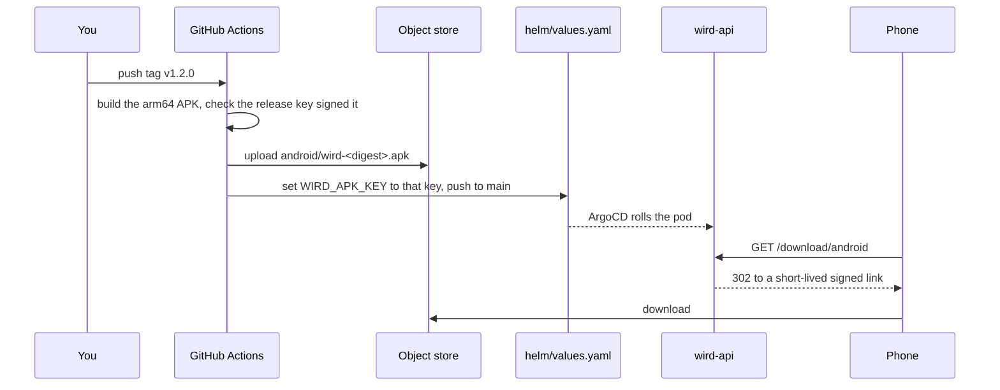

# Releasing the APK

A version tag builds a signed Android APK and publishes it at `https://wird.bnei.dev/download/android`, the link behind the public page's Download button. iOS is not built in CI. [ADR 0019](../adr/0019-the-apk-is-built-on-a-tag-and-published-by-ci.md) records why.



## Cut a release

1. Bump `version:` in `app/pubspec.yaml`. Raise the build number after `+` every time: Android refuses an update whose version code is not higher.
2. Merge to main.
3. Tag the merge commit with the same version and push it:

   ```sh
   git tag v1.2.0
   git push origin v1.2.0
   ```

4. Watch the `apk` workflow. It ends with a `chore(deploy)` commit on main, and the new build is live once ArgoCD syncs it.

The workflow stops if the tag and the pubspec disagree, if any signing value is missing, or if the APK came out signed with the debug key. Nothing is published then.

The object key carries the first 12 characters of the APK's sha256. A published key is never overwritten, so a phone resuming a download never gets half of one build and half of another. The route is served by [`apk.go`](../../server/internal/api/apk.go#L21).

## Installing over an older build

- **A phone with a debug-signed build** cannot take a release APK as an update. Android refuses it because the signing key differs. Uninstall first. That deletes the app's local data, including the downloaded voice model.
- **A phone with a release APK** refuses a later local walk build. The release APK carries version code 2001 (`2 × 1000 + build number`), and a walk build passes `force-version-code-ignoring-abi`, which makes it 1. Install the walk build with `adb install -d`, or uninstall first.

## A build without a tag

Run the `apk` workflow by hand from the Actions tab, on `main`. It builds and uploads, and the run summary names the key, but it does not publish: only a tag moves `/download/android`.

## Who can read the signing key

The workflow reads the release keystore and the store key over OIDC, from Wird's own secret project. The machine identity it uses can read only that project, and accepts only this workflow file, run from a tag or from `main`. It is never the identity the image build uses: that one can read a project every app shares, and the keystore must never live there.
