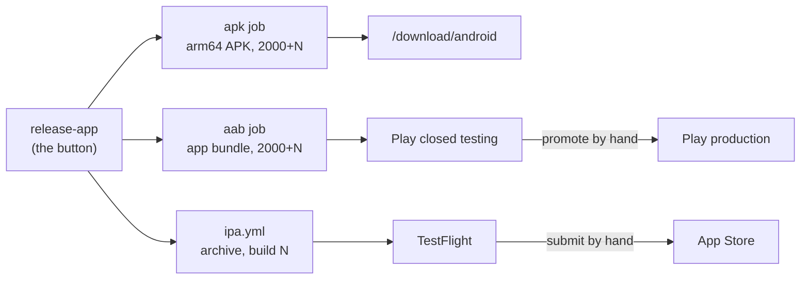

# Releasing to the stores

The release button ([releasing the APK](releasing-the-apk.md)) builds for three places at once: the APK at `/download/android`, Google Play's closed testing track, and TestFlight. Promoting a build to the public store listings is done by hand, in each store's console. [ADR 0028](../adr/0028-wird-ships-through-play-and-the-app-store-beside-the-apk.md) records why it works this way.



The `aab` job only runs once the repository variable `PLAY_RELEASE_ENABLED` is `true`, and `ipa.yml` only runs once `IOS_RELEASE_ENABLED` is `true`. Until then a release only builds the APK, exactly as before.

## One-time setup: Google Play

Do the steps in this order. Each step needs the one before it. The `aab` job reads the upload key and the service account before it builds anything, so both must exist before the first release with Play switched on.

1. **Account.** Create the developer account (personal). Confirm your identity, your contact details and a real Android device through the Play Console app. Identity checks can take days, so start here.
2. **App.** Create the app with package name `dev.bnei.wird`. Complete developer verification for that package name with the APK's signing certificate, following what the Console asks for at that moment.
3. **Upload key.** Generate a new keystore: PKCS12, RSA with 2048 bits or more, one password for both the store and the key. Store it, base64, in Infisical next to the release keystore, under the upload key names the `aab` job reads.
4. **Service account.** Create one in Google Cloud, turn on the Google Play Android Developer API in that project, and give the account release permission on the app in the Play Console. Store its JSON key in Infisical.
5. **App signing.** In *Test and release → App integrity*, choose to use your own key and download Google's encryption public key. Commit it at `app/android/play-encryption-public-key.pem` through a pull request to `main`. It is a public key, so it is safe to commit. Then run **apk** by hand from `main` with **pepk** ticked. The job produces `play-app-signing-key`, a zip encrypted to Google. Upload that zip in the Console, and register the upload key's certificate in the same form. This cannot be undone.
6. **Check the signing key before any release.** App integrity must show an app signing certificate whose SHA-256 equals the release fingerprint in [`helm/values.yaml`](../../helm/values.yaml). Do not open *Create release* until it does: Play's default is a key of its own, and once a bundle is uploaded under it, that choice is permanent.
7. **First release, by hand.** Set `PLAY_RELEASE_ENABLED` to `true` and cut a release. The Play upload step fails the first time, because Play only accepts an app's first release from the Console. The bundle is already built by then: download the `wird-aab` artifact from that run and upload it to the closed testing track in the Console. From the next release on, the `aab` job uploads by itself.
8. **Closed test.** Google reviews the first closed release, which can take days for a new account. Then at least 12 testers must stay opted in for 14 days in a row before a new personal account can apply for production. Recruit 15 or more, so one dropping out does not reset the clock. This is the longest wait, so recruit from the first day.
9. **Second release during the test.** The check in [moving between the APK and Play](#moving-between-the-apk-and-play) needs a version code newer than the one installed, so cut one more release inside the 14 days.
10. **Forms and production.** Fill in the listing, Data safety, content rating, app access and the other *App content* forms (advertising ID, financial, health, government) from the answers below. Declare yourself a non-trader. Then apply for production. Google reviews the application, then reviews the production release itself.

## One-time setup: App Store

1. In the developer portal, check that the App ID `dev.bnei.wird` has **Associated Domains** turned on. Xcode turns it on the first time it signs a build with the entitlement.
2. In App Store Connect, create the app with bundle ID `dev.bnei.wird`, primary language English, and SKU `wird`.
3. Create an App Store Connect API key with the **Admin** role. Cloud signing needs Admin; App Manager is not enough. Store the key file's text, its ID and the issuer ID in an Infisical project of their own, not Wird's: `ipa.yml` reads them with an identity that is a Viewer of that project only, so it never sees the Android keystore. The identity is recorded in infra-bootstrap. Put its identity ID and project slug in the repository variables `ipa.yml` reads. Its OIDC binding must accept any `v*` tag, since every release brings a new one.
4. Set `IOS_RELEASE_ENABLED` to `true`. The next release appears in TestFlight once Apple has processed it. Every release also publishes the APK, so a fix to `ipa.yml` that needs a new tag reaches APK phones too.
5. Install the TestFlight build on a real iPhone and sign in. Sign-in opens Safari and must come back to the app through the universal link. If it does not, fix that before submitting: review will try it.
6. Complete the EU trader declaration in App Store Connect as a non-trader. Wird is free, with no purchases and no ads, and a trader declaration would put a home address and phone number on the listing. Google Play asks for the same declaration.
7. Fill in the listing, App Privacy, age rating and review notes from the answers below, then submit.

## The listing

| Field | Text |
|---|---|
| Name | Wird |
| Subtitle (App Store, 30) | Understand what you recite |
| Short description (Play, 80) | Read the Qur'an word by word, through its roots, and pray with it in front of you. |
| Category | Books (App Store: Reference) |
| Keywords (App Store, 100) | quran,koran,arabic,roots,salah,prayer,recitation,tajweed,word by word,morphology,tafsir |
| Support URL | the repository's GitHub issues page |
| Privacy policy URL | `https://wird.bnei.dev/privacy.html` |
| Price | Free, no in-app purchases, no ads |

**Full description**

> Wird helps you understand the ayas you recite in prayer.
>
> Pick a set of ayas and read it word by word. Every word opens into its root: the three letters it grows from, the other words that share them, and what the root means. When you pray, the set stays in front of you, and Wird can follow your recitation and keep your place.
>
> - Word-by-word glosses in English and French, with a translation of each aya.
> - Roots, forms and grammatical parsing for every word, from the Quranic Arabic Corpus.
> - Six reciters, with each word highlighted as it is recited, or each word spoken on its own.
> - Voice-follow: Wird listens while you recite and keeps your place. Your voice is processed on your phone and never leaves it.
> - Works offline, with no account. Sign in only if you want your reading on several devices.
>
> Wird is free and open source, with no ads and no tracking.

A French listing uses the same structure. The app's own French strings, in `app/lib/l10n/app_fr.arb`, are the reference for wording.

## Privacy forms

Both forms must say the same thing as [the privacy page](https://wird.bnei.dev/privacy.html). When one of them changes, change all three together.

| Data | Collected | Linked to the user | Why | Optional |
|---|---|---|---|---|
| User ID (account identifier) | yes, when signed in | yes | app functionality (sync) | yes |
| Email address (the bnei.dev sign-in) | yes, when signed in | yes | app functionality (account) | yes |
| Other user content (notes, kept items, progress, prayers recorded) | yes, when signed in | yes | app functionality (sync) | yes |
| Customer support (bug reports) | yes, when the reader sends one | no | app functionality | yes |
| Audio (microphone) | **no**: processed on the device, never sent | | | |
| Location, contacts, identifiers for ads, diagnostics, usage data | no | | | |

Answers that apply to both stores:
- Data is encrypted in transit: yes.
- Tracking: none.
- Data is sold or shared with third parties: no.
- Users can request deletion: yes, in the app and by email.

On Play, Data safety also asks for an account deletion URL: use `https://wird.bnei.dev/privacy.html#deleting-your-account`.

The iOS privacy manifest, `app/ios/Runner/PrivacyInfo.xcprivacy`, declares the same four data types.

## Content rating and review notes

- **Rating.** Answer no to every content question. Wird is a reading app with no user-to-user communication and no web browsing.
- **App access.** Every feature works without signing in. Sign-in only syncs reading between devices.
- **Note for Apple review:**

  > No account is needed to use Wird. Sign-in is optional and only syncs reading between devices. Sign-in uses a bnei.dev account, an email and password on our own identity server, which is shared with other bnei.dev services. To test deletion, sign in with the demo account below, then go to Settings → Account → Delete account. That deletes the Wird account and all of its data from our server, and empties the phone; it cannot be undone. The shared bnei.dev sign-in stays, because other services use it, and the privacy policy explains how to have it removed too. The microphone is used for voice-follow during recitation; audio is processed on the device and never sent.

  Give a demo account in the review notes. Create it in Authentik with access to the Wird application only, no second factor and no email verification step. Deletion keeps the sign-in, so the same demo account keeps working for the next review. [ADR 0032](../adr/0032-account-deletion-removes-wird-data-and-keeps-the-shared-sign-in.md) records why.

## Screenshots

| Store | Size | How many |
|---|---|---|
| Play, phone | 1080 × 1920 (no wider than 1:2), 24-bit PNG with no alpha | 2 to 8 |
| Play | feature graphic 1024 × 500, icon 512 × 512 | 1 each |
| App Store, iPhone 6.9" | 1320 × 2868 | 3 to 10 |
| App Store, iPad 13" | 2064 × 2752 | 3 to 10 |

The phone captures in `screens/` are 1080 × 2400 and include alpha. Both stores refuse them as they are: crop them to 1080 × 1920 and flatten the alpha first. The iPhone 16 used for testing is a 6.1" phone, which is the wrong size for the 6.9" slot. Capture the iPhone and iPad sizes from simulators instead:

```sh
scripts/store-screens.sh "iPhone 17 Pro Max" out/iphone      # 1320 × 2868
scripts/store-screens.sh "iPad Pro 13-inch (M5)" out/ipad    # 2064 × 2752
```

Each run uses a simulator of its own, sets the status bar to 9:41 with a full battery, hides the debug banner, and walks the screens in `app/integration_test/store_screens.dart`. On iPad, the home and prayer preparation screens are phone layouts stretched wide, so the iPad listing uses the set, the root, the deep dive and the prayer.

## Moving between the APK and Play

Play re-signs with the APK's own key and uses the APK's version code, so a phone that has one can install the other's next release as an ordinary update. A build with the same code shows as already installed. Check this once on a tester's phone during the closed test, in both directions, before telling APK users that they can switch.

> pending: the result of that check.
