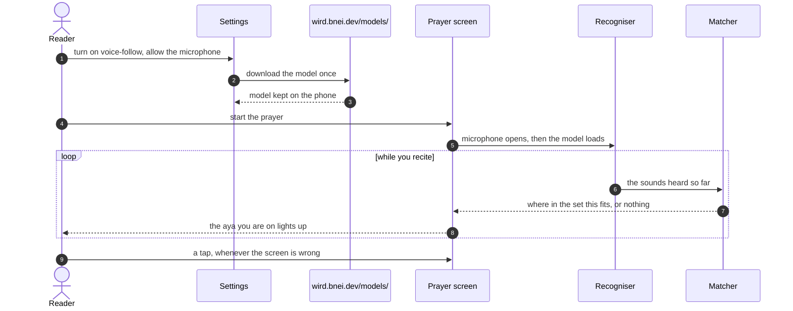

# Tour: Following your voice

For anyone who wonders how the prayer screen knows where you are. You follow **voice-follow** from the first "allow" to the moment an **aya** lights up, all on the phone.

## 1. You say yes, in Settings

Voice-follow is off until you turn it on. The microphone is asked for in Settings, never inside a prayer. Your answer is stored, so the prayer screen only reads it.

→ [Voice-follow: the microphone is asked for in Settings](../architecture/app/voice-follow.md#1-the-microphone-is-asked-for-in-settings-never-in-a-prayer)

## 2. The model comes down once

You tap download, and about 73 MB arrive from `wird.bnei.dev`. A download cut halfway resumes later. An older model left on the phone is swept away.

→ [Voice-follow: the model is downloaded on request, and resumes](../architecture/app/voice-follow.md#2-the-model-is-downloaded-on-request-and-resumes) · [old models are swept away](../architecture/app/voice-follow.md#3-old-models-are-swept-away)

## 3. The prayer opens the microphone first

When you start the prayer, the microphone opens before the model finishes loading. Loading takes seconds, and your first words must not be lost. If anything is missing, the screen simply waits for your tap.

→ [Voice-follow: a prayer opens the microphone before the model loads](../architecture/app/voice-follow.md#4-a-prayer-opens-the-microphone-before-the-model-loads)

## 4. The recogniser hears sounds, not words

A small model on the phone turns your recitation into Qurʼanic phonemes: letters, short vowels, tajwīd marks. It runs apart from the screen, in short slices of audio. Your voice never leaves the phone.

→ [Voice-follow: the recogniser runs on its own isolate](../architecture/app/voice-follow.md#5-the-recogniser-runs-on-its-own-isolate) · [300 ms slices](../architecture/app/voice-follow.md#6-the-drain-hands-audio-over-in-300-ms-slices)

## 5. The matcher finds your place

The matcher already knows the text of your **set**. It only asks where the last few sounds fit. Both sides are first folded down to the letters they agree on, and a place is chosen only when one clearly wins.

→ [Voice-follow: both sides are folded](../architecture/app/voice-follow.md#7-both-sides-are-folded-to-the-letters-they-agree-on) · [the matcher locates the reciter](../architecture/app/voice-follow.md#8-the-matcher-locates-the-reciter-in-the-set)

## 6. The aya lights up

A match moves the cursor, and the screen turns to that aya. It can move back too, when you repeat an aya or start the next rakʿa. When nothing clearly fits, it stays put: late is better than wrong.

→ [Voice-follow: the cursor moves, and the screen turns the aya](../architecture/app/voice-follow.md#9-the-cursor-moves-and-the-screen-turns-the-aya)

## 7. The prayer ends quietly

When you leave, everything stops once, and no error ever reaches you. A small log on the phone keeps what happened, so a prayer can be read back afterwards.

→ [Voice-follow: the prayer trail](../architecture/app/voice-follow.md#10-the-prayer-trail-records-what-happened) · [leaving stops everything](../architecture/app/voice-follow.md#11-leaving-the-prayer-stops-everything-once)

Where to go next: why the model hears phonemes and not a language is in [ADR 0009](../adr/0009-the-recogniser-hears-quranic-phonemes-not-language.md), and what walking it on real devices taught is in the [voice-follow walk](../journal/voice-follow-walk.md).

Next tour: [Signing in](signing-in.md)
