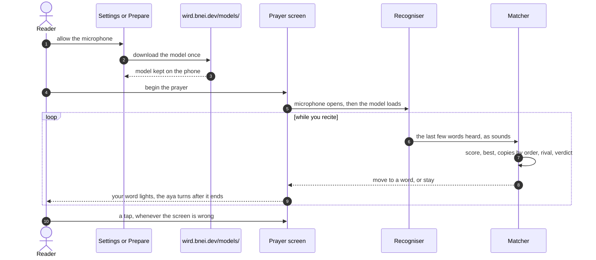

# Tour: Following your voice

For anyone who wonders how the prayer screen knows where you are. You follow **voice-follow** end to end, all on the phone: from the first "allow", through what the recogniser hears and how the matcher places it, to the moment your word lights up. Then you see how a prayer is read back afterwards, and how the matcher is tested.

## 1. You say yes before the prayer

Voice-follow needs two things on the phone: your permission for the microphone, and the recogniser model. You can give both in Settings, or right under "Follow my voice" when you prepare a prayer. Nothing is ever asked inside the prayer itself, where the phone is on the floor.

→ [Voice-follow: the microphone is asked for before the prayer](../architecture/app/voice-follow.md#1-the-microphone-is-asked-for-before-the-prayer-never-in-it)

## 2. The model comes down once

You tap download, and about 73 MB arrive from `wird.bnei.dev`. A download cut halfway resumes later. An older model left on the phone is swept away.

→ [Voice-follow: the model is downloaded on request, and resumes](../architecture/app/voice-follow.md#2-the-model-is-downloaded-on-request-and-resumes) · [old models are swept away](../architecture/app/voice-follow.md#3-old-models-are-swept-away)

## 3. The prayer opens the microphone first

When you begin the prayer, the microphone opens before the model finishes loading. Loading takes seconds, and your first words must not be lost. If anything is missing, the screen simply waits for your tap.

→ [Voice-follow: a prayer opens the microphone before the model loads](../architecture/app/voice-follow.md#4-a-prayer-opens-the-microphone-before-the-model-loads)

## 4. The recogniser hears sounds, not words

A small model on the phone turns your recitation into Qurʼanic phonemes: letters, short vowels, tajwīd marks. It runs apart from the screen and is fed 300 ms slices of audio. Your voice never leaves the phone.

→ [Voice-follow: the recogniser runs on its own isolate](../architecture/app/voice-follow.md#5-the-recogniser-runs-on-its-own-isolate) · [300 ms slices](../architecture/app/voice-follow.md#6-the-drain-hands-audio-over-in-300-ms-slices)

## 5. What you said is carried across a breath

Each time the recogniser answers, the phrase you are saying is joined to the one before it, so a place can be read across the pause between two ayas. Then both your sounds and the muṣḥaf's text are folded down to the bare letters they agree on. Only the last 24 letters, about four words, are kept.

→ [Voice-follow: the drain](../architecture/app/voice-follow.md#6-the-drain-hands-audio-over-in-300-ms-slices) · [both sides are folded](../architecture/app/voice-follow.md#7-both-sides-are-folded-to-the-letters-they-agree-on)

## 6. The matcher scores every place in the rakʿah

The matcher already knows the text of the rakʿah you are reciting: Al-Fātiḥa, then the passage you prepared. It lays your last few words against the text ending at every word, anywhere in the rakʿah, and scores how alike they are. The best place is the top score, or the earliest that ties with it, because late is better than ahead.

→ [Voice-follow: the matcher locates the reciter](../architecture/app/voice-follow.md#8-the-matcher-locates-the-reciter-in-the-set)

## 7. A phrase said twice is taken in order

Al-Fātiḥa says "ar-raḥmāni r-raḥīm" twice, and the basmala you say before your passage says it again. Your voice cannot tell those copies apart, but order can. The matcher takes the copy at or just after where the screen stands, never one behind you, and never more than about an aya ahead.

→ [Voice-follow: the matcher, step 3](../architecture/app/voice-follow.md#8-the-matcher-locates-the-reciter-in-the-set) · [the unseen basmala](../architecture/app/voice-follow.md#14-the-voice-hears-a-basmala-the-screen-does-not-show)

## 8. A place must clearly beat its rival

Any other place that fits nearly as well is a rival, and the best place must beat it by a margin. Two places with nothing in common need a wide margin; places the text itself makes alike need less, but never less than a floor. The answer is one of five verdicts: too little heard, a poor fit, unclear, a copy with none just ahead, or move.

→ [Voice-follow: the matcher, steps 4 and 5](../architecture/app/voice-follow.md#8-the-matcher-locates-the-reciter-in-the-set)

## 9. Your word lights, and the aya turns after it

A move puts the cursor on your word, and that word lights. When you reach the last word of an aya, the next aya arrives half a second later, with no word lit until you say one. When nothing clearly fits, the screen stays put: late is better than wrong.

→ [Voice-follow: the cursor moves, and the screen turns the aya](../architecture/app/voice-follow.md#9-the-cursor-moves-and-the-screen-turns-the-aya)

## 10. The pace covers when the voice loses you

If you also chose a pace, it waits 3 seconds without a sure match, then steps the words on from where the voice left them. It stops as soon as the voice finds you again. Your taps work in every mode.

→ [Voice-follow: the pace covers for a lost voice](../architecture/app/voice-follow.md#15-the-pace-covers-for-a-lost-voice)

## 11. The next rakʿah begins when you recite Al-Fātiḥa

When a rakʿah ends, the same microphone and model listen for the next one. What you say while bowing does not begin it. Only Al-Fātiḥa does, once you have said about a basmala's worth of it.

→ [Voice-follow: one voice follows each rakʿah](../architecture/app/voice-follow.md#12-one-voice-follows-each-rakʿah-in-turn) · [a rakʿah begins only on Al-Fātiḥa](../architecture/app/voice-follow.md#13-a-rakʿah-begins-only-on-al-fātiḥa)

## 12. The prayer ends quietly, and leaves a trail

When you leave, everything stops once, and no error ever reaches you. A small log on the phone keeps every verdict the matcher gave, so a prayer can be read back afterwards. A debug build also keeps the audio the recogniser was given, so it can be replayed off the phone.

→ [Voice-follow: the prayer trail](../architecture/app/voice-follow.md#10-the-prayer-trail-records-what-happened) · [leaving stops everything](../architecture/app/voice-follow.md#11-leaving-the-prayer-stops-everything-once)

## 13. The bench keeps the matcher honest

Every number the matcher decides with lives in one place, and a bench replays recordings, real trails and synthetic rakʿahs through it in a few seconds. It fails if the cursor ever lands in the wrong place, or falls further behind than it did before. A trail from your own prayer can become one of its conditions.

→ [Voice-follow: the bench](../architecture/app/voice-follow.md#the-bench)

Where to go next: why the model hears phonemes and not a language is in [ADR 0009](../adr/0009-the-recogniser-hears-quranic-phonemes-not-language.md), and why copies are settled by order is in [ADR 0020](../adr/0020-the-margin-is-asked-per-pair-and-repeats-are-settled-by-order.md). What walking it on real devices taught is in the [voice-follow walk](../journal/voice-follow-walk.md).

Next tour: [Signing in](signing-in.md)
