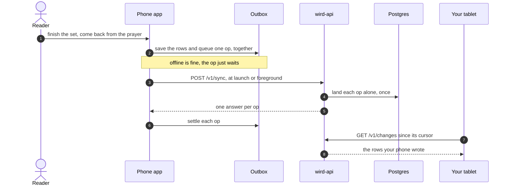

# Tour: A prayer, from tap to Postgres

For anyone who wants to see where a finished prayer goes. You follow one tap from the reader screen, through the **outbox** and the server, and back down to your tablet.

## 1. You finish a set

You read the **set**, mark it understood, then pray it: you prepare the prayer, and the set is the passage after Al-Fātiḥa. The prayer screen itself writes nothing. The prayer is counted on your way back from it, and only if you reached a rakʿah that recited the set, so a prayer you never came back from is never invented.

→ [Sets and reader: praying a set](../architecture/app/sets-and-reader.md#9-praying-a-set) · [App: a prayer is recorded on the way back](../architecture/app.md#5-a-prayer-is-prepared-then-recorded-on-the-way-back-from-it)

## 2. The write and its op land together

Your phone saves the new rows and queues an op in the **outbox** in one step. Both commit, or neither does. Pressing twice lands on the same op, so nothing is counted twice.

→ [Sync: a write and its op commit together](../architecture/app/sync.md#1-a-write-and-its-op-commit-together)

## 3. The outbox waits for a good moment

The **outbox** does not move on every write. It moves when the app starts or comes back to the foreground, at most once every two minutes. If you are signed in, the bearer token is added at that moment, in one place.

→ [Sync: the queue moves at launch, on return to the foreground, and when the app is put away](../architecture/app/sync.md#2-the-queue-moves-at-launch-on-return-to-the-foreground-and-when-the-app-is-put-away) · [the token is attached in one place](../architecture/app/sync.md#3-the-token-is-attached-in-one-place)

## 4. The batch reaches the server

The app sends the oldest ops first, in one `POST /v1/sync`. The server reads the batch and hands it to the store. Only a batch it cannot read, or one that is too big, is refused whole.

→ [Sync: which ops ride](../architecture/app/sync.md#4-which-ops-ride) · [Sync endpoints: the handler reads the batch](../architecture/api/sync-endpoints.md#1-the-handler-reads-the-batch-and-hands-it-over)

## 5. Each op lands alone, once

Every op gets its own transaction in Postgres. The op log remembers each op id, so a replay after a timeout answers `duplicate` and changes nothing. One bad op never blocks the others.

→ [Sync endpoints: each op gets its own transaction](../architecture/api/sync-endpoints.md#2-each-op-gets-its-own-transaction) · [idempotence](../architecture/api/sync-endpoints.md#3-idempotence-the-op-log)

## 6. The answers come home

Your phone reads one answer per op. `applied` and `duplicate` leave the outbox. `refused` is parked and shown in Settings, never during a prayer. No answer at all leaves the outbox exactly as it was.

→ [Sync: each answer settles its op](../architecture/app/sync.md#6-each-answer-settles-its-op) · [no answer is not an attempt](../architecture/app/sync.md#7-no-answer-is-not-an-attempt) · [parked writes wait in Settings](../architecture/app/sync.md#9-parked-writes-wait-in-settings)

## 7. Your tablet catches up

Later, your tablet asks for everything since its cursor with `GET /v1/changes`. The cursor follows the order writes reached the server, not a clock. So a prayer sent days late still shows up.

→ [Sync endpoints: the pull](../architecture/api/sync-endpoints.md#7-the-pull-get-v1changes) · [Sync: pull rows since the cursor](../architecture/app/sync.md#8-pull-rows-since-the-cursor)

Where to go next: the op names both sides share are fixed in [ADR 0002](../adr/0002-set-identity.md), and the token that rides along is the subject of [Signing in](signing-in.md).

Next tour: [How a word finds its root and its sense](word-to-sense.md)
