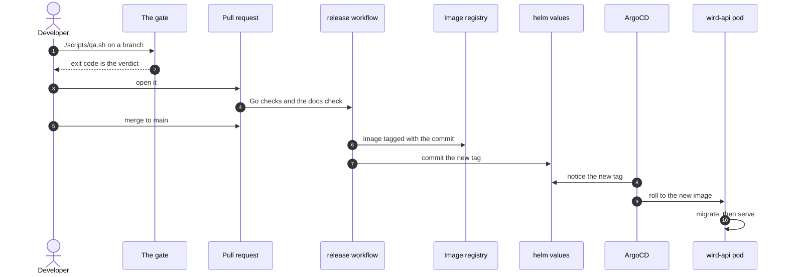

# Tour: Shipping a change

For contributors. You follow one change from your branch to a running `wird-api` pod, and see which checks stand in the way.

## 1. You work on a branch

You make your change on a branch. If it changes behaviour, the architecture page that describes it changes in the same branch. Links into code you moved are yours to fix.

→ [Deploy: the docs workflow](../architecture/deploy.md#9-the-docs-workflow)

## 2. The gate says yes or no

You run `./scripts/qa.sh` on your machine. Its exit code is the verdict, not an opinion. CI only runs the Go half, so the Flutter tests and the device journeys are yours to run before you push.

→ [Deploy: the checks, the Go half of the gate](../architecture/deploy.md#2-the-checks-the-go-half-of-the-gate)

## 3. The pull request runs the checks

Your pull request builds, vets and tests both Go modules against a fresh Postgres. A second workflow checks the docs: links, line anchors and every diagram. A pull request deploys nothing.

→ [Deploy: what triggers a release](../architecture/deploy.md#1-what-triggers-a-release) · [the checks](../architecture/deploy.md#2-the-checks-the-go-half-of-the-gate) · [the docs workflow](../architecture/deploy.md#9-the-docs-workflow)

## 4. You merge, and that is the release

A merge to `main` is a release. Nobody cuts a version. The same checks run again, and then one container image is built holding only `wird-api`, tagged with your commit.

→ [Deploy: the image tag is the commit](../architecture/deploy.md#3-the-image-tag-is-the-commit) · [one binary per image](../architecture/deploy.md#4-one-binary-per-image)

## 5. The tag is written into helm

Once the image is pushed, CI rewrites one line in `helm/values.yaml` and commits it. Bumping before the push would point at an image that does not exist yet.

→ [Deploy: bump the tag, and only after the push](../architecture/deploy.md#5-bump-the-tag-and-only-after-the-push)

## 6. ArgoCD rolls the pod

ArgoCD sees the new tag and rolls the pod. The new pod runs its database migrations first, then starts serving on `wird.bnei.dev`.

→ [Deploy: what the pod is told](../architecture/deploy.md#6-what-the-pod-is-told) · [the first thing the pod does](../architecture/deploy.md#7-postgres-and-the-first-thing-the-pod-does)

## 7. You check it is live

A green status can lag behind the bump. So you compare the running image tag with the one in helm, or call the route you changed.

→ [Deploy: knowing your commit is live](../architecture/deploy.md#8-knowing-your-commit-is-live)

Where to go next: the rules the gate holds you to are in [CONTRIBUTING](../../CONTRIBUTING.md#the-gate), and why the API ships this way is in [ADR 0005](../adr/0005-deploying-the-api.md).

Next tour: [A prayer, from tap to Postgres](prayer-to-postgres.md)
