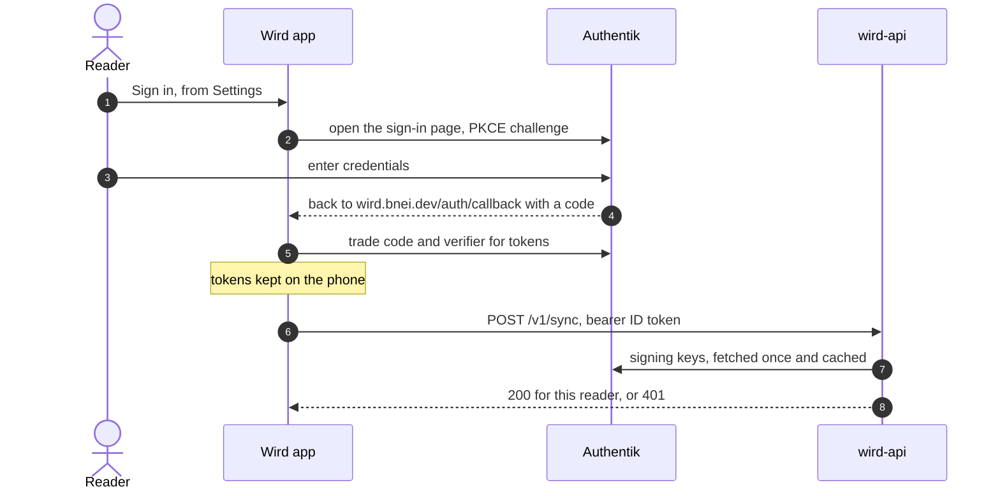

# Tour: Signing in

For anyone who wants to know what an account does, and what it does not. You follow one sign-in from the Settings button to a token the API trusts.

## 1. You choose to sign in

Nothing needs an account. You can read, pray and open roots signed out. Signing in only gives your **outbox** somewhere to land. When you tap the button, the app opens Authentik with a PKCE challenge instead of a secret.

→ [Auth: black box](../architecture/api/auth.md#black-box) · [the app starts a sign-in](../architecture/api/auth.md#1-the-app-starts-a-sign-in)

## 2. The code comes back

Authentik sends you back to `wird.bnei.dev/auth/callback`, and the app picks up the code. It checks that the return trip is the one it started. Then it trades the code for tokens.

→ [Auth: the code comes back and is traded for tokens](../architecture/api/auth.md#2-the-code-comes-back-and-is-traded-for-tokens)

## 3. The tokens stay on your phone

The tokens are kept in the app's own database, beside your data. If a different reader signs in on the same phone, the last reader's data is cleared in the same step.

→ [Auth: the tokens are stored in sqflite](../architecture/api/auth.md#3-the-tokens-are-stored-in-sqflite)

## 4. Each sync carries the token

When the outbox sends, one place adds the ID token as a bearer. A token about to expire is refreshed first. Nothing else in the app knows a token exists.

→ [Auth: every sync request carries the ID token](../architecture/api/auth.md#4-every-sync-request-carries-the-id-token) · [Sync: the token is attached in one place](../architecture/app/sync.md#3-the-token-is-attached-in-one-place)

## 5. The API checks it against the issuer's keys

The API never mints tokens. At start-up it reads Authentik's discovery document and caches its signing keys. Each request is then checked for signature, issuer, audience and expiry, and only then tied to a reader.

→ [Auth: the API builds a verifier](../architecture/api/auth.md#5-the-api-builds-a-verifier-from-the-issuer) · [the middleware checks, then finds the reader](../architecture/api/auth.md#6-the-middleware-checks-then-finds-the-reader)

## 6. The audience is what makes it a Wird token

The identity provider signs tokens for many apps with one key. So the audience check is what tells a Wird token from another app's. Set it wrong and every real token is refused.

→ [Auth: the audience trap](../architecture/api/auth.md#7-the-oidc_audience-trap)

## 7. Operators pass one more gate

The operations view uses the same kind of token, with its own audience. It also asks for membership in an Authentik admin group, and checks that itself instead of trusting a proxy. It is not deployed yet.

→ [Admin web: the group gate](../architecture/adminweb.md#3-the-group-gate)

Where to go next: wiring Authentik yourself is in the [Authentik wiring guide](../guides/authentik-wiring.md), and the operations view is decided in [ADR 0004](../adr/0004-the-operations-view-behind-authentiks-group.md).

Next tour: [Shipping a change](shipping-a-change.md)
