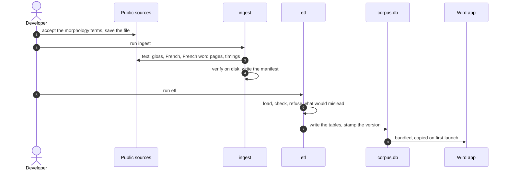

# Tour: Where the Quran text comes from

For anyone who wants to know what is inside the app and who allowed it. You follow the Quran text from its public sources to the **corpus** bundled on your phone.

## 1. Three sources, each with its own terms

The text, the English word-by-word gloss and the French translation come from the Quran Foundation API. The French under each word comes from The Last Dialogue, by permission, matched to each word by its Arabic ([ADR 0012](../adr/0012-french-word-glosses-from-the-last-dialogue.md)). The morphology comes from the Quranic Arabic Corpus. The word timings come from the quran-align release.

→ [Corpus: black box](../architecture/pipelines/corpus.md#black-box)

## 2. A person fetches the morphology

The morphology page asks someone to accept its terms. That is a person taking a licence, so no tool does it for you. You save the file by hand, and `ingest` refuses to go on without it.

→ [Corpus: the morphology file is fetched by a person](../architecture/pipelines/corpus.md#1-the-morphology-file-is-fetched-by-a-person)

## 3. ingest downloads the rest

`ingest` fetches the sūras and ayas, and the timings from quran-align, whose licence lets them be stored. Then it reads everything back from disk and counts the words three ways. If they disagree, it writes no manifest.

→ [Corpus: timings come from the quran-align release](../architecture/pipelines/corpus.md#2-timings-come-from-the-quran-align-release) · [sūras and ayas, one file each](../architecture/pipelines/corpus.md#3-sūras-and-ayas-one-file-each) · [verify, then write the manifest](../architecture/pipelines/corpus.md#4-verify-what-is-on-disk-then-write-the-manifest)

## 4. etl loads and checks

`etl` loads the files with ids taken from the text's own numbering. Then it checks the result like a gate, not a report. A partial Quran, a missing credit or a backwards timing stops the build.

→ [Corpus: load with natural keys](../architecture/pipelines/corpus.md#5-load-with-natural-keys) · [check](../architecture/pipelines/corpus.md#6-check-refuse-a-corpus-that-would-mislead)

## 5. One file comes out

`etl` writes `corpus.db` and stamps it with a version and the licence notice. The file is committed like code. **The gate** keeps it under 60 MB.

→ [Corpus: write the tables and stamp the version](../architecture/pipelines/corpus.md#7-write-the-tables-and-stamp-the-version) · [the gate keeps it under 60 MB](../architecture/pipelines/corpus.md#8-the-gate-keeps-it-under-60-mb)

## 6. The corpus rides in the app

The app bundles `corpus.db`. On first launch it copies it out once, and from then on every screen reads it with no network. That is why you can read and pray in airplane mode.

→ [App: the bundled corpus becomes the one database](../architecture/app.md#2-the-bundled-corpus-becomes-the-one-database)

## 7. The licences travel with it

Each source keeps its own terms, recorded with the date they were read. The morphology and Quran Foundation granted Wird free use in writing, which lets the repo be MIT. The app's Sources and licences screen shows the same credits.

→ [Corpus: licences](../architecture/pipelines/corpus.md#licences) · [data/SOURCES.md](../../data/SOURCES.md)

Where to go next: the choice of stack and licence is in [ADR 0001](../adr/0001-stack.md), and running the pipeline yourself starts in [Getting started](../guides/getting-started.md).

Next tour: [Following your voice](following-your-voice.md)
