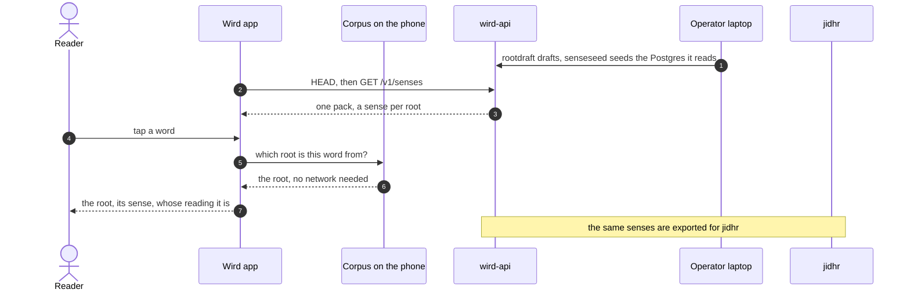

# Tour: How a word finds its root and its sense

For anyone curious about the root screen. You tap one word, find its **root** on the phone, and then trace its **sense** back to where it was written, and on to **jidhr**.

## 1. You tap a word

You open any word in the **passage**, and the root screen appears at once. Nothing waits on a network here. The word's root is already on your phone.

→ [App: the bundled corpus becomes the one database](../architecture/app.md#2-the-bundled-corpus-becomes-the-one-database)

## 2. The root comes from the corpus

The **corpus** ships inside the app, and every word in it already points at its root. That link was checked when the corpus was built. A word pointing at an unknown root stops the build.

→ [Corpus: check, refuse a corpus that would mislead](../architecture/pipelines/corpus.md#6-check-refuse-a-corpus-that-would-mislead)

## 3. The sense is not in the corpus

The corpus carries every root, but no senses. A sense is Wird's own sentence, so the server owns it. Your phone fetched the pack earlier, quietly, the first time it saw a network.

→ [Senses in the app: black box](../architecture/app/senses.md#black-box) · [two moments start a fetch](../architecture/app/senses.md#1-two-moments-start-a-fetch)

## 4. The pack is checked, then stored

A `HEAD /v1/senses` asks for the version and moves no bytes. If it is new, a `GET` brings the whole pack. The app checks every row first, then swaps the senses in one transaction.

→ [Senses in the app: HEAD asks](../architecture/app/senses.md#2-head-asks-and-moves-no-bytes) · [GET, and check the whole body first](../architecture/app/senses.md#3-get-and-check-the-whole-body-first) · [replace the rows in one transaction](../architecture/app/senses.md#4-replace-the-rows-in-one-transaction)

## 5. The root screen reads it back

Now the root screen shows the sense, with a line saying whose reading it is. With no sense, it tells you which of two things is true: none was written yet, or this phone has not fetched any.

→ [Senses in the app: the root screen reads it back](../architecture/app/senses.md#6-the-root-screen-reads-it-back)

## 6. Where the sense was written

Go back one step further. On a laptop, `rootdraft` asks a language model about each root, one prompt per root, with the corpus glosses beside it. Every good draft is appended to a log, never overwritten.

→ [Senses pipeline: draft one root at a time](../architecture/pipelines/senses.md#1-draft-one-root-at-a-time) · [append to the drafting log](../architecture/pipelines/senses.md#4-append-to-the-drafting-log)

## 7. How it reached the server

`senseseed` reads that log, refuses it if any row is wrong, and replaces the whole table in Postgres. A correction is one re-seed. It reaches you the next time you download senses in Settings, with no app release.

→ [Senses pipeline: check the log, then seed Postgres](../architecture/pipelines/senses.md#5-check-the-log-then-seed-postgres) · [replace the whole table](../architecture/pipelines/senses.md#6-replace-the-whole-table-in-one-transaction) · [serve the pack](../architecture/pipelines/senses.md#8-serve-the-pack-open-and-cacheable)

## 8. jidhr asks the same question

**jidhr** answers "which root is this word from?" for anyone outside Wird. It reads one file built from the same corpus and the same senses. Nothing in Wird calls it today; it is a standalone engine.

→ [jidhr: black box](../architecture/jidhr.md#black-box) · [Senses pipeline: the same senses feed jidhr](../architecture/pipelines/senses.md#10-the-same-senses-feed-jidhr)

Where to go next: why the server owns the senses is told in [ADR 0010](../adr/0010-the-server-owns-the-roots-and-their-senses.md). How jidhr finds a root it has never seen is in its [white box](../architecture/jidhr.md#white-box).

Next tour: [Where the Quran text comes from](where-the-text-comes-from.md)
